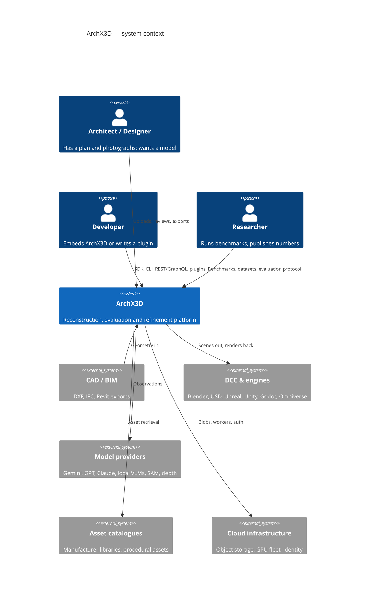
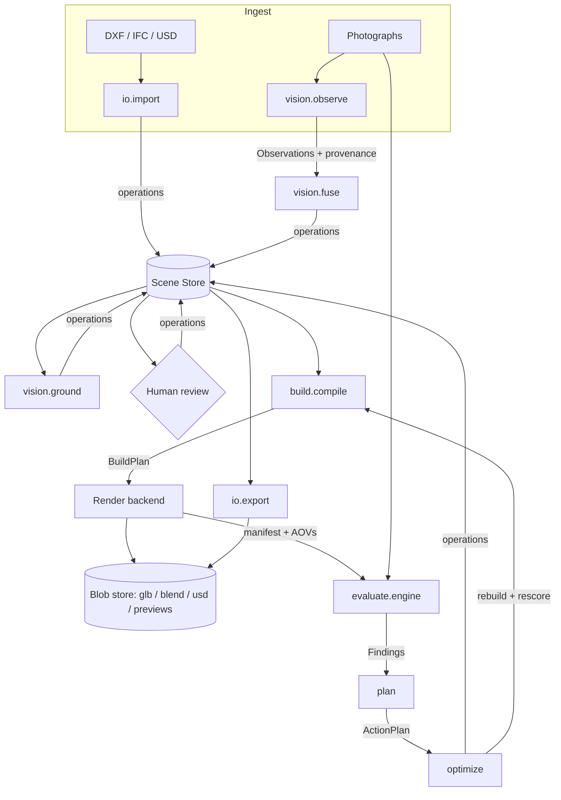
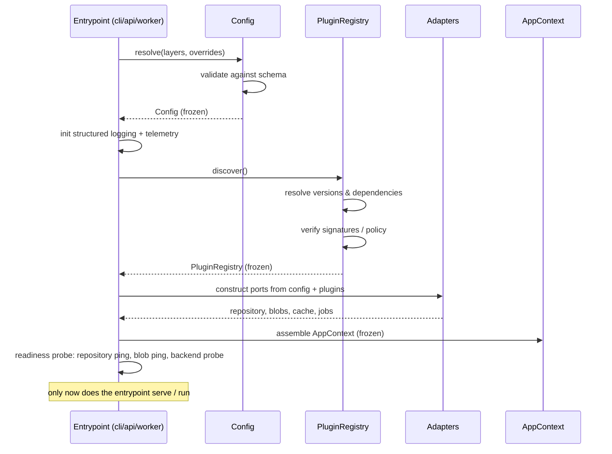
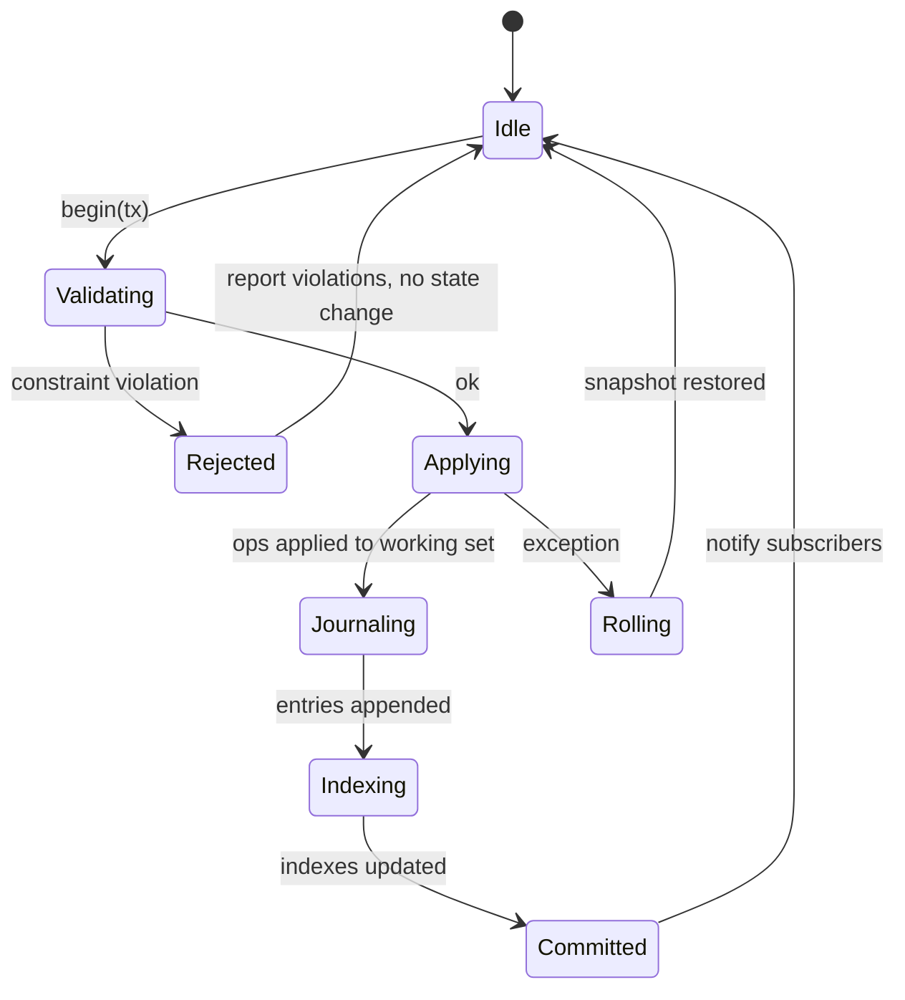
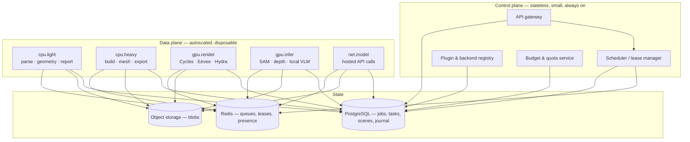
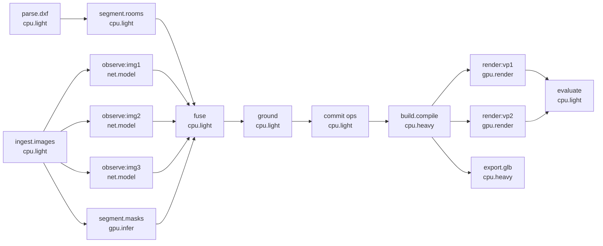
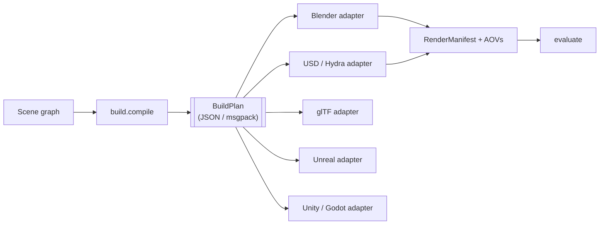
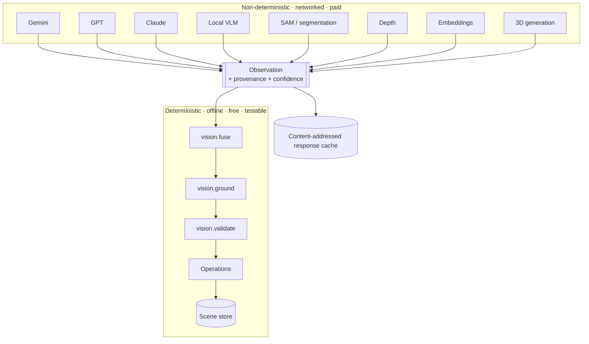

# ArchX3D — Architecture (v2.0 target)

The architecture ArchX3D is being built into. This is a specification, not a
review: where it differs from what is on disk today, the document is right and
the code is behind.

```
                    photographs ──┐
                    DXF / IFC ────┼──► Scene Graph ──► BuildPlan ──► any backend
                    BIM / USD ────┘         │
                                            │
                    evaluation ◄────────────┴────────► plan ──► optimise
                         │                                          │
                         └──────────── measured, not predicted ─────┘
```

**Status.** Target architecture. `ROADMAP.md` says which release delivers which
part. Sections marked **(v1)** describe what exists now and why it must change.

**Audience.** Contributors adding a subsystem, reviewers judging whether a change
belongs where it was put, and anyone who needs to know what ArchX3D refuses to
do and why.

---

## Contents

**Part A — The system**
1. [What ArchX3D is](#1-what-archx3d-is)
2. [v1 as built, and the seven defects](#2-v1-as-built-and-the-seven-defects)
3. [The five theses of v2](#3-the-five-theses-of-v2)

**Part B — Structure**
4. [Layering](#4-layering)
5. [Package hierarchy and module ownership](#5-package-hierarchy-and-module-ownership)
6. [Dependency rules](#6-dependency-rules)
7. [Ports — the complete interface catalogue](#7-ports--the-complete-interface-catalogue)
8. [Distributions and installation profiles](#8-distributions-and-installation-profiles)

**Part C — Behaviour**
9. [Data flow](#9-data-flow)
10. [Lifecycle, initialisation and configuration](#10-lifecycle-initialisation-and-configuration)
11. [Threading, process and worker model](#11-threading-process-and-worker-model)
12. [Error handling](#12-error-handling)
13. [Logging, telemetry and observability](#13-logging-telemetry-and-observability)

**Part D — Infrastructure**
14. [Storage architecture](#14-storage-architecture)
15. [Caching](#15-caching)
16. [Distributed execution](#16-distributed-execution)

**Part E — Boundaries**
17. [Rendering: how the backend becomes irrelevant](#17-rendering-how-the-backend-becomes-irrelevant)
18. [AI: how the model becomes irrelevant](#18-ai-how-the-model-becomes-irrelevant)
19. [Frontend architecture](#19-frontend-architecture)

**Part F — Process**
20. [Testing philosophy](#20-testing-philosophy)
21. [Versioning strategy](#21-versioning-strategy)
22. [Decision log](#22-decision-log)

---

# Part A — The system

## 1. What ArchX3D is

ArchX3D reconstructs a *specific* interior — not a plausible one — from a floor
plan and photographs of it, then measures how far the reconstruction is from the
photographs and closes the loop.

That single sentence contains every constraint that matters:

- **Specific, not plausible.** Rules out generative furnishing as a default
  (`ENGINEERING_PRINCIPLES.md` §2).
- **Measures.** Rules out a pipeline that cannot be scored, and requires
  deterministic renders from known cameras.
- **Closes the loop.** Requires that changes be executable, reversible and
  attributable — which is what forces the operation algebra.

### System context



### Deployment targets

One codebase, five shapes. Each is a *profile* over the same packages
(see [§8](#8-distributions-and-installation-profiles)), not a fork.

| Shape | What runs | Storage | Workers |
| --- | --- | --- | --- |
| **Library** | `archx3d-core` imported into someone else's Python | none | caller's |
| **CLI / desktop headless** | full local pipeline | `.arx` (SQLite) + local blobs | local processes |
| **Desktop app** | Tauri shell + local server | `.arx` + local blobs | local processes |
| **Self-hosted server** | API + workers on one host | Postgres + MinIO | local pool |
| **Cloud SaaS** | control plane + autoscaled fleet | Postgres + S3 + Redis | distributed |

The rule that keeps this honest: **the desktop app and the cloud service run the
same code paths against different port implementations.** A feature that works
only in the cloud is a feature that was built against an infrastructure detail
instead of a port.

---

## 2. v1 as built, and the seven defects

### What v1 is

~41,000 lines of Python across ~70 modules under `modules/`, plus a Next.js
review UI. Six pipeline stages orchestrated by `main.py`, each launched as a
subprocess, each communicating through JSON files in `data/` and `output/`.

```
main.py
  ├─ subprocess ─► modules/dxf_extractor.py     ──► data/geometry.json
  ├─ subprocess ─► modules/scene_analyzer.py    ──► data/scene_graph.json
  │                  └─ modules/vision/*        (observe → fuse → ground → validate)
  ├─ subprocess ─► blender --background modules/blender_generator.py
  │                  └─ modules/blender/*, modules/blender_furniture.py
  │                                             ──► output/model.glb, scene.blend
  │                  └─ modules/render/*        ──► output/preview/**, manifest.json
  ├─ subprocess ─► modules/video_stitcher.py    ──► output/walkthrough.mp4
  ├─ subprocess ─► modules/evaluation/engine.py ──► output/evaluation/**
  └─ subprocess ─► modules/optimizer/pipeline.py──► output/refinement/**
```

**A great deal of v1 is right and is being kept.** The finding-not-score design,
the confidence policy, the three-digest render cache, whole-state rollback, the
closed action vocabulary, injected execution in the optimiser, the scheduler's
batch abstraction, and the documentation standard are all load-bearing good
decisions. v2 preserves their semantics exactly; what changes is where they live
and what they are allowed to touch.

### The seven defects

These are requirements, stated as the problems they solve.

---

#### D1 — Scene graph does not scale

`SceneGraph` is a tree of dataclasses holding Python lists, fully materialised,
fully serialised to one JSON file, with linear-scan lookups:

```python
def object_by_id(self, obj_id):        # modules/vision/schema.py
    for obj in self.objects:            # O(n) per call
        if obj.id == obj_id:
            return obj
```

Called once per object inside `optimizer.mutations`, `vision.validate`,
`review.apply_edits` and the Blender generator, this is O(n²). `validate_graph`
is worse — it rebuilds a set of all object ids inside the loop over objects.

At 40 objects nobody notices. The requirement is **1,000+ rooms and 100,000+
objects**, where:

- one JSON document is ~400 MB and cannot be parsed inside Blender's process;
- every `to_dict()` allocates the entire graph a second time;
- `rollback.take()` deep-copies the whole graph *per action*;
- there is no way to load one storey, one room, or one viewport's frustum.

There is also no **Level** concept at all. `rooms` is a flat list; a second floor
would collide in plan coordinates with the first.

→ [`SCENE_GRAPH_SPEC.md`](SCENE_GRAPH_SPEC.md).

---

#### D2 — Storage is a directory of files

`data/*.json`, `output/**`, `projects/<id>/**`, `.cache/vision/`, `.cache/optimize/`.
No transactions, no concurrent access, no history, no integrity, no query.
`project_api._run_generation` copies files into the repo root because `main.py`
reads fixed paths, and the comment says so: *"Crude, but it avoids reworking the
CLI's path handling for the API."* Two concurrent generations corrupt each other.

→ [§14](#14-storage-architecture).

---

#### D3 — Three mutation paths

| Writer | Mechanism | Validation | Undo | Audit |
| --- | --- | --- | --- | --- |
| `vision.review.apply_edits` | deep-copy, key dispatch | `OVERRIDE_KEYS`, clamps, polygon | replace document | `EditReport` |
| `optimizer.mutations.apply` | in-place, type dispatch | `optimizer.constraints` | whole-graph snapshot | `MutationResult` |
| `web/lib/editor.ts` | immutable doc | client-side clamps | document stack | `countChanges` |

Three vocabularies for one concept. `MIN_DIMENSION` exists in Python *and* in
TypeScript. `locked` is enforced by the optimiser's constraints and by the
editor's UI, but a REST client posting `object_overrides` reaches
`apply_edits`, which checks it separately. Adding a fourth writer —
collaboration, a plugin, a migration — means a fourth implementation.

→ [§7](#7-ports--the-complete-interface-catalogue), [`SCENE_GRAPH_SPEC.md` §6](SCENE_GRAPH_SPEC.md#6-the-operation-algebra).

---

#### D4 — No package structure

No `pyproject.toml`. No `setup.py`. No installable artefact. Imports work
because nine files call `sys.path.insert`:

```
modules/blender_generator.py:56   modules/evaluation/engine.py:48,559
modules/optimizer/pipeline.py:49  modules/project_api.py:346,381,393,433
modules/render/preview.py:617     modules/render/_blender_render.py:49
modules/scene_analyzer.py:27      modules/vision/similarity.py:253
server.py:27                      tests/conftest.py:13
```

Consequences: `pip install archx3d` is impossible; module names are unqualified
(`from vision import assets` — `vision` is a very common top-level name and will
collide); import cycles are undetectable; there is no enforceable dependency
rule, so the stdlib-only constraint on `schema.py` is a comment that CI cannot
check.

→ [§5](#5-package-hierarchy-and-module-ownership), [§6](#6-dependency-rules).

---

#### D5 — No plugin system

Every extension point is a hard-coded dispatch table:
`evaluation.axes` is five modules named in a tuple; `optimizer.mutations.apply`
is a dict literal of eleven handlers; `vision.assets` is a fixed catalogue;
there is one renderer. A third party cannot add an evaluation axis, a material
resolver, an importer or a render backend without forking.

→ [`PLUGIN_SPEC.md`](PLUGIN_SPEC.md).

---

#### D6 — No enterprise architecture

`JobRegistry` is a dict behind a lock; jobs die with the process. Auth does not
exist. Tenancy does not exist. There are no quotas, no audit log, no rate
limits, no RBAC, no encryption boundary, no telemetry beyond `logging.info`. The
docstring is honest about it — *"an in-process registry, not a durable queue"* —
and names `JobRegistry` as the seam a real queue would replace. That seam is
correct and gets used.

→ [§16](#16-distributed-execution), [`API_SPEC.md`](API_SPEC.md).

---

#### D7 — Blender is a hard dependency of the pipeline, not a backend

`BLENDER_EXECUTABLE_PATH` is a module constant in `main.py` pointing at a
Windows path. The generator imports ArchX3D modules *into Blender's Python*,
which is why `vision/schema.py` and `vision/catalog.py` may not import numpy or
PIL — a real constraint enforced only by a docstring. Rendering, material
construction, lighting and export are all expressed in `bpy` calls; there is no
description of the scene that a non-Blender backend could consume.

→ [§17](#17-rendering-how-the-backend-becomes-irrelevant).

---

## 3. The five theses of v2

Everything in Parts B–E follows from these.

### T1 — The scene graph is a database, not a document

Entity–component storage, content-addressed identity, an append-only operation
journal, spatial and semantic indexes, partial loading. A `.arx` file *is* a
SQLite database with the same logical schema the cloud runs on Postgres. This
is what makes offline editing, undo, history, collaboration and streaming one
mechanism instead of five.

### T2 — There is exactly one way to write

A typed, invertible, serialisable **Operation**. Editor, optimiser, plugin,
collaborative peer, migration and CLI all emit the same operations, validated by
the same rules, recorded in the same journal. Undo is journal inversion.
Collaboration is journal reconciliation. Audit is the journal.

### T3 — The backend receives a BuildPlan, not our code

`archx3d.build` compiles a scene graph into a **BuildPlan** — a flat, versioned,
backend-neutral instruction document. Blender, USD/Hydra, glTF, Unreal, Unity
and Godot adapters interpret it. No ArchX3D module is ever imported into
Blender's Python again, which deletes the stdlib-only constraint at its root
rather than policing it.

### T4 — Models produce observations, never graph state

Every model — hosted or local, VLM or segmenter or depth estimator — implements a
provider port and returns **Observations** carrying provenance and confidence. A
deterministic fusion stage turns observations into operations. Swapping Gemini
for Claude for a local VLM changes one adapter and no downstream code, and the
whole system below the fusion boundary stays deterministic and testable without
a network.

### T5 — Execution is a DAG of content-addressed tasks

A task's identity is `H(task_type, input_digest, code_version)`. Outputs are
content-addressed. Therefore retry is free, deduplication is free, distribution
is a scheduling decision rather than a rewrite, and the local process pool and
the thousand-node fleet run the same task definitions.

---

# Part B — Structure

## 4. Layering

Six layers. **Dependencies point downward only.** No exceptions, no "just this
once", enforced in CI.

```
┌──────────────────────────────────────────────────────────────────────────┐
│ L5  ENTRYPOINTS      cli · api · desktop-host · worker-main              │
├──────────────────────────────────────────────────────────────────────────┤
│ L4  ORCHESTRATION    runtime (jobs, tasks, scheduling) · plugins ·       │
│                      persistence adapters · pipelines                    │
├──────────────────────────────────────────────────────────────────────────┤
│ L3  DOMAIN           io · build · render · vision · evaluate · plan ·    │
│                      optimize · assets                                   │
├──────────────────────────────────────────────────────────────────────────┤
│ L2  PORTS            protocol definitions, capability descriptors,       │
│                      DTOs that cross a boundary                          │
├──────────────────────────────────────────────────────────────────────────┤
│ L1  SCENE            model · ops · store · index · query · migrate       │
├──────────────────────────────────────────────────────────────────────────┤
│ L0  CORE             ids · units · errors · result · hashing · config ·  │
│                      logging · provenance · version                      │
└──────────────────────────────────────────────────────────────────────────┘
        L0 and L1 are standard-library only. Enforced, not requested.
```

### Why these boundaries and not others

**L0/L1 stdlib-only** is not asceticism. Three consumers cannot take
dependencies: a generated TypeScript mirror of the schema, a WASM build for the
browser viewport, and — until T3 lands — Blender's bundled interpreter. A
boundary that three real consumers depend on is a boundary.

**L2 exists as its own layer** so that L3 domain packages depend on *protocols*
rather than on each other. `evaluate` needs render output; it depends on
`ports.RenderResult`, not on `render`. This is what allows an evaluation axis to
be unit-tested with a fabricated render manifest and no GPU, which is why the
existing evaluation tests run in milliseconds — v2 generalises that property
instead of achieving it by luck.

**L3 packages are siblings that do not import each other.** `vision` does not
import `build`. `plan` does not import `evaluate`. They exchange L1 documents
and L2 DTOs. When two L3 packages genuinely need to compose, the composition is
a *pipeline* and lives at L4.

**L4 is where the wiring happens** — the only layer that knows which
implementation satisfies which port. Everything below it is written against
interfaces and is therefore substitutable.

**L5 is thin by rule.** An entrypoint parses input, builds a context, calls one
L4 pipeline, formats output. Logic in an entrypoint is logic that the other four
entrypoints cannot use. `main.py` at 511 lines is the counter-example: its
argument handling, config resolution, image discovery and stale-graph policy are
all pipeline concerns trapped in a CLI.

---

## 5. Package hierarchy and module ownership

```
archx3d/
│
├── core/                       # L0 — stdlib only, no I/O beyond os.path
│   ├── ids.py                  # EntityId, ULID/UUIDv7, typed refs, namespacing
│   ├── units.py                # Length/Angle/Temperature; metre-canonical
│   ├── errors.py               # exception hierarchy (§12)
│   ├── result.py               # Measured[T] — the "unmeasured is not zero" type
│   ├── hashing.py              # canonical digests; the one true normaliser
│   ├── clock.py                # HybridLogicalClock, injectable wall clock
│   ├── provenance.py           # Provenance, Source, Confidence, ConfidencePolicy
│   ├── config/                 # layered config resolution, schema, validation
│   ├── logging/                # structured events, context vars, redaction
│   └── version.py              # SCHEMA_/CONTRACT_/API_ version constants
│
├── scene/                      # L1 — stdlib only. The Scene Graph. SPEC: SCENE_GRAPH_SPEC.md
│   ├── model/                  # entity/component definitions, component registry
│   ├── ops/                    # the operation algebra: types, inverse, compose
│   ├── store/                  # Transaction, Journal, Snapshot, Repository port
│   ├── index/                  # id, spatial (BVH/grid), semantic, relationship
│   ├── query/                  # typed query AST + planner
│   └── migrate/                # versioned migration chain
│
├── ports/                      # L2 — Protocols and DTOs only. Zero logic.
│   ├── storage.py  blobs.py  cache.py  telemetry.py  auth.py
│   ├── geometry_io.py  render.py  build.py  assets.py
│   ├── vision.py   segmentation.py  depth.py  embedding.py  generative.py
│   ├── evaluation.py  planning.py  constraints.py
│   └── jobs.py     plugins.py
│
├── io/                         # L3 — import/export. One subpackage per format.
│   ├── dxf/  ifc/  gltf/  usd/  obj/  fbx/  archive/
│
├── build/                      # L3 — SceneGraph → BuildPlan. No bpy, no GPU.
│   ├── plan.py                 # the BuildPlan document
│   ├── walls.py openings.py furniture.py materials.py lighting.py cameras.py
│   └── lod.py                  # level-of-detail policy
│
├── render/                     # L3 — backend-neutral rendering
│   ├── request.py  capabilities.py  manifest.py
│   ├── cache.py                # the three-digest invalidation model (kept)
│   ├── scheduler.py            # batching (kept, generalised)
│   └── backends/               # thin registries; implementations are plugins
│
├── vision/                     # L3 — observations → graph operations
│   ├── observe/                # per-image observation extraction
│   ├── fuse/                   # deterministic multi-observation fusion
│   ├── ground/                 # camera fitting, back-projection, placement
│   ├── segment/  rooms/  relations/  validate/
│   └── prompts/                # versioned prompt assets, hashed
│
├── evaluate/                   # L3 — measurement only. Never writes a graph.
│   ├── engine.py  schema.py  scoring.py  imaging.py  projection.py  report.py
│   └── axes/                   # built-in axes; third-party axes are plugins
│
├── plan/                       # L3 — findings → ranked, ordered ActionPlan
├── optimize/                   # L3 — execute a plan, keep what measurably helps
├── assets/                     # L3 — catalogue, matching, retrieval, procedural
│
├── plugins/                    # L4 — discovery, registry, resolution, sandbox
├── runtime/                    # L4 — Job/Task DAG, queues, workers, leases, budgets
├── persistence/                # L4 — sqlite/, postgres/, objectstore/, redis/
├── pipelines/                  # L4 — the named compositions (analyse, generate, refine)
│
├── api/                        # L5 — REST, GraphQL, WebSocket, SSE
├── cli/                        # L5 — the `archx3d` command
└── worker/                     # L5 — worker process entrypoint
```

### Ownership

Every package has an owning team and a `CODEOWNERS` entry. "Owner" means:
reviews changes, owns the public interface, owns the docs, answers questions.

| Package | Owner | Public interface | Docs of record |
| --- | --- | --- | --- |
| `core` | Platform | frozen after 2.0; changes need an ADR | `DESIGN_GUIDELINES.md` |
| `scene` | Platform | `SCENE_GRAPH_SPEC.md` is normative | `SCENE_GRAPH_SPEC.md` |
| `ports` | Platform | every symbol is public and versioned | `PLUGIN_SPEC.md` |
| `io` | Interop | per-format capability matrix | `docs/io/<format>.md` |
| `build`, `render` | Graphics | `BuildPlan` schema, `RenderCapabilities` | this doc §17 |
| `vision` | Perception | provider ports, `Observation` schema | `VISION_PIPELINE.md`, `MULTI_IMAGE.md` |
| `registration` | Perception | `PlanTransform`, `RegistrationResult` | `REGISTRATION.md` |
| `evaluate` | Research | `Finding`, `AxisScore`, axis protocol | `EVALUATION.md` |
| `plan`, `optimize` | Research | `Action`, `ActionType`, constraints | `REFINEMENT.md` |
| `assets` | Content | catalogue schema, matching contract | `FIDELITY.md`, `APPEARANCE.md` |
| `plugins` | Platform | `CONTRACT_VERSION` | `PLUGIN_SPEC.md` |
| `runtime`, `persistence` | Infrastructure | job/task schema, repository port | this doc §14–16 |
| `api` | Product | OpenAPI + GraphQL SDL are generated and versioned | `API_SPEC.md` |
| `cli` | Product | `--help` output is a tested artefact | `docs/cli.md` |
| `web/` | Product | — | this doc §19 |

A package with no owner is deleted or adopted within one release. Unowned code
is how a codebase acquires two of everything.

---

## 6. Dependency rules

### The matrix

Read as: *may a package in the row import a package in the column?*

| ↓ imports → | core | scene | ports | io | build | render | vision | evaluate | plan | optimize | assets | plugins | runtime | persistence | pipelines | api/cli/worker |
| --- | --- | --- | --- | --- | --- | --- | --- | --- | --- | --- | --- | --- | --- | --- | --- | --- |
| **core** | — | ✗ | ✗ | ✗ | ✗ | ✗ | ✗ | ✗ | ✗ | ✗ | ✗ | ✗ | ✗ | ✗ | ✗ | ✗ |
| **scene** | ✓ | — | ✗ | ✗ | ✗ | ✗ | ✗ | ✗ | ✗ | ✗ | ✗ | ✗ | ✗ | ✗ | ✗ | ✗ |
| **ports** | ✓ | ✓ | — | ✗ | ✗ | ✗ | ✗ | ✗ | ✗ | ✗ | ✗ | ✗ | ✗ | ✗ | ✗ | ✗ |
| **io** | ✓ | ✓ | ✓ | — | ✗ | ✗ | ✗ | ✗ | ✗ | ✗ | ✗ | ✗ | ✗ | ✗ | ✗ | ✗ |
| **build** | ✓ | ✓ | ✓ | ✗ | — | ✗ | ✗ | ✗ | ✗ | ✗ | ✓ | ✗ | ✗ | ✗ | ✗ | ✗ |
| **render** | ✓ | ✓ | ✓ | ✗ | ✓ | — | ✗ | ✗ | ✗ | ✗ | ✗ | ✗ | ✗ | ✗ | ✗ | ✗ |
| **vision** | ✓ | ✓ | ✓ | ✗ | ✗ | ✗ | — | ✗ | ✗ | ✗ | ✓ | ✗ | ✗ | ✗ | ✗ | ✗ |
| **evaluate** | ✓ | ✓ | ✓ | ✗ | ✗ | ✗ | ✗ | — | ✗ | ✗ | ✗ | ✗ | ✗ | ✗ | ✗ | ✗ |
| **plan** | ✓ | ✓ | ✓ | ✗ | ✗ | ✗ | ✗ | ✓* | — | ✗ | ✓ | ✗ | ✗ | ✗ | ✗ | ✗ |
| **optimize** | ✓ | ✓ | ✓ | ✗ | ✗ | ✗ | ✗ | ✗ | ✓ | — | ✗ | ✗ | ✗ | ✗ | ✗ | ✗ |
| **assets** | ✓ | ✓ | ✓ | ✗ | ✗ | ✗ | ✗ | ✗ | ✗ | ✗ | — | ✗ | ✗ | ✗ | ✗ | ✗ |
| **plugins** | ✓ | ✓ | ✓ | ✗ | ✗ | ✗ | ✗ | ✗ | ✗ | ✗ | ✗ | — | ✗ | ✗ | ✗ | ✗ |
| **runtime** | ✓ | ✓ | ✓ | ✗ | ✗ | ✗ | ✗ | ✗ | ✗ | ✗ | ✗ | ✓ | — | ✗ | ✗ | ✗ |
| **persistence** | ✓ | ✓ | ✓ | ✗ | ✗ | ✗ | ✗ | ✗ | ✗ | ✗ | ✗ | ✗ | ✗ | — | ✗ | ✗ |
| **pipelines** | ✓ | ✓ | ✓ | ✓ | ✓ | ✓ | ✓ | ✓ | ✓ | ✓ | ✓ | ✓ | ✓ | ✓ | — | ✗ |
| **api/cli/worker** | ✓ | ✓ | ✓ | ✗ | ✗ | ✗ | ✗ | ✗ | ✗ | ✗ | ✗ | ✓ | ✓ | ✓ | ✓ | — |

`evaluate` in the `plan` row is starred: `plan` imports **only** `evaluate.schema`
(the `Finding` vocabulary), never the engine. Enforced as a module-level rule.

### Forbidden imports — the explicit list

These are the ones that will be attempted. Each has a reason and a replacement.

| Forbidden | Why | Instead |
| --- | --- | --- |
| anything → `bpy` outside `archx3d-blender` | Blender is a backend, not a dependency | emit a `BuildPlan` |
| `core`/`scene` → any third party | three consumers cannot take deps (§4) | stdlib, or move the code up a layer |
| `core`/`scene` → `numpy` | same, and it forces a 60 MB wheel on a schema user | plain floats; vectorised code lives in L3 |
| `scene` → `ports` | inverts L1/L2 | the port defines a protocol *over* scene types |
| any L3 → any other L3 | sibling coupling; makes both untestable alone | exchange L1 documents / L2 DTOs, compose at L4 |
| `evaluate` → `scene.store` | the engine must not be able to write | it receives an immutable view |
| `evaluate` → `plan`/`optimize` | measurement must not know about remedies | findings name a `Subsystem` string |
| `optimize` → `render`/`build` | the loop's execution is injected — this is why its tests run in milliseconds | `ports.Executor` |
| `vision` → `evaluate` | would let detection tune itself to the metric | never |
| domain → `persistence` | binds domain to a driver | `ports.SceneRepository` |
| domain → `runtime` | binds domain to a scheduler | return a task description |
| `api` → domain (L3) directly | skips the pipeline layer, duplicates orchestration | call `pipelines` |
| anything → `requests`/`httpx` outside adapters | untracked network access | a provider port |
| test → private symbols across packages | freezes internals | test the public interface |

### Enforcement

Not a review convention — a build failure. `pyproject.toml`:

```toml
[tool.importlinter]
root_packages = ["archx3d"]

[[tool.importlinter.contracts]]
name = "Layers point downward"
type = "layers"
layers = [
  "archx3d.api | archx3d.cli | archx3d.worker",
  "archx3d.pipelines",
  "archx3d.runtime | archx3d.persistence | archx3d.plugins",
  "archx3d.io | archx3d.build | archx3d.render | archx3d.vision | archx3d.evaluate | archx3d.plan | archx3d.optimize | archx3d.assets",
  "archx3d.ports",
  "archx3d.scene",
  "archx3d.core",
]

[[tool.importlinter.contracts]]
name = "Domain packages are independent siblings"
type = "independence"
modules = [
  "archx3d.io", "archx3d.build", "archx3d.render", "archx3d.vision",
  "archx3d.evaluate", "archx3d.assets",
]

[[tool.importlinter.contracts]]
name = "core and scene are standard library only"
type = "forbidden"
source_modules = ["archx3d.core", "archx3d.scene"]
forbidden_modules = ["numpy", "PIL", "bpy", "httpx", "requests", "pydantic", "sqlalchemy"]

[[tool.importlinter.contracts]]
name = "evaluate cannot write"
type = "forbidden"
source_modules = ["archx3d.evaluate"]
forbidden_modules = ["archx3d.scene.store", "archx3d.scene.ops", "archx3d.plan", "archx3d.optimize"]

[[tool.importlinter.contracts]]
name = "optimize does not know how execution happens"
type = "forbidden"
source_modules = ["archx3d.optimize"]
forbidden_modules = ["archx3d.render", "archx3d.build", "archx3d.runtime"]
```

Plus a test that asserts no `sys.path` mutation exists anywhere in the source
tree. All nine current sites are deleted by packaging; the test stops them
coming back.

### Cycle policy

Zero import cycles, including within a package. `import-linter` fails the build.
The two legitimate-looking cases and their resolutions:

- **Mutual type references** (`Room` ↔ `Object`): use `EntityId`, not object
  references. The scene graph is a store; entities reference each other by id.
  This is required by [T1](#t1--the-scene-graph-is-a-database-not-a-document)
  anyway.
- **Dispatch tables** (`mutations.apply` importing `ActionType`): resolved by the
  registry pattern — handlers register themselves with the L2 port; nobody
  imports the dispatcher.

Deferred imports inside functions to break a cycle are **forbidden**. v1 has
several (`from planner.action_graph import ActionType` inside `mutations.apply`,
`from vision import assets` inside `_asset`), and they hide the cycle from
tooling rather than removing it.

---

## 7. Ports — the complete interface catalogue

Every port lives in `archx3d.ports`, is a `typing.Protocol`, is versioned, and is
the only thing L3 domain code depends on. Implementations live in L4 adapters or
in plugins.

The following is the complete set for v2.0. A subsystem that needs a new kind of
collaborator adds a port here — it does not import a concrete class.

### Scene and storage

```python
class SceneRepository(Protocol):
    """Load, commit and history for one scene document."""
    def open(self, scene_id: SceneId, *, mode: OpenMode) -> SceneHandle: ...
    def commit(self, handle: SceneHandle, tx: Transaction) -> CommitId: ...
    def journal(self, scene_id: SceneId, since: CommitId | None) -> Iterator[JournalEntry]: ...
    def snapshot(self, scene_id: SceneId, at: CommitId | None) -> SnapshotRef: ...
    def checkout(self, scene_id: SceneId, at: CommitId) -> SceneHandle: ...

class BlobStore(Protocol):
    """Content-addressed bytes. The only place large artefacts live."""
    def put(self, data: bytes | IO[bytes], *, media_type: str) -> BlobRef: ...
    def get(self, ref: BlobRef) -> IO[bytes]: ...
    def presign(self, ref: BlobRef, *, expires_s: int, method: str) -> str: ...
    def exists(self, ref: BlobRef) -> bool: ...

class CacheBackend(Protocol):
    def get(self, key: CacheKey) -> bytes | None: ...
    def put(self, key: CacheKey, value: bytes, *, ttl_s: int | None) -> None: ...
    def invalidate(self, prefix: str) -> int: ...
```

### Geometry interchange

```python
class GeometryImporter(Protocol):
    format: ClassVar[str]                       # "dxf" | "ifc" | "gltf" | "usd"
    capabilities: ClassVar[ImportCapabilities]
    def probe(self, source: IO[bytes]) -> ProbeResult: ...
    def import_(self, source: IO[bytes], opts: ImportOptions) -> ImportResult: ...
        # ImportResult carries operations, not a graph — see T2.

class GeometryExporter(Protocol):
    format: ClassVar[str]
    capabilities: ClassVar[ExportCapabilities]
    def export(self, scene: SceneView, opts: ExportOptions) -> BlobRef: ...
```

### Build and render

```python
class SceneBuilder(Protocol):
    """SceneGraph → BuildPlan. Pure, deterministic, no backend knowledge."""
    def compile(self, scene: SceneView, opts: BuildOptions) -> BuildPlan: ...

class RenderBackend(Protocol):
    id: ClassVar[str]                           # "blender.cycles", "hydra.storm"
    def capabilities(self) -> RenderCapabilities: ...
    def prepare(self, plan: BuildPlan, ctx: RenderContext) -> PreparedScene: ...
    def render(self, scene: PreparedScene, reqs: Sequence[RenderRequest]) -> Sequence[RenderResult]: ...
    def release(self, scene: PreparedScene) -> None: ...

class RenderScheduler(Protocol):
    def plan(self, tasks: Sequence[RenderTask], budget: RenderBudget) -> Sequence[RenderBatch]: ...
    def run(self, batches: Sequence[RenderBatch], executor: BatchExecutor) -> Sequence[RenderOutcome]: ...
```

### Perception

```python
class VisionProvider(Protocol):
    """A model that describes an image. Returns observations, never graph state."""
    id: ClassVar[str]
    def capabilities(self) -> ModelCapabilities: ...
    def observe(self, req: ObservationRequest) -> ObservationResponse: ...

class SegmentationProvider(Protocol):
    def segment(self, image: ImageRef, prompts: SegmentPrompts) -> Sequence[Mask]: ...

class DepthProvider(Protocol):
    def depth(self, image: ImageRef, opts: DepthOptions) -> DepthMap: ...

class EmbeddingProvider(Protocol):
    def embed(self, items: Sequence[Embeddable]) -> Sequence[Vector]: ...

class GenerativeProvider(Protocol):
    """3D/asset/texture generation. Output is always marked `generated`."""
    def generate(self, req: GenerationRequest) -> GenerationResult: ...
```

### Assets and appearance

```python
class AssetProvider(Protocol):
    def search(self, q: AssetQuery, k: int) -> Sequence[AssetCandidate]: ...
    def resolve(self, key: AssetKey) -> AssetDefinition: ...

class MaterialResolver(Protocol):
    def resolve(self, spec: MaterialSpec, ctx: AppearanceContext) -> MaterialDefinition: ...

class LightingSolver(Protocol):
    def solve(self, room: RoomView, env: LightingEnvironment) -> LightingRig: ...
```

### Analysis

```python
class EvaluationAxis(Protocol):
    axis: ClassVar[str]
    requires: ClassVar[frozenset[str]]          # AOVs / inputs it needs
    def evaluate(self, ctx: AxisContext) -> AxisOutcome: ...   # score + findings

class ActionRule(Protocol):
    """Findings → candidate actions. The planner's extension point."""
    rule_id: ClassVar[str]
    handles: ClassVar[frozenset[str]]           # Subsystem names
    def propose(self, findings: Sequence[Finding], ctx: PlanContext) -> Sequence[Action]: ...

class ConstraintRule(Protocol):
    """An invariant checked before and after every operation batch."""
    rule_id: ClassVar[str]
    def check(self, before: SceneView, after: SceneView, tx: Transaction) -> Sequence[Violation]: ...
```

### Infrastructure

```python
class JobQueue(Protocol):
    def submit(self, job: JobSpec) -> JobId: ...
    def claim(self, classes: Sequence[WorkerClass], lease_s: int) -> TaskLease | None: ...
    def heartbeat(self, lease: TaskLease) -> None: ...
    def complete(self, lease: TaskLease, result: TaskResult) -> None: ...
    def fail(self, lease: TaskLease, error: TaskError) -> None: ...

class TelemetrySink(Protocol):
    def event(self, e: Event) -> None: ...
    def metric(self, m: Metric) -> None: ...
    def span(self, name: str, **attrs) -> ContextManager[Span]: ...

class AuthProvider(Protocol):
    def authenticate(self, credential: Credential) -> Principal: ...
    def authorize(self, principal: Principal, action: str, resource: ResourceRef) -> Decision: ...

class PluginHost(Protocol):
    def discover(self) -> Sequence[PluginManifest]: ...
    def load(self, manifest: PluginManifest, policy: SandboxPolicy) -> LoadedPlugin: ...
    def unload(self, plugin: LoadedPlugin) -> None: ...
```

**Twenty-two ports.** That is the whole extension surface of ArchX3D, and
`PLUGIN_SPEC.md` says which of them third parties may implement.

---

## 8. Distributions and installation profiles

One repository, several wheels. A user installs what they need.

| Distribution | Contains | Dependencies | Size target |
| --- | --- | --- | --- |
| `archx3d-core` | `core`, `scene`, `ports` | none | < 1 MB |
| `archx3d` | + `io`, `build`, `render`, `vision`, `evaluate`, `plan`, `optimize`, `assets`, `plugins`, `pipelines`, `cli` | `numpy`, `Pillow`, `ezdxf` | < 20 MB |
| `archx3d-blender` | BuildPlan interpreter, render adapter | none *(runs inside Blender)* | < 500 KB |
| `archx3d-server` | `api`, `runtime`, `persistence` | `fastapi`, `psycopg`, `boto3`, `redis` | — |
| `archx3d-worker` | worker entrypoint, task registry | profile-dependent | — |
| `@archx3d/schema` (npm) | generated TS types + op builders | none | < 200 KB |
| `@archx3d/client` (npm) | REST/WS client, op transport | — | — |

Optional extras on `archx3d`: `[ifc]`, `[usd]`, `[torch]`, `[gemini]`, `[openai]`,
`[anthropic]`, `[local-vlm]`. **No model SDK is a hard dependency.** A default
install can reconstruct a shell, evaluate it and refine it with no network and no
API key — which is also what makes CI cheap and hermetic.

`archx3d-blender` having **zero dependencies and containing none of our domain
code** is thesis T3 made physical. It is a BuildPlan interpreter, nothing more.

---

# Part C — Behaviour

## 9. Data flow

### The end-to-end path



### The four invariants of this diagram

1. **Every arrow into the store is an operation.** Nothing writes fields.
2. **`evaluate` has no arrow out of it into the store.** It measures. The only
   thing it produces is findings, and only `plan` reads them.
3. **`optimize` closes the loop through `build` and `evaluate`,** not around
   them. That is what "measure, do not predict" looks like as a data flow.
4. **The model boundary is `vision.observe` → `vision.fuse`.** Above it,
   non-determinism and network. Below it, pure functions. Everything in the
   diagram below that line is reproducible from a fixture.

### Documents that cross boundaries

| Document | Producer | Consumers | Versioned by | Stability |
| --- | --- | --- | --- | --- |
| `Operation` | every writer | store, journal, sync | `OPS_VERSION` | **Frozen** — journals are permanent |
| `SceneView` | store | all readers | `SCHEMA_VERSION` | Additive only |
| `Observation` | providers | `vision.fuse` | `OBS_VERSION` | Additive; replay fixtures pinned |
| `BuildPlan` | `build` | render backends | `BUILDPLAN_VERSION` | **Frozen** within a major |
| `RenderManifest` | render | `evaluate` | `MANIFEST_VERSION` | Additive |
| `Finding` | `evaluate` | `plan`, reports | `EVAL_VERSION` | Additive |
| `ActionPlan` | `plan` | `optimize`, reports | `PLAN_VERSION` | Additive |
| `TaskSpec` | pipelines | runtime, workers | `TASK_VERSION` | Additive |

Frozen means: a v2.x reader must read every v2.y document. The journal is
permanent data — an operation type that shipped can never change meaning, only
be deprecated and superseded. See [§21](#21-versioning-strategy).

---

## 10. Lifecycle, initialisation and configuration

### The application context

Nothing is a module-level global. Every runnable assembles an `AppContext`
explicitly, and everything below L4 receives what it needs as a parameter.

```python
@dataclass(frozen=True)
class AppContext:
    config:     Config
    logger:     Logger
    telemetry:  TelemetrySink
    clock:      Clock
    repository: SceneRepository
    blobs:      BlobStore
    cache:      CacheBackend
    jobs:       JobQueue
    plugins:    PluginRegistry
    principal:  Principal | None
```

**Why a context object rather than module globals or a DI framework.** Globals
make tests order-dependent and make two tenants in one process impossible — the
latter is not hypothetical, it is what a cloud worker does. A DI framework buys
nothing at this size and costs a layer of magic in stack traces. An explicit
frozen record is greppable, typed, and trivially substituted in a test.

`main.py`'s module-level `BLENDER_EXECUTABLE_PATH`, `BASE_DIR`, `DATA_DIR`,
`OUTPUT_DIR`, `CONFIG_PATH` and the module-level `logging.basicConfig` are all
instances of the thing this replaces. `blender_generator.py` reading
`ARCHX3D_BASE_DIR` from the environment to avoid clobbering the project's
directories is the same problem solved with an environment variable; the context
solves it structurally.

### Startup sequence



Five ordering rules, each learned from a real failure mode:

1. **Config before logging** — logging configuration is config.
2. **Logging before plugins** — plugin load failures must be observable.
3. **Plugins before adapters** — a plugin may *be* an adapter.
4. **Everything before readiness** — a process that accepts work before its
   repository is reachable produces failed jobs instead of a failed deploy.
5. **The context is frozen at assembly.** No component reconfigures another at
   runtime. Reload means build a new context and swap it.

### Shutdown

```
SIGTERM → stop accepting new work
        → release task leases (so another worker claims them immediately)
        → finish or checkpoint in-flight tasks, up to grace period
        → flush telemetry
        → close repository, blob and cache handles
        → exit 0
```

A worker killed mid-task must never lose the work: leases expire and the task is
re-claimed. Because tasks are idempotent and content-addressed
([T5](#t5--execution-is-a-dag-of-content-addressed-tasks)), re-execution is
correct, not merely tolerated.

### Configuration

Five layers, later wins:

```
1. built-in defaults          (in code, typed, the only complete set)
2. system config              /etc/archx3d/config.toml
3. user config                ~/.config/archx3d/config.toml
4. project config             <project>/archx3d.toml
5. environment                ARCHX3D__RENDER__ENGINE=cycles
6. explicit overrides         CLI flags, API request fields
```

Rules:

- **One schema, validated at startup.** Unknown keys are an error, not a warning
  — a typo'd key that silently does nothing is how a user spends a day.
- **No `{**defaults, **user}`.** `main.py:load_config` does a shallow merge, so a
  user supplying `{"vision": {"model": "x"}}` silently loses `cache`,
  `cache_dir`, `max_images` and every other vision default. Merging is deep and
  per-key, and the resolved config records which layer each value came from.
- **Secrets are not config.** API keys resolve through a `SecretProvider` (env,
  keyring, cloud secret manager) and never appear in a resolved config dump, a
  log line, a job record, or a cache key.
- **The resolved config is part of a run's provenance.** Its digest goes into
  render cache keys, so changing `preview.samples` invalidates exactly what it
  should. This is already how `render.cache` folds settings into its digest.
- **Effective config is inspectable**: `archx3d config show --explain` prints
  every value with its source layer.

---

## 11. Threading, process and worker model

### The rules

| Work | Mechanism | Why |
| --- | --- | --- |
| API request handling | asyncio, single thread per process | I/O bound; no CPU work at the edge |
| Scene mutation | **one writer per scene document**, serialised | see below |
| Scene reads | any number, lock-free, MVCC snapshots | readers never block writers |
| CPU-bound domain work | separate process | the GIL; and isolation from crashes |
| Blender / renderer | separate process, always | it segfaults, leaks, and calls `sys.exit` |
| Model calls | async I/O with bounded concurrency | network bound; concurrency is a cost control |
| Background jobs | task queue + worker processes | must survive process restart |

### Single-writer-per-document

The one concurrency rule that everything else depends on.

Every scene document has exactly one logical writer at a time. Concurrent edits
are *serialised into* that writer as operation batches, not applied in parallel.
Reads run against MVCC snapshots and never block.

**Why not fine-grained locking.** A scene mutation is not a field write; it is a
transaction with cross-entity invariants — moving an object cascades to what
rests on it, deleting one deletes its dependents, a relationship constrains two
entities at once. Fine-grained locks over that produce either deadlock or
inconsistent intermediate states that a validator would reject. Serialising is
simpler, is fast enough (an operation batch is microseconds; the render it
triggers is seconds), and it gives a total order on the journal for free — which
is exactly what undo, history and collaborative sync all require.

**Why not optimistic concurrency alone.** Used *in addition*: a commit carries
the base `CommitId` and is rejected if the document has moved. Collaboration then
rebases the rejected operations. But the apply itself is still serialised —
optimistic control decides *whether* to apply, not *how*.



### Process topology

```
Local / desktop                      Cloud
───────────────                      ─────
archx3d-desktop (Tauri)              api-gateway  (N replicas, asyncio)
  └─ localhost server (asyncio)      scheduler    (leader-elected)
       ├─ scene actor (1 thread)     scene-service(sharded by scene_id)
       ├─ worker pool (N procs)      workers:
       │    ├─ cpu.light                  cpu.light   (autoscale, spot)
       │    ├─ cpu.heavy                  cpu.heavy   (autoscale, spot)
       │    └─ gpu.render ──► blender     gpu.render  (autoscale, spot+checkpoint)
       └─ blob store (filesystem)         gpu.infer   (autoscale, on-demand)
                                          net.model   (high concurrency, tiny)
```

The desktop and cloud topologies differ in *deployment*, not in code: the same
`JobQueue` port is backed by an in-process queue locally and Postgres+Redis in
the cloud.

### What v1 does and why it changes

`project_api.start_analysis` spawns `threading.Thread(daemon=True)` and returns.
The docstring is candid that this is in-process and lost on restart. Three
concrete failures follow: a server restart during a 20-minute analysis loses it
with no record; two concurrent generations both `shutil.copy2` into the shared
repo `data/` directory and race; and there is no way to run a second API replica.

`JobRegistry` is the named seam and it is the right one. v2 keeps the interface
shape and replaces the implementation with `ports.JobQueue`.

---

## 12. Error handling

### The hierarchy

```python
ArchX3DError                       # never raised directly
├── UserError                      # the caller can fix it → 4xx, actionable message
│   ├── ValidationError            #   input failed schema/constraint
│   ├── NotFoundError
│   ├── ConflictError              #   concurrent modification, version mismatch
│   ├── QuotaError                 #   budget/limit exceeded
│   └── UnsupportedError           #   capability the backend does not have
├── DataError                      # the input is real but malformed/degenerate
│   ├── ParseError                 #   with byte offset / entity handle
│   ├── GeometryError              #   self-intersecting, non-manifold, degenerate
│   └── SchemaMigrationError
├── BackendError                   # an external dependency failed → retryable
│   ├── RenderBackendError
│   ├── ModelProviderError         #   with a `retryable` flag and retry-after
│   ├── StorageError
│   └── TimeoutError
├── PluginError                    # a plugin misbehaved → isolate and disable
│   ├── PluginLoadError
│   ├── PluginContractError        #   returned something the port forbids
│   └── PluginSandboxError
└── InternalError                  # a bug. Never caught, always reported.
```

### Rules

1. **Never raise a bare `Exception`, never catch one** except at a designated
   stage boundary (`ENGINEERING_PRINCIPLES.md` §8). The boundary is marked with
   a decorator so it is greppable:

   ```python
   @stage_boundary("vision", degradable=True)
   def analyse(ctx, request): ...
   ```

2. **Every error carries structured context**, not a formatted string:

   ```python
   raise GeometryError(
       "wall segment is degenerate",
       entity=wall_id, length_m=1.4e-9, source="dxf:LINE#4A2F",
       remedy="check the DXF unit scale; 1e-9 m suggests a unit mismatch",
   )
   ```

   The message is for a human, the fields are for a machine, and `remedy` is
   there because the evaluation engine already proved that naming the fix is
   what makes a diagnostic useful.

3. **Retryability is declared, not guessed.** `BackendError.retryable` and
   `retry_after_s` are set by the code that knows. The scheduler never inspects
   an error message to decide whether to retry.

4. **Degradation is a terminal state, not a log line.** A degraded stage records
   `StageOutcome(status="degraded", reason=..., missing=[...])` into the run's
   diagnostics. The job's final status is `COMPLETED_WITH_DEGRADATION`, distinct
   from `COMPLETED`, and the API surfaces it. v1's `critical=False` steps log a
   warning and the run reports success — a user cannot tell from the outcome that
   vision never ran.

5. **Partial results are explicit.** An operation over many entities returns
   `BatchResult(succeeded=[...], failed=[(id, error), ...])`. It does not raise
   on the first failure and it does not silently skip.

6. **Errors crossing the API boundary are mapped once**, in one place, to RFC
   9457 problem documents. Domain code never constructs an HTTP status.

7. **`InternalError` is never caught.** It fails the task, is reported with a
   stack trace and a correlation id, and pages someone. Catching it converts a
   bug into corrupt data.

### Failure isolation boundaries

| Boundary | Blast radius | Behaviour |
| --- | --- | --- |
| Plugin call | that plugin | disabled for the run; recorded; the run continues without it |
| Render batch | that batch | remaining batches still run; every task in the batch gets an outcome carrying the error (v1's `render.scheduler` already does exactly this) |
| Task | that task | retried by class policy; then poisoned |
| Job | that job | other jobs unaffected |
| Scene transaction | that transaction | snapshot restored; document unchanged |
| Worker process | its in-flight tasks | leases expire, tasks re-claimed |
| Model provider | calls to that provider | fall back to the configured fallback model, recorded in provenance |

---

## 13. Logging, telemetry and observability

### Structured events only

No `print`. No `logging.info(f"...")` with data interpolated into prose. One
event per fact, with fields:

```python
log.event("render.completed",
          viewpoint=vp.id, room=room.id, backend="blender.eevee",
          duration_ms=241, cache_hit=False, samples=16, aovs=["albedo", "depth"])
```

Rationale beyond taste: the render pipeline's whole value proposition is that a
cached pass costs milliseconds. Proving that in production requires
`cache_hit` as a field you can aggregate, not a word inside a sentence.

`print()` is permitted in exactly two places: the CLI's own user-facing output
(which is a UI, not a log) and the Blender-side adapter (which has no logger and
communicates over stdout by design — v1's `[VISION]`-prefixed line protocol,
formalised into NDJSON).

### Correlation

Every event carries, via context variables set once at the boundary:
`trace_id`, `span_id`, `run_id`, `job_id`, `task_id`, `scene_id`, `commit_id`,
`tenant_id`, `principal_id`, `plugin_id` (when inside a plugin call).

Given any render in the blob store, you can recover the commit that produced it,
the job that scheduled it, the user who triggered it, and the evaluation that
scored it. This is the operational form of principle 4.

### The three signals

| Signal | Backend | Retention | Purpose |
| --- | --- | --- | --- |
| **Logs** | NDJSON → OTLP → Loki/CloudWatch | 30 d hot, 1 y cold | debugging a specific run |
| **Metrics** | OpenTelemetry → Prometheus | 15 mo | SLOs, autoscaling, cost |
| **Traces** | OpenTelemetry → Tempo/Jaeger | 7 d, tail-sampled | latency attribution across the DAG |

Plus a fourth that is specific to this system:

| **Run records** | Postgres + object storage | forever | reproducibility |

A run record is the complete provenance of one reconstruction: input digests,
config digest, code version, plugin set with versions, model ids and prompt
versions, every commit, every render manifest, every evaluation. It is what makes
a published benchmark number defensible three years later, and it is a product
feature as much as an engineering one.

### The metrics that matter

Named explicitly because a metric nobody named is a metric nobody has.

```
archx3d_job_duration_seconds{kind,status}            histogram
archx3d_task_duration_seconds{class,type,status}     histogram
archx3d_render_seconds{backend,engine,cache_hit}     histogram
archx3d_render_cache_ratio{scope}                    gauge
archx3d_model_tokens_total{provider,model,kind}      counter
archx3d_model_cost_usd_total{provider,tenant}        counter
archx3d_scene_entities{scene,kind}                   gauge
archx3d_commit_latency_seconds{ops_bucket}           histogram
archx3d_queue_depth{class}                           gauge
archx3d_worker_utilisation{class}                    gauge
archx3d_evaluation_score{axis,measured}              histogram
archx3d_degraded_stages_total{stage,reason}          counter
archx3d_plugin_errors_total{plugin,kind}             counter
```

The last three are the unusual ones and the most valuable: score distribution
tells you whether a model change helped across the whole corpus rather than on
one demo; degradation counts tell you what is quietly not running in production;
plugin errors tell you which third party to talk to.

### Privacy

Floor plans and interior photographs are sensitive. Rules:

- Image bytes, DXF contents and model prompts **never** appear in logs.
- Blob references and digests appear; contents do not.
- Free-text model output is redacted from logs at the sink, on by default.
- Telemetry that leaves the customer's boundary is opt-in, aggregate-only, and
  documented field-by-field in `docs/TELEMETRY.md`.
- Self-hosted deployments default to telemetry **off**.

---

# Part D — Infrastructure

## 14. Storage architecture

### The decision

| Technology | Role | Verdict |
| --- | --- | --- |
| **SQLite** | canonical single-user document format (`.arx`), local journal, local cache index | **Adopt** — primary embedded store |
| **PostgreSQL** | multi-tenant system of record: scenes, journals, jobs, users, plugins | **Adopt** — primary server store |
| **Object storage** (S3/R2/MinIO/filesystem) | all blobs: source files, meshes, textures, renders, exports | **Adopt** — the only place bytes live |
| **Redis** | queues, leases, presence, rate limits, pub/sub fan-out | **Adopt** — ephemeral only, never authoritative |
| **pgvector** | asset, material and style retrieval embeddings | **Adopt** — inside Postgres, not a separate service |
| **DuckDB** | analytics over exported journals, evaluations, benchmarks | **Adopt** — read-only, offline, research and product analytics |
| **Dedicated vector DB** (Qdrant/LanceDB/Milvus) | large external catalogues | **Defer** — behind `AssetProvider`; adopt when a catalogue exceeds ~10M vectors |

### Why each, and what was rejected

**SQLite as the desktop format.** The alternative — the current one — is a
directory of JSON files. SQLite gives ACID transactions, a WAL that makes the
journal durable without a fsync per operation, single-file portability (a
project is one file you can email), partial reads (load one storey), a real
query planner, and thirty years of durability testing. A `.arx` file is a SQLite
database with a documented schema; third-party tools can open it with any SQLite
binding. That last property is worth a lot for an open-source platform and is
unavailable from any custom format.

Rejected: a custom binary container (all the work, none of the tooling); LMDB
(faster key-value, but no queries, no schema, poor cross-platform file
portability); JSON+zip (no transactions, no partial read — the thing we are
leaving).

**Postgres as the server store, sharing SQLite's logical schema.** This is the
key decision and the one that makes offline-first work. The tables, the column
meanings, the id types and the journal format are identical; only the DDL
dialect differs. Consequences:

- Sync is **journal reconciliation** — exchange operations since a common commit
  — not file merging. There is exactly one merge algorithm, and it is the same
  one collaboration uses.
- A cloud project exports to `.arx` and a desktop project imports to cloud with
  no conversion, only transport.
- The `SceneRepository` port has two implementations that pass the *same*
  conformance test suite.

Postgres specifically over MySQL (weaker `jsonb`, no `LISTEN/NOTIFY`, worse
partial indexes), over MongoDB (no transactions across documents when we started
caring, and the schema is genuinely relational), and over a graph database
(Neo4j/Dgraph: the traversals we do are shallow and bounded — "objects in room",
"children of node" — which relational indexes serve better than a graph engine,
and we would lose SQLite symmetry).

**Object storage for all blobs, content-addressed.** A `.blend` is 50 MB, a GLB
is 14 MB (there is a 14 MB `model.glb` in this repository right now), a preview
set is hundreds of PNGs. These do not belong in a database — they belong behind
a digest. Content addressing means: deduplication across runs and projects,
immutability (a render can never be silently replaced under a manifest that
cites it), and free cache validation. The local implementation is a directory;
the cloud implementation is S3. Same port.

**Redis for coordination only.** Queues, leases, presence, rate-limit counters,
collaboration fan-out. Explicitly **not** a system of record: everything in
Redis is reconstructible from Postgres. This rule is what lets Redis be flushed
during an incident without data loss, and it is violated by exactly the kind of
"just cache this one thing authoritatively" change that must be caught in review.

**pgvector rather than a vector service.** Asset retrieval needs `k`-NN over a
few hundred thousand embeddings, filtered by category, style and dimensions —
i.e. a *hybrid* query. Doing that across two systems means fetching a
too-large candidate set from one and filtering in the application. In Postgres
it is one query with an HNSW index and a `WHERE` clause. A dedicated service
wins above roughly ten million vectors; at that point `AssetProvider` gets a
second implementation, which is what the port is for.

**DuckDB for analytics, not for serving.** Journals and evaluations export to
Parquet; DuckDB queries them for research (score distributions across a corpus,
ablation comparisons) and product analytics. It is not in the request path. Its
value is that a researcher can answer "how did the layout axis behave across
10,000 rooms" on a laptop, with no cluster.

### Logical schema

Shared by both backends. Types shown for Postgres; SQLite uses `BLOB`/`TEXT`
equivalents.

```sql
-- ── Tenancy and identity ────────────────────────────────────────────────
CREATE TABLE tenants (
  id            uuid PRIMARY KEY,
  slug          text UNIQUE NOT NULL,
  plan          text NOT NULL,
  created_at    timestamptz NOT NULL DEFAULT now()
);

CREATE TABLE principals (                    -- users and service accounts
  id            uuid PRIMARY KEY,
  tenant_id     uuid NOT NULL REFERENCES tenants(id),
  kind          text NOT NULL,               -- user | service | api_key
  email         citext,
  created_at    timestamptz NOT NULL DEFAULT now()
);

-- ── Projects and scenes ─────────────────────────────────────────────────
CREATE TABLE projects (
  id            uuid PRIMARY KEY,
  tenant_id     uuid NOT NULL REFERENCES tenants(id),
  name          text NOT NULL,
  created_by    uuid REFERENCES principals(id),
  created_at    timestamptz NOT NULL DEFAULT now(),
  archived_at   timestamptz
);

CREATE TABLE scenes (
  id            uuid PRIMARY KEY,
  project_id    uuid NOT NULL REFERENCES projects(id) ON DELETE CASCADE,
  schema_version text NOT NULL,
  head_commit   uuid,                        -- → commits(id)
  entity_count  integer NOT NULL DEFAULT 0,
  created_at    timestamptz NOT NULL DEFAULT now()
);

-- ── The scene graph itself ──────────────────────────────────────────────
-- Entities are identity + kind. Components carry the data. See SCENE_GRAPH_SPEC.
CREATE TABLE entities (
  scene_id      uuid NOT NULL REFERENCES scenes(id) ON DELETE CASCADE,
  entity_id     bytea NOT NULL,              -- 16-byte UUIDv7
  kind          smallint NOT NULL,           -- interned EntityKind
  level_id      bytea,                       -- owning Level, NULL for site-scope
  parent_id     bytea,
  created_at    uuid NOT NULL,               -- commit that created it
  deleted_at    uuid,                        -- commit that tombstoned it
  PRIMARY KEY (scene_id, entity_id)
);
CREATE INDEX entities_level    ON entities (scene_id, level_id, kind)
                               WHERE deleted_at IS NULL;
CREATE INDEX entities_parent   ON entities (scene_id, parent_id)
                               WHERE deleted_at IS NULL;

CREATE TABLE components (
  scene_id      uuid NOT NULL,
  entity_id     bytea NOT NULL,
  component     smallint NOT NULL,           -- interned ComponentType
  data          jsonb NOT NULL,              -- msgpack BLOB in SQLite
  provenance    jsonb NOT NULL,
  updated_at    uuid NOT NULL,               -- commit
  PRIMARY KEY (scene_id, entity_id, component)
);
CREATE INDEX components_by_type ON components (scene_id, component);

-- Hot numeric fields are promoted out of jsonb into a typed table so spatial
-- queries never deserialise. Written by the same transaction; a derived index,
-- not a second source of truth.
CREATE TABLE transforms (
  scene_id      uuid NOT NULL,
  entity_id     bytea NOT NULL,
  level_id      bytea NOT NULL,
  x, y, z       double precision NOT NULL,
  yaw           real NOT NULL,
  bbox_min_x, bbox_min_y, bbox_min_z double precision NOT NULL,
  bbox_max_x, bbox_max_y, bbox_max_z double precision NOT NULL,
  hilbert       bigint NOT NULL,             -- streaming/locality order
  PRIMARY KEY (scene_id, entity_id)
);
CREATE INDEX transforms_bbox    ON transforms USING gist (
  box(point(bbox_min_x, bbox_min_y), point(bbox_max_x, bbox_max_y)));
CREATE INDEX transforms_stream  ON transforms (scene_id, level_id, hilbert);

CREATE TABLE relationships (
  scene_id      uuid NOT NULL,
  subject       bytea NOT NULL,
  predicate     smallint NOT NULL,
  object        bytea NOT NULL,
  confidence    real NOT NULL,
  satisfied     boolean NOT NULL DEFAULT false,
  provenance    jsonb NOT NULL,
  PRIMARY KEY (scene_id, subject, predicate, object)
);
CREATE INDEX relationships_object ON relationships (scene_id, object, predicate);

-- ── History ─────────────────────────────────────────────────────────────
CREATE TABLE commits (
  id            uuid PRIMARY KEY,            -- UUIDv7: time-ordered
  scene_id      uuid NOT NULL REFERENCES scenes(id) ON DELETE CASCADE,
  parent_id     uuid REFERENCES commits(id),
  author        uuid REFERENCES principals(id),
  agent         text NOT NULL,               -- "editor" | "optimizer" | "plugin:x" | "import:dxf"
  message       text,
  op_count      integer NOT NULL,
  lamport       bigint NOT NULL,             -- hybrid logical clock
  created_at    timestamptz NOT NULL DEFAULT now()
);
CREATE INDEX commits_scene_order ON commits (scene_id, lamport);

CREATE TABLE operations (                    -- the journal. Append-only. Immutable.
  scene_id      uuid NOT NULL,
  commit_id     uuid NOT NULL REFERENCES commits(id),
  seq           integer NOT NULL,
  op_type       smallint NOT NULL,
  target        bytea,
  payload       jsonb NOT NULL,
  inverse       jsonb NOT NULL,              -- materialised: undo never recomputes
  PRIMARY KEY (scene_id, commit_id, seq)
);

CREATE TABLE snapshots (                     -- periodic checkpoints
  scene_id      uuid NOT NULL,
  commit_id     uuid NOT NULL,
  blob_ref      text NOT NULL,               -- → object storage
  entity_count  integer NOT NULL,
  bytes         bigint NOT NULL,
  PRIMARY KEY (scene_id, commit_id)
);

-- ── Artefacts ───────────────────────────────────────────────────────────
CREATE TABLE blobs (
  digest        bytea PRIMARY KEY,           -- BLAKE3-256 of contents
  media_type    text NOT NULL,
  bytes         bigint NOT NULL,
  storage_url   text NOT NULL,
  created_at    timestamptz NOT NULL DEFAULT now()
);

CREATE TABLE artefacts (                     -- named, versioned outputs of a scene
  scene_id      uuid NOT NULL,
  commit_id     uuid NOT NULL,
  kind          text NOT NULL,               -- glb | blend | usd | preview | report
  name          text NOT NULL,
  digest        bytea NOT NULL REFERENCES blobs(digest),
  metadata      jsonb NOT NULL,
  PRIMARY KEY (scene_id, commit_id, kind, name)
);

-- ── Execution ───────────────────────────────────────────────────────────
CREATE TABLE jobs (
  id            uuid PRIMARY KEY,
  tenant_id     uuid NOT NULL,
  project_id    uuid NOT NULL,
  scene_id      uuid,
  kind          text NOT NULL,
  status        text NOT NULL,               -- QUEUED|RUNNING|COMPLETED|DEGRADED|FAILED|CANCELLED
  spec          jsonb NOT NULL,
  result        jsonb,
  budget        jsonb NOT NULL,              -- caps: usd, worker_s, tokens
  consumed      jsonb NOT NULL DEFAULT '{}',
  submitted_by  uuid,
  created_at    timestamptz NOT NULL DEFAULT now(),
  finished_at   timestamptz
);
CREATE INDEX jobs_active ON jobs (tenant_id, status, created_at)
                          WHERE status IN ('QUEUED', 'RUNNING');

CREATE TABLE tasks (
  id            uuid PRIMARY KEY,
  job_id        uuid NOT NULL REFERENCES jobs(id) ON DELETE CASCADE,
  task_key      bytea NOT NULL,              -- H(type, inputs, code_version) — dedup key
  type          text NOT NULL,
  worker_class  text NOT NULL,
  depends_on    uuid[] NOT NULL DEFAULT '{}',
  status        text NOT NULL,
  attempt       smallint NOT NULL DEFAULT 0,
  lease_owner   text,
  lease_expires timestamptz,
  input_digest  bytea NOT NULL,
  output        jsonb,
  error         jsonb,
  created_at    timestamptz NOT NULL DEFAULT now()
);
CREATE UNIQUE INDEX tasks_dedup  ON tasks (task_key);
CREATE INDEX tasks_claimable     ON tasks (worker_class, status, created_at)
                                 WHERE status = 'READY';
CREATE INDEX tasks_lease_expiry  ON tasks (lease_expires) WHERE status = 'RUNNING';

-- ── Retrieval ───────────────────────────────────────────────────────────
CREATE TABLE asset_embeddings (
  asset_key     text PRIMARY KEY,
  catalogue     text NOT NULL,
  category      text NOT NULL,
  style         text,
  dims_w, dims_d, dims_h real NOT NULL,
  embedding     vector(768) NOT NULL
);
CREATE INDEX asset_ann ON asset_embeddings
  USING hnsw (embedding vector_cosine_ops) WITH (m = 16, ef_construction = 64);
CREATE INDEX asset_filter ON asset_embeddings (category, style);
```

### Index rationale

| Index | Serves | Without it |
| --- | --- | --- |
| `entities_level` | "everything on storey 3" | full scan of 100k rows |
| `transforms_bbox` (GiST) | frustum culling, spatial queries, collision candidates | O(n) per viewport frame |
| `transforms_stream` (Hilbert) | streaming load in locality order | random I/O; a viewport loads a scattered working set |
| `components_by_type` | "every LightSource", axis evaluation | scan all components |
| `relationships_object` | reverse traversal ("what rests on this?") | scan all relationships — v1 does this per delete |
| `commits_scene_order` | history, sync since a point | sort the whole journal |
| `tasks_dedup` (unique) | idempotency; two identical tasks collapse | duplicated GPU spend |
| `tasks_claimable` (partial) | worker claim, hot path | scan a table that is 99% finished tasks |
| `asset_ann` (HNSW) | asset retrieval | brute-force cosine over the catalogue |

Partial indexes (`WHERE deleted_at IS NULL`, `WHERE status = 'READY'`) matter
disproportionately here: scenes are append-only with tombstones and the task
table is mostly history, so the live working set is a small fraction of rows.

### Migration

- **Numbered, forward-only, reversible-where-possible**, in
  `archx3d/persistence/migrations/NNNN_name.sql` with an accompanying Python
  migration for data reshaping.
- **Both backends in one migration file**, dialect-guarded. A migration that
  applies only to Postgres is a schema divergence and is rejected.
- **Expand/contract for anything online**: add nullable column → dual-write →
  backfill → switch reads → drop old. No release ever contains both the
  backfill and the drop.
- **Scene *documents* migrate separately from the *database*.** A `.arx` written
  by 2.1 opened by 2.4 runs document migrations at open time, in order, and the
  result is written back as a new commit authored by `migration:2.4`. Migrations
  are therefore visible in history and revertible like any other change — which
  is a direct benefit of the journal design.
- **Compatibility window: two minor versions back**, tested by a corpus of
  fixture documents from every released version, kept in the repository forever.

### Scaling

| Dimension | Approach | Limit before the next step |
| --- | --- | --- |
| scenes per tenant | rows | ~10⁶, then partition `entities`/`components` by `scene_id` hash |
| entities per scene | partial loading + indexes | ~10⁶ measured; beyond that, per-level sharding |
| journal length | snapshot every 1,000 ops or 5 MB; compact below the retention horizon | unbounded with compaction |
| tenants | shared schema + row-level security | ~10⁴, then schema-per-tenant, then database-per-tenant for enterprise |
| read throughput | streaming replicas; the scene service caches hot documents | replica lag budget 200 ms |
| write throughput | single-writer-per-scene means writes shard perfectly by scene | effectively unbounded |
| blobs | object storage; lifecycle rules move previews to cold after 30 d | unbounded |

Single-writer-per-scene is what makes write scaling trivial: there is no
cross-scene contention, so scenes distribute across shards with no coordination.

### Backup and recovery

| Asset | Method | RPO | RTO |
| --- | --- | --- | --- |
| Postgres | continuous WAL archiving + daily base backup, PITR | 5 min | 1 h |
| Object storage | versioning + cross-region replication | ~0 | minutes |
| Redis | none — reconstructible by design | n/a | n/a |
| `.arx` (desktop) | the file is the backup; atomic write via temp+rename; `.arx.bak` on schema migration | user-controlled | — |

**Recovery drills are scheduled, not aspirational.** Quarterly: restore to a
scratch environment from backup alone, verify a known scene's head commit
digest matches, verify one artefact re-renders to the same digest. A backup that
has not been restored is a hypothesis.

**The journal is the deepest recovery layer.** Because operations are immutable
and inverses are materialised, a scene can be rebuilt from `operations` alone
even if every snapshot is lost. That is a stronger guarantee than point-in-time
restore and it costs nothing extra.

---

## 15. Caching

Six caches, each with an explicit key, scope, invalidation rule and failure
behaviour. **Every one of them must be correct when cold and correct when
disabled** — a cache whose absence changes results is not a cache.

| # | Cache | Key | Store | Invalidated by | On miss |
| --- | --- | --- | --- | --- | --- |
| 1 | Model response | `H(provider, model, prompt_version, input_digest, params)` | blob + index | never (content-addressed) | call the provider |
| 2 | Render preview | `H(pipeline+settings, scene_hash, room_hash, camera_hash)` | blob + manifest | any of the four digests | render |
| 3 | BuildPlan | `H(scene_hash, build_options)` | blob | scene or options change | compile |
| 4 | Evaluation | `H(render_digest, reference_digest, weights, engine_version)` | blob | inputs or engine version | evaluate |
| 5 | Asset match | `H(category, dims, style, material, colour, catalogue_version)` | Redis/local | catalogue version | match |
| 6 | Query result | `H(scene_id, head_commit, query_digest)` | in-process LRU | any commit to the scene | execute |

### The render cache is the load-bearing one

v1's `render.cache` is already the right design and v2 keeps its semantics
exactly. Restating the essentials because they are easy to break:

- Hash the **inputs that produce the image**, never the artefact. Hashing the
  `.blend` fails because Blender embeds paths and timestamps; hashing timestamps
  fails because regeneration rewrites every byte.
- Three attributed digests — `scene_hash`, `room_hash[room]`, `camera_hash` —
  so invalidation is surgical.
- **Conservative in one direction:** anything unattributable to a room folds into
  `scene_hash` and invalidates the building. A re-render costs a few hundred
  milliseconds; a stale evaluation image costs a wrong similarity score.
- **Known under-invalidation, accepted deliberately:** repainting the kitchen
  does not re-render a living-room view that sees the kitchen through a doorway.
  The alternative degrades to "one room invalidates the building" in open-plan
  layouts, which is the exact failure the design exists to avoid.
  `include_neighbours` trades it back, one hop, no transitivity.
- `HASH_VERSION` bumps when the *meaning* of a hash changes, invalidating
  everything at once. This is the release valve that makes the whole scheme safe
  to evolve.

v2 additions: the cache becomes distributed (the key is already global, the
store becomes the shared blob store, so a render computed for one user serves
another **within the same tenant**), and negative caching records "this scene
produced no image for this viewpoint" so a degenerate camera is not retried
every iteration.

### Cross-tenant sharing

Content-addressed caches tempt cross-tenant deduplication. **Model responses and
renders are never shared across tenants**, because the key is derived from the
customer's floor plan and photographs, and a cache hit is an observable signal
about another tenant's data. Sharing is permitted only for artefacts derived
entirely from public inputs — the asset catalogue, procedural materials, style
priors — which are tagged `public` at creation and are the only entries in the
shared namespace.

### Rules

1. A cache is a **port** (`CacheBackend`), never a module global.
2. **Every cache is disableable**, and the test suite runs a smoke pass with all
   caching off. Divergence is a correctness bug, reported as such.
3. **No cache is authoritative.** Everything is recomputable from the store and
   the blobs.
4. **Cache keys carry a version.** Bump on any change to the computation.
5. **Hit ratio is a metric**, per cache, per scope. A cache without a hit-ratio
   metric cannot be shown to work and will silently stop working.

---

## 16. Distributed execution

### Control plane / data plane



The control plane holds no work. Every worker is disposable and can be killed at
any moment. This is what makes spot instances viable for the expensive tier.

### Jobs and tasks

A **job** is what a user asked for (`analyse`, `generate`, `evaluate`, `refine`,
`export`). A **task** is one unit of work with one worker class. A job is a DAG
of tasks — the same directed-acyclic structure as `planner.ActionGraph`, using
the same deterministic topological ordering, because the problem is the same one
and one implementation is enough.



Note what the DAG buys immediately: the three `observe` tasks fan out across
providers concurrently, `segment.masks` runs on a GPU worker in parallel with
them, and the two renders parallelise. v1 runs all of this strictly sequentially
through six `subprocess.run` calls.

### Task identity and idempotency

```
task_key   = BLAKE3(task_type ‖ input_digest ‖ code_version ‖ config_digest)
input_digest = BLAKE3 over the canonical form of every input reference
```

Consequences, all of them free once the key exists:

- **Retry is safe.** Re-running produces the same output.
- **Deduplication is automatic.** `UNIQUE (task_key)` — two identical tasks
  become one. Two users refining the same scene do not each pay for the render.
- **Resume is automatic.** A job restarted after a crash skips completed tasks.
- **Speculative execution is safe.** A straggler can be duplicated onto a second
  worker and the first result wins.

### Scheduling

Priority within a worker class:

```
score = w_tier · tenant_tier
      + w_age  · min(age_s / target_latency_s, 2.0)      # anti-starvation
      + w_crit · on_critical_path
      - w_cost · estimated_cost_usd
```

with a deterministic tie-break on `task_key` so ordering is reproducible
(principle 3 applies to schedulers too).

Fairness: **weighted fair queueing per tenant**, so one tenant submitting 10,000
renders cannot starve everyone else. Per-tenant concurrency caps by plan tier.

Claiming is **lease-based pull**, not push:

```
claim(classes, lease_s) → SELECT ... WHERE status='READY' AND worker_class = ANY(...)
                          ORDER BY score DESC, task_key
                          FOR UPDATE SKIP LOCKED LIMIT 1
```

`SKIP LOCKED` gives contention-free claiming across hundreds of workers with no
external coordinator. Pull over push because workers know their own capacity —
a GPU worker with 8 GB free knows it cannot take a 4K Cycles render, and a
scheduler guessing that from the outside is always slightly wrong.

Leases: 30 s default, heartbeat every 10 s, extended while progress is reported.
A dead worker's tasks become claimable 30 s later with no operator involvement.

### Retry

| Error class | Retries | Backoff | Then |
| --- | --- | --- | --- |
| `BackendError(retryable=True)` | 5 | exponential, jittered, cap 60 s | poison |
| `TimeoutError` | 3 | linear, ×1.5 timeout each attempt | poison |
| `ModelProviderError` (429/5xx) | 5 | honour `Retry-After`, else exponential | fall back to secondary model, record in provenance |
| `RenderBackendError` (OOM) | 2 | immediate, on a larger worker class | degrade quality, then fail |
| `UserError`, `DataError` | 0 | — | fail immediately; retrying a malformed DXF is spend with no upside |
| `PluginError` | 1 | immediate, plugin disabled on second failure | continue without the plugin |
| `InternalError` | 0 | — | fail, page, keep inputs for reproduction |

Poisoned tasks go to a dead-letter table with full inputs — the inputs are
content-addressed and already stored, so reproduction is `archx3d task replay
<task_id>`.

### Autoscaling

Per worker class, driven by queue depth and target latency:

```
desired = ceil(queue_depth × mean_task_seconds / target_latency_seconds)
desired = clamp(desired, min_replicas, max_replicas)
```

| Class | min | Instance | Notes |
| --- | --- | --- | --- |
| `cpu.light` | 2 | small CPU, spot | scale on depth; sub-second tasks |
| `cpu.heavy` | 0 | large CPU, spot | scale to zero off-peak |
| `gpu.render` | 0 | GPU spot + checkpointing | the dominant cost; see below |
| `gpu.infer` | 0 | GPU on-demand or serverless | model weights make cold start expensive; keep warm during business hours |
| `net.model` | 1 | tiny CPU, high concurrency | thousands of in-flight calls per replica; scale on provider rate limit, not CPU |

Scale-up is aggressive (a queued user is waiting), scale-down is conservative
(15-minute stabilisation) because GPU cold start plus Blender start plus scene
load is 30–60 s and thrashing costs more than idling.

### Cost optimisation

Ranked by impact, which for this system is unusually skewed:

1. **The render cache.** A fully cached refinement iteration costs milliseconds
   against tens of seconds. This is worth more than every other item combined
   and it already exists — the work is making it distributed.
2. **Task deduplication.** Free, from content addressing.
3. **Spot instances for `gpu.render`.** 60–90% saving. Safe because tasks are
   idempotent and re-claimable; long renders checkpoint per sample tile.
4. **Right-sized worker classes.** Never run a DXF parse on a GPU node.
5. **Batching.** Blender takes ~3 s to start and load a furnished scene, against
   ~250 ms to render a 640×360 Eevee frame. One process per *batch*, many tasks
   per batch — v1's scheduler docstring already establishes this and it is the
   single biggest render-throughput lever after caching.
6. **Model tiering.** Cheap model first, escalate only on low confidence. The
   `model` / `fallback_model` pair exists; v2 makes escalation a policy rather
   than only a failure path.
7. **Preview-resolution evaluation.** Evaluation runs at 640×360; there is no
   reason to score at delivery resolution. Already true; protect it.
8. **Budgets.** Every job carries `budget: {usd, worker_seconds, tokens}`.
   Exceeding it stops the job with `QuotaError` and a partial result. A runaway
   refinement loop is bounded by construction, not by a human noticing.

### Worker communication and data movement

Workers do not talk to each other. All data moves through the blob store and all
coordination through the task table.

**Rationale.** Direct worker-to-worker transfer is faster in a benchmark and a
liability in production: it requires service discovery, it breaks when a worker
dies mid-transfer, and it makes the data path untraceable. Going through
content-addressed storage means every intermediate is durable, inspectable,
cacheable and reproducible — the same properties that make retry free.

Large-payload handling: a task's input and output are **references**, never
inline bytes. The task table holds digests; workers presign and stream. A task
row is always small enough that the task table stays fast.

Locality: workers cache blobs on local disk keyed by digest. Immutability means
no invalidation logic. The scheduler mildly prefers workers that already hold a
task's inputs (a soft hint in the claim query, never a hard constraint — a
correctness-neutral optimisation that can always be ignored).

### Failure recovery matrix

| Failure | Detection | Recovery | Data loss |
| --- | --- | --- | --- |
| Worker crash | lease expiry (30 s) | task re-claimed | none |
| Worker OOM | exit code | retry on larger class | none |
| Spot reclamation | 2-minute warning | checkpoint, release lease early | none |
| Render backend hang | task timeout | kill process tree, retry | none |
| Model provider outage | error rate + circuit breaker | fall back, then degrade the stage | none; run marked degraded |
| Postgres primary loss | health check | promote replica | ≤ 5 min (WAL) |
| Redis loss | connection error | rebuild queues from `tasks` table | none by design |
| Object storage partial outage | read error | retry across regions | none (replicated) |
| Scheduler loss | leader election | another replica takes over | none (state is in Postgres) |
| Whole-region loss | external monitoring | restore from replicated backups | ≤ RPO |

---

# Part E — Boundaries

## 17. Rendering: how the backend becomes irrelevant

### The problem restated

v1 cannot render without Blender, and cannot express a scene except as `bpy`
calls. `blender_generator.py` (950 lines) constructs geometry, materials,
lighting and cameras through the Blender API, importing ArchX3D modules into
Blender's interpreter — which is what forces the stdlib-only constraint on
`vision/schema.py` and `vision/catalog.py`.

### The solution: BuildPlan

`archx3d.build` compiles a `SceneView` into a **BuildPlan**: a flat, ordered,
versioned, backend-neutral instruction document with no ArchX3D types in it.



```json
{
  "buildplan_version": "1.0",
  "units": "metre", "up_axis": "Z", "handedness": "right",
  "colour_space": { "working": "ACEScg", "output": "sRGB" },
  "levels":    [ { "id": "L0", "elevation": 0.0, "height": 3.0 } ],
  "materials": [ { "id": "M_walnut", "model": "principled",
                   "base_colour": [0.35, 0.22, 0.13], "roughness": 0.42,
                   "metallic": 0.0,
                   "procedural": { "kind": "wood", "grain_scale": 0.4,
                                   "ring_contrast": 0.25, "seed": 17 } } ],
  "geometry":  [ { "id": "G_wall_3", "op": "extrude_polyline", "level": "L0",
                   "points": [[0,0],[6,0]], "height": 3.0, "thickness": 0.15,
                   "material": "M_plaster",
                   "cuts": [ { "op": "opening", "at": [2.4, 0], "w": 0.9,
                               "h": 2.1, "sill": 0.0 } ] } ],
  "instances": [ { "id": "I_sofa_1", "asset": "sofa.sectional.l",
                   "transform": { "t": [3.1, 1.8, 0.0], "r_z": 90.0,
                                  "s": [1.0, 1.0, 1.0] },
                   "material_overrides": { "upholstery": "M_grey_fabric" },
                   "lod_policy": "distance" } ],
  "lights":    [ { "id": "LT_ceiling_1", "type": "area", "shape": "disc",
                   "size": 0.4, "power_w": 60.0, "temperature_k": 3000,
                   "transform": { "t": [3.0, 2.0, 2.85] } } ],
  "environment": { "kind": "sky", "elevation_deg": 35, "azimuth_deg": 210,
                   "turbidity": 3.0, "strength": 1.0 },
  "cameras":   [ { "id": "VP_img_a1", "type": "perspective",
                   "transform": { "t": [1.2, 0.8, 1.6], "yaw": 35.0, "pitch": -4.0 },
                   "vfov_deg": 55.0, "aspect": 1.7778,
                   "sensor": { "shift_x": 0.0, "shift_y": 0.0 } } ],
  "provenance": { "scene_hash": "…", "commit": "…", "compiler_version": "2.0.0" }
}
```

Design constraints on this document, each with a reason:

- **No backend concepts.** No sample counts, no denoiser, no tile size, no
  engine name. Those belong to a `RenderRequest`, because the same BuildPlan
  must serve a 4K Cycles beauty render and a 640×360 Eevee evaluation preview.
- **Explicit units, axes, handedness and colour space.** Every one of these is a
  classic silent-corruption source between DCCs. Stating them in the document
  makes a mismatch a validation error instead of a mirrored model.
- **Geometry as parametric operations, not meshes.** `extrude_polyline` with
  `cuts` rather than triangles: it is orders of magnitude smaller, it survives
  round-tripping, backends can use their own booleans, and it stays legible in a
  diff. Meshes appear only where they are the source of truth (an imported
  asset), and then by reference.
- **Assets by key, resolved by the backend** through `AssetProvider`. The plan
  does not embed 200 MB of furniture.
- **Deterministic ordering** throughout, so two compilations of one scene
  produce byte-identical plans — which is what makes the BuildPlan cache
  (cache #3) work.

### Capability negotiation

Backends differ, and the system must degrade knowingly rather than silently.

```python
@dataclass(frozen=True)
class RenderCapabilities:
    engines:        frozenset[str]     # {"cycles", "eevee"} / {"storm", "karma"}
    aovs:           frozenset[str]     # {"beauty","albedo","depth","normal",
                                       #  "material_id","object_id","cryptomatte"}
    max_resolution: tuple[int, int]
    gpu:            bool
    denoise:        bool
    volumetrics:    bool
    ray_tracing:    bool
    interactive:    bool               # progressive/viewport rendering
    colour_spaces:  frozenset[str]
    deterministic:  bool               # same seed ⇒ same pixels
```

The evaluation engine declares what each axis requires — the material axis needs
`material_id`, the layout axis needs `depth` and `object_id`. The scheduler
matches requirement to capability. A backend that cannot produce `material_id`
does not silently return a black image; the material axis reports
`measured=False` with reason `"backend blender.eevee does not provide material_id"`,
which is exactly the "unmeasured is not zero" contract already in `AxisScore`.

### Backend matrix

| Backend | Role | Engines | AOVs | Deterministic | Priority |
| --- | --- | --- | --- | --- | --- |
| `blender.eevee` | evaluation previews, fast iteration | Eevee Next | beauty, albedo, depth, normal, IDs | yes | **v2.0** — reference |
| `blender.cycles` | final quality, ground truth | Cycles | all + cryptomatte | yes (fixed seed) | **v2.0** |
| `gltf.viewer` | web delivery | — | — | — | **v2.0** (export only) |
| `hydra.storm` | fast preview without Blender | Storm | beauty, depth, IDs | yes | v2.1 |
| `hydra.*` (Karma, Cycles-Hydra, Arnold) | studio pipelines | delegate-dependent | delegate-dependent | delegate-dependent | v2.1 |
| `unreal` | archviz, real-time walkthrough | Lumen/path tracer | beauty, depth, custom | no | v3 |
| `unity` | interactive/AR/VR | HDRP/URP | beauty, depth | no | v3 |
| `godot` | open-source real-time | Forward+ | beauty, depth | no | v3 (community) |
| `omniverse` | enterprise collaboration | RTX | full | no | v4 |

**Blender stays the reference backend.** Not by inertia: it is free, scriptable,
headless, deterministic with a fixed seed, produces every AOV the evaluation
engine needs, and installs everywhere. A benchmark whose reference renderer costs
money to run is a benchmark nobody reproduces.

### Interchange formats

| Format | Direction | Role | Why this one |
| --- | --- | --- | --- |
| **glTF 2.0** | out | web and mobile delivery | the only universally supported real-time format; already the deliverable |
| **USD / USDZ** | both | DCC and engine interchange; the pivot | layer composition maps onto scene layers; every major DCC reads it; Omniverse and Unreal native |
| **IFC 4.x** | both | BIM exchange | the only open BIM standard; `IfcSpace`/`IfcBuildingStorey` map onto Room/Level (see `SCENE_GRAPH_SPEC.md` §11) |
| **DXF** | in | the existing primary input | universal CAD export |
| **`.blend`** | out | editable handoff | users want to open it in Blender |
| **`.arx`** | both | ArchX3D's own lossless format | nothing else round-trips provenance, confidence and history |

**USD is the pivot, not the internal format.** USD is excellent at composition
and interchange and has no place to put confidence, provenance, observation
counts, or the fact that a human locked an object. Making it internal would
either lose that data or bury it in custom attributes that no other USD tool
understands. So: internal representation stays ours; USD is a first-class
export/import with an explicitly documented lossy boundary.

### How this pays off

- **Blender becomes replaceable.** Not theoretically — the adapter is ~600 lines
  interpreting a documented format.
- **The stdlib-only constraint disappears** because no ArchX3D code runs inside
  Blender any more.
- **Render farms become trivial.** A BuildPlan and a RenderRequest are a
  self-contained work unit; a farm node needs no scene graph, no database, no
  credentials. `render.scheduler`'s `RenderTask` docstring already anticipates
  this: *"will one day be serialised onto a wire for a farm."*
- **Backends are testable without a GPU.** A conformance suite feeds fixture
  BuildPlans to a backend and asserts on its manifest and capability claims.
- **Third parties can add backends** through `PLUGIN_SPEC.md` without touching
  the core.

---

## 18. AI: how the model becomes irrelevant

### The boundary



**One rule, and it is the whole design: a model's output never becomes graph
state.** It becomes an `Observation` — a typed record of what a model claimed,
about which image, with what confidence, from which model version, under which
prompt version. A deterministic fusion stage reconciles observations into
operations.

v1 already has the right shape here (`vision/observe.py` → `vision/fusion.py`),
and the `.cache/vision` content-addressed cache is already the right mechanism.
v2 formalises it into a port and extends it beyond VLMs.

### What this buys

| Property | Because |
| --- | --- |
| Swap any model without touching downstream code | fusion reads `Observation`, not a provider response |
| Combine models | multiple observations of one image fuse; corroboration raises confidence — the merge logic already exists in `evaluation.schema.merge` and generalises |
| Test without a network | replay recorded observations from fixtures |
| Reproduce a published run | provenance pins provider, model, prompt version, and response digest |
| Bound cost | one place counts tokens and enforces budget |
| Run fully offline | a local VLM is another provider; nothing else changes |
| Audit an AI decision | every graph value traces to an observation traces to a model call |

### Observation

```json
{
  "observation_id": "obs_01J...",
  "kind": "object_detection",
  "source": { "image": "blob:b3:7f2a…", "region": [0.31, 0.44, 0.58, 0.79] },
  "provider": { "id": "gemini", "model": "gemini-2.5-pro",
                "prompt_version": "objects/4", "response_digest": "b3:91cd…",
                "requested_at": "2026-07-29T09:14:22Z", "latency_ms": 3412,
                "tokens": { "in": 2891, "out": 744 } },
  "claim": { "category": "sofa", "label": "L-shaped grey fabric sectional",
             "dimensions_m": { "width": 2.4, "depth": 1.6, "height": 0.8 },
             "material": "fabric", "colour_hex": "#8B8B86" },
  "confidence": 0.82,
  "alternatives": [ { "category": "loveseat", "confidence": 0.11 } ]
}
```

`alternatives` matters: fusion can use a second choice when the first conflicts
with geometry, which is information a single top-1 answer throws away.

### Provider capabilities

Providers differ in kind, not only in quality, and the system must not assume
otherwise.

```python
@dataclass(frozen=True)
class ModelCapabilities:
    modalities:        frozenset[str]   # {"image", "text", "video", "3d"}
    max_images:        int
    max_image_pixels:  int
    structured_output: bool             # native JSON-schema constraint
    grounding:         bool             # returns coordinates
    context_tokens:    int
    streaming:         bool
    local:             bool             # no network, no per-call cost
    deterministic:     bool             # temperature 0 ⇒ stable
    cost_per_mtok:     tuple[float, float] | None
```

Prompt strategy adapts to capability: a provider with `structured_output` gets a
schema and no format instructions; one without gets few-shot examples and a
tolerant parser. This is a routing decision, not a per-model code path.

### Model roles

| Role | Port | Candidates | Notes |
| --- | --- | --- | --- |
| Scene description | `VisionProvider` | Gemini 2.5 Pro/Flash, GPT-5, Claude, Qwen-VL, InternVL, LLaVA | current primary; `model`/`fallback_model` already exists |
| Instance segmentation | `SegmentationProvider` | SAM 2, Grounding DINO + SAM, Mask2Former | replaces bbox-only grounding with masks — better back-projection |
| Metric depth | `DepthProvider` | Depth Anything V2, Metric3D, UniDepth, Depth Pro | the highest-leverage addition: real depth removes the largest source of placement error |
| Embeddings | `EmbeddingProvider` | CLIP, SigLIP, DINOv2, text embeddings | asset retrieval, style matching, similarity |
| Material estimation | `VisionProvider` (specialised) | intrinsic decomposition, BRDF estimation | the axis measured most indirectly today |
| Lighting estimation | `VisionProvider` (specialised) | HDR environment estimation, StyleLight-class | replaces inferred `LightingEnvironment` with a measured one |
| Asset retrieval | `AssetProvider` + `EmbeddingProvider` | Objaverse-XL, manufacturer catalogues | retrieval over generation wherever a real asset exists |
| 3D generation | `GenerativeProvider` | TRELLIS, InstantMesh, image-to-3D | **last resort only**, always tagged `generated`, never presented as observed |

### The rules that keep this from rotting

1. **A provider adapter contains no domain logic.** Request in, `Observation`
   out. If it decides anything about the scene, the decision has escaped into a
   place nobody tests.
2. **Prompts are versioned assets**, stored in `vision/prompts/`, hashed into the
   cache key. Editing a prompt is a behaviour change and invalidates cache
   entries; it goes through review like code.
3. **Every response is cached content-addressed** on
   `H(provider, model, prompt_version, input_digest, params)`. Re-running a
   pipeline costs nothing. This already exists and is one of v1's best decisions.
4. **Every response is recordable as a fixture.** `--record` writes them;
   `--replay` runs the whole pipeline from them. CI uses replay exclusively.
5. **No provider is a hard dependency.** All are optional extras. The default
   install has no model SDK and still runs the deterministic pipeline end to end.
6. **Structured output is validated, never trusted.** `schema._f` coercing
   `"1.2m"` to `1.2` is right and stays; what changes is that a coercion is
   recorded on the observation, so fusion can weigh a cleanly-parsed value above
   a rescued one.
7. **Generation is opt-in and labelled.** Generated geometry enters as
   `source: "generated"` and is visually distinguished in every UI. This is
   principle 2 applied to the most tempting violation of it.

### Local-first

An installation with no API key must be fully functional:

- Local VLM via llama.cpp/vLLM/Ollama behind `VisionProvider`.
- SAM 2 and Depth Anything V2 run on consumer GPUs behind their ports.
- Blender renders locally.
- Evaluation and refinement are already model-free by design.

This is not only a privacy feature. Architecture practices handle confidential
plans; "your data never leaves the machine" is a market, and it is available for
free if the ports are respected.

---

## 19. Frontend architecture

### Shape

```
                    ┌─────────────────────────────────────────┐
                    │       @archx3d/core  (shared)           │
                    │  generated types · op builders ·        │
                    │  validation · undo · selection · query  │
                    │  (TS, mirrors archx3d.core + scene)     │
                    └───────────────┬─────────────────────────┘
            ┌───────────────────────┼───────────────────────┐
            ▼                       ▼                       ▼
   ┌────────────────┐      ┌────────────────┐      ┌────────────────┐
   │  Web (Next.js) │      │ Desktop (Tauri)│      │  Embeddable    │
   │  PWA, offline  │      │ native shell,  │      │  <archx3d-view>│
   │                │      │ local server   │      │  web component │
   └───────┬────────┘      └───────┬────────┘      └───────┬────────┘
           └───────────────────────┼───────────────────────┘
                                   ▼
                    ┌─────────────────────────────────────────┐
                    │        Viewport abstraction             │
                    │  scene diff → renderer commands         │
                    ├─────────────┬───────────────┬───────────┤
                    │  Three.js   │  Babylon.js   │  WebGPU   │
                    │  (default)  │  (opt-in)     │  (future) │
                    └─────────────┴───────────────┴───────────┘
```

### Decisions

**Shared core, generated from Python.** `@archx3d/core` is generated from the
component and operation definitions in `archx3d.scene` — types, validators,
operation constructors, bounds constants. This kills D3's TypeScript half
structurally: `MIN_DIMENSION` cannot drift because there is one definition and
one generator. Generation runs in CI; a drifted artefact fails the build.

Hot geometric routines (spatial index, snapping, collision candidates) compile
to WASM from the same Rust/Python-adjacent source rather than being reimplemented
in TypeScript, for the same reason.

**Tauri for desktop, not Electron.** Electron ships a 150 MB Chromium per app,
uses ~200 MB idle, and has a wide attack surface. Tauri uses the system WebView,
produces 10–20 MB bundles, has a Rust sidecar that hosts the local server and
manages the Python runtime, and has a materially better security model
(explicit capability allow-lists). The cost is WebView inconsistency across
platforms, which is manageable because the viewport is WebGL/WebGPU and the UI is
mainstream CSS. **Electron remains the documented fallback** if a required
capability is missing on a supported platform — the frontend code is identical
either way, only the shell differs.

**Three.js as the default viewport, behind an abstraction.** Three.js has the
largest ecosystem, the best glTF support, and the most contributors who already
know it — decisive for an open-source project. Babylon.js is genuinely stronger
at built-in physics, its inspector, and WebGPU maturity, so it is a supported
alternative rather than a rejected one. The `Viewport` interface is narrow —
`applyDiff`, `setCamera`, `pick`, `setSelection`, `frame` — and the abstraction
is justified by three real consumers (Three, Babylon, and a future native
viewport in the desktop shell), not by speculation.

**Godot is an export target, not a frontend.** Godot is excellent for
interactive walkthroughs and VR and is worth supporting as a `RenderBackend` and
export target. Embedding it as the editor viewport would mean shipping a game
engine to run a web app and would fork the UI. Rejected.

### State management

The client uses **the same operation algebra as the server**. This is the second
half of the fix for D3.

```
User gesture
   → build Operation(s)                     [@archx3d/core, identical to server types]
   → validate locally                       [generated validators — instant feedback]
   → apply optimistically to local store
   → push to server as a transaction
   → server validates authoritatively, commits, broadcasts
   → client reconciles: confirm, or rebase local ops onto the new head
```

- **Undo is journal inversion**, not a document stack. `web/lib/editor.ts`
  keeps up to 200 whole documents; v2 keeps operations and their materialised
  inverses, which is smaller, correct across collaboration, and identical to the
  server's undo.
- **Local validation is advisory; the server is authoritative.** Generated
  validators make them agree by construction, but a hostile client is still a
  client.
- **Optimistic application is what makes the UI feel instant** over a network,
  and rebasing is well-defined because operations are typed and the journal is
  ordered.

### Large projects in the browser

100,000 objects will not fit in a naive Three.js scene.

| Technique | Effect |
| --- | --- |
| Load by **level**, then by frustum, in Hilbert order | working set is what you can see |
| **Instanced rendering** per asset key | 5,000 identical chairs → one draw call |
| **LOD** by screen-space size; below a threshold, an impostor box | bounded triangle count |
| **Occlusion culling** using the room graph — a closed door culls a room | interiors cull extremely well |
| **Web Workers** for the spatial index and diff computation | main thread stays at 60 fps |
| **Virtualised lists** in the inspector | a 100k-row list renders 30 rows |
| **Progressive commit application** — batch and coalesce per frame | a 500-op import does not stall |
| **Streaming geometry** — meshes as separate blobs, loaded on demand | first paint before everything arrives |

Target: interactive (>30 fps) with 100k objects on a 2020 laptop; first
meaningful paint under 2 s on a warm cache.

### Realtime collaboration

- Transport: WebSocket, with SSE fallback for restrictive networks.
- Server broadcasts committed operations; clients apply and rebase.
- **Presence** (cursors, selections, viewport frusta) is ephemeral, over Redis
  pub/sub, never journalled — it is not history.
- **Conflicts**: last-writer-wins per component with the hybrid logical clock,
  except for structural operations (create/delete/reparent), which use
  operational transformation over the typed operations. Details in
  `SCENE_GRAPH_SPEC.md` §9.
- **Locking**: a user may soft-lock an entity ("I am editing this"); it is
  advisory, times out, and is distinct from the semantic `locked` flag that means
  "this placement is ground truth".

### Offline

The web app is a PWA; the desktop app is offline by construction.

- The scene document, its journal and the assets in use are cached locally
  (IndexedDB in the browser, SQLite in the desktop shell).
- Edits queue as operations while offline.
- On reconnect, operations sync and rebase — the same path collaboration uses.
- Conflicts that cannot auto-resolve surface as a review UI listing both
  operations with their authors and timestamps. Never silent.

---

# Part F — Process

## 20. Testing philosophy

### The thesis

**Test speed is an architectural property, not a testing practice.** v1's
optimiser tests run in milliseconds because execution is injected; its vision
tests run without a network because responses are fixtures. Those are
architecture decisions that happen to make testing possible. Every dependency
rule in [§6](#6-dependency-rules) is also a testability rule.

Target: **the full unit suite under 60 seconds** on a laptop, with no GPU, no
network, no Blender, and no database. If it is slower, the boundary is wrong.

### The pyramid

| Tier | Count | Runtime | Needs | Runs on |
| --- | --- | --- | --- | --- |
| **Unit** | ~3,000 | < 60 s total | nothing | every save |
| **Contract** | ~400 | < 60 s | nothing | every commit |
| **Integration** | ~300 | < 5 min | SQLite, temp dirs | every commit |
| **Backend** | ~100 | < 20 min | Blender, GPU | every PR |
| **End-to-end** | ~30 | < 40 min | full stack | every merge to main |
| **Corpus** | ~10 scenarios × N scenes | hours | full stack, models | nightly |
| **Performance** | ~40 benchmarks | < 30 min | pinned hardware | nightly + release |

### Contract tests — the tier that matters most here

Every port has **one conformance suite that every implementation must pass.**

```python
class SceneRepositoryContract:
    """Run against SQLite, Postgres, and the in-memory fake. Identically."""
    def test_commit_is_atomic(self, repo): ...
    def test_journal_replays_to_identical_state(self, repo): ...
    def test_concurrent_commit_on_stale_base_is_rejected(self, repo): ...
    def test_snapshot_plus_journal_equals_checkout(self, repo): ...
    def test_undo_of_a_commit_restores_prior_digest(self, repo): ...
```

This is what makes "the desktop and the cloud run the same code" a fact rather
than an aspiration, and it is what makes a third-party plugin trustworthy: it
either passes the port's contract suite or it does not load in strict mode.

Contract suites exist for all 22 ports and are **published as part of the plugin
SDK**.

### Determinism tests

A dedicated tier, because principle 3 is otherwise unenforceable:

- Run the deterministic pipeline twice; assert byte-identical artefacts.
- Run with `PYTHONHASHSEED` varied across a range; assert identical output.
- Run a scheduler with shuffled task completion order; assert identical output.
- Assert every public ranking function produces a total order over a fixture set
  containing deliberate ties.
- Compile a BuildPlan twice from one scene; assert identical bytes.

### Golden files

Used for `Finding` documents, evaluation reports, BuildPlans and export
manifests. Rules: goldens are regenerated by an explicit command, never
auto-accepted in CI, and a golden diff must be explained in the PR description.
A golden that changes without explanation is the single loudest signal that a
change did more than it claimed.

### What is deliberately not unit-tested

- **Blender API calls.** Mocking `bpy` tests the mock. The Blender adapter is
  covered by backend tests against real Blender, and by BuildPlan contract tests
  that need no Blender at all.
- **Model providers.** Covered by replay fixtures plus a small nightly live suite
  that checks the provider still honours its schema.
- **Rendered pixels, exactly.** Compared perceptually with a tolerance, because
  driver and version differences produce legitimate small deltas. A hard pixel
  equality test is a test that will be disabled within a year.

### Test data

A versioned corpus in a separate repository (`archx3d-fixtures`), because
photographs are large and their licensing is separate:

| Set | Contents | Purpose |
| --- | --- | --- |
| `tiny` | 1 room, 4 walls, 6 objects | unit tests; in-repo |
| `apartment` | 5 rooms, 1 level, ~120 objects, 12 photos | integration |
| `office` | 40 rooms, 3 levels, ~2,000 objects | scale, levels, IFC |
| `tower` | 1,200 rooms, 12 levels, ~110,000 objects | the D1 requirement, synthetic |
| `adversarial` | malformed DXF, degenerate geometry, huge coordinates, mixed units, unicode layer names | robustness |
| `historical` | one `.arx` per released schema version | migration compatibility |

`tower` is generated by a scripted composer rather than authored, so it can be
regenerated at any size — a scale test you cannot resize stops being a scale test
as hardware improves.

### Coverage

Line coverage is reported, not gated — gating it produces tests written for the
metric. What is gated:

- Every public function in `core`, `scene` and `ports` has a test.
- Every operation type has: apply, inverse, validate, and round-trip tests.
- Every error class is raised somewhere in a test.
- Every port has a passing contract suite for every shipped implementation.
- Every bug fix arrives with a test that fails without it. No exceptions.

---

## 21. Versioning strategy

### Six independent version numbers

Conflating these is a classic and expensive mistake: it forces a major release
for a schema addition, or hides a breaking schema change inside a patch.

| Version | Applies to | Scheme | Breaking change means |
| --- | --- | --- | --- |
| `PACKAGE_VERSION` | each Python distribution | SemVer | Python API incompatibility |
| `SCHEMA_VERSION` | scene documents | `major.minor` | an older reader cannot load it |
| `OPS_VERSION` | the operation vocabulary | integer | **never breaks** — journals are permanent |
| `BUILDPLAN_VERSION` | the BuildPlan document | `major.minor` | a backend adapter must change |
| `CONTRACT_VERSION` | the plugin ABI | integer | plugins must be recompiled/updated |
| `API_VERSION` | HTTP/GraphQL surface | `v1`, `v2` in the path | clients must change |

### Compatibility guarantees

**Python API (SemVer).**
- Patch: bug fixes, no signature changes.
- Minor: additive. New parameters are keyword-only with defaults.
- Major: breaking, with a migration guide and a deprecation shim where possible.
- Anything named `_private` or under `archx3d.*.internal` is exempt.

**Scene documents (the strongest guarantee).**
- A reader reads its own version and **all older versions**, forever, via the
  migration chain.
- A reader reads a *newer minor* by ignoring unknown components — and records
  that it did, so a round trip through an old client does not silently delete
  data it did not understand. This "preserve unknown" rule is what makes mixed
  version fleets survivable.
- A reader refuses a newer *major* with an actionable error.

**Operations (frozen).**
- An operation type, once released, never changes meaning. Journals are
  permanent; reinterpreting a five-year-old operation rewrites history.
- Superseding is the only evolution path: `TranslateV2` is added, `Translate` is
  deprecated for *emission* and supported for *replay* indefinitely.

**Plugins.** See `PLUGIN_SPEC.md` §6. Summary: a plugin declares
`requires_contract = ">=3,<4"`; the host refuses to load an incompatible one
rather than crashing inside it.

**HTTP API.** See `API_SPEC.md` §11. Summary: version in the path, two versions
live at once, 12-month minimum deprecation with `Sunset` headers.

### Release cadence

| Kind | Cadence | Contents |
| --- | --- | --- |
| Patch | as needed | fixes, security |
| Minor | ~6 weeks | features, additive schema, new ports |
| Major | ~12–18 months | breaking changes, contract bumps |
| LTS | annually | 24 months of security and critical fixes |

LTS exists because desktop software and enterprise deployments cannot be forced
onto a six-week upgrade treadmill.

### Deprecation

1. Announce in release notes; mark with `@deprecated(since, removal, alternative)`.
2. Runtime `DeprecationWarning` naming the replacement, once per process.
3. Minimum two minor releases, or 12 months, whichever is longer.
4. Removal only in a major release, listed in the migration guide.

Nothing is removed without a working alternative already shipped. "Deprecated,
use the new thing coming next quarter" is not a deprecation.

---

## 22. Decision log

Architecture decision records live in `docs/adr/NNNN-title.md`. The ones
implied by this document, recorded so future contributors inherit the reasoning
rather than the conclusion.

| # | Decision | Status | Because | Rejected alternative |
| --- | --- | --- | --- | --- |
| 0001 | Six layers, dependencies downward, CI-enforced | Accepted | a rule reviewers enforce is a rule that decays | convention + review |
| 0002 | `core`/`scene` are stdlib-only | Accepted | three consumers cannot take dependencies | allow numpy in core |
| 0003 | Entity–component scene graph | Accepted | 100k objects, partial loading, plugin components | dataclass tree with lazy loading |
| 0004 | One operation algebra for all writers | Accepted | three drifting writers exist today | keep separate writers, share validators |
| 0005 | Journal + materialised inverses; snapshots as checkpoints | Accepted | undo, history, sync, audit become one mechanism | whole-state snapshots only |
| 0006 | SQLite embedded, Postgres server, one logical schema | Accepted | offline-first + cloud with one sync algorithm | separate designs per deployment |
| 0007 | Content-addressed blob store for all artefacts | Accepted | dedup, immutability, free cache validation | database BLOBs |
| 0008 | BuildPlan as a backend-neutral document | Accepted | frees us from Blender; enables farms; deletes the stdlib constraint at its root | keep the bpy generator, add adapters beside it |
| 0009 | Models emit Observations, never graph state | Accepted | determinism below the boundary; model swap is one adapter | write model output into the graph and clean up later |
| 0010 | Ports as `typing.Protocol` + contract suites | Accepted | structural typing, no inheritance coupling, testable conformance | ABCs |
| 0011 | Task identity `H(type, inputs, code_version)` | Accepted | retry/dedup/resume for free | UUID task ids |
| 0012 | Redis is never authoritative | Accepted | flushable during an incident | Redis-backed job state |
| 0013 | Tauri for desktop, Electron documented as fallback | Accepted | 10× smaller, better security model | Electron |
| 0014 | Three.js default viewport behind an abstraction | Accepted | largest ecosystem; Babylon is a real second implementation | commit to one renderer |
| 0015 | USD as interchange pivot, not internal format | Accepted | no place for provenance and confidence in USD | USD as the native scene format |
| 0016 | pgvector rather than a vector service | Accepted | retrieval is a hybrid filtered query | Qdrant/Milvus from day one |
| 0017 | Six independent version numbers | Accepted | one number forces false majors and hides real breaks | single SemVer for everything |
| 0018 | Single-writer-per-scene | Accepted | total journal order for free; perfect write sharding | fine-grained locking |
| 0019 | No cross-tenant cache sharing | Accepted | a cache hit is an observable signal about another tenant's data | global content-addressed dedup |
| 0020 | Blender remains the reference render backend | Accepted | free, headless, deterministic, all AOVs; reproducible benchmarks | a commercial renderer as reference |

Every future ADR follows the same shape: context, decision, consequences,
alternatives considered and why they lost. An ADR without a rejected alternative
is a note, not a decision record.

---

## Related documents

| Document | Covers |
| --- | --- |
| [`ENGINEERING_PRINCIPLES.md`](ENGINEERING_PRINCIPLES.md) | the twelve rules this architecture implements |
| [`SCENE_GRAPH_SPEC.md`](SCENE_GRAPH_SPEC.md) | schema, storage, indexes, identity, journal, queries, migration |
| [`PLUGIN_SPEC.md`](PLUGIN_SPEC.md) | lifecycle, discovery, versioning, sandboxing, marketplace |
| [`API_SPEC.md`](API_SPEC.md) | REST, GraphQL, WebSocket, SDK, CLI, auth, rate limits |
| [`PERFORMANCE_GUIDE.md`](PERFORMANCE_GUIDE.md) | ranked bottlenecks, expected speedups, what never to optimise |
| [`DESIGN_GUIDELINES.md`](DESIGN_GUIDELINES.md) | coding standards, review checklist, module conventions |
| [`ROADMAP.md`](ROADMAP.md) | v2–v5 engineering plan and the research programme |
