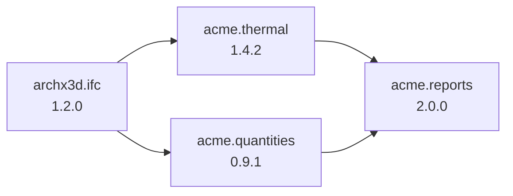

# ArchX3D — Plugin specification (contract v1)

How third parties extend ArchX3D without forking it, and how ArchX3D stays
correct, fast and safe while they do.

```
      discovery ──► manifest ──► resolution ──► verification ──► load
                                                                   │
       ┌───────────────────────────────────────────────────────────┘
       ▼
   register extensions against ports ──► activate ──► serve ──► deactivate ──► unload
```

**Status.** Normative for contract version 1, shipping in ArchX3D 2.1.

**Scope.** This document defines the plugin *contract*: what a plugin is, how it
declares itself, how it is found, verified, loaded, configured, isolated and
retired. The ports a plugin implements are defined in
[`ARCHITECTURE.md` §7](ARCHITECTURE.md#7-ports--the-complete-interface-catalogue);
this document says what a plugin must do around them.

---

## Contents

1. [Why a plugin system, and why not sooner](#1-why-a-plugin-system-and-why-not-sooner)
2. [What a plugin is](#2-what-a-plugin-is)
3. [Extension points](#3-extension-points)
4. [The manifest](#4-the-manifest)
5. [Lifecycle](#5-lifecycle)
6. [Discovery](#6-discovery)
7. [Registration](#7-registration)
8. [Version compatibility](#8-version-compatibility)
9. [Dependency resolution](#9-dependency-resolution)
10. [Configuration](#10-configuration)
11. [Capabilities and permissions](#11-capabilities-and-permissions)
12. [Sandboxing and isolation](#12-sandboxing-and-isolation)
13. [Security](#13-security)
14. [Resource governance](#14-resource-governance)
15. [Errors and failure isolation](#15-errors-and-failure-isolation)
16. [Testing a plugin](#16-testing-a-plugin)
17. [Determinism obligations](#17-determinism-obligations)
18. [Distribution and the registry](#18-distribution-and-the-registry)
19. [Marketplace readiness](#19-marketplace-readiness)
20. [Worked examples](#20-worked-examples)
21. [What plugins may never do](#21-what-plugins-may-never-do)

---

## 1. Why a plugin system, and why not sooner

### The problem

Every extension point in v1 is a closed dispatch table:

| Subsystem | How it dispatches | To extend it you must |
| --- | --- | --- |
| Evaluation axes | `AXES = (COLOUR, MATERIAL, LIGHTING, LAYOUT, OBJECTS)` | edit `evaluation/schema.py` and add a module |
| Mutations | a dict literal of 11 handlers in `mutations.apply` | edit the dict |
| Action types | `ActionType.ALL` tuple | edit the class |
| Assets | `vision/assets.py` catalogue | edit the catalogue |
| Materials | `blender/materials.py` species table | edit the table |
| Render backend | `blender_generator.py` | there is only one |
| Importers | `dxf_extractor.py` | there is only one |

Each of those tuples is deliberately closed, and the reasoning in v1 is sound —
`ActionType`'s docstring says an action type exists *"only where there is a
mutation that applies it, a constraint set that validates it, and a rollback that
undoes it"*, because *"a planner able to propose changes nobody can execute would
produce plans that look richer and achieve less."*

That reasoning does not change under a plugin system. What changes is **who** may
supply the matched set. A plugin that provides an axis, a rule, a backend or an
importer supplies the whole set or does not load.

### Why not sooner

`ENGINEERING_PRINCIPLES.md` §11: make the seam, not the abstraction. Until there
is a real second implementation, a plugin system is indirection with a cost and
no benefit. The second implementations now exist or are committed:

| Port | First | Second | Third |
| --- | --- | --- | --- |
| `RenderBackend` | `blender.eevee` | `blender.cycles` | `hydra.storm` |
| `VisionProvider` | Gemini | Claude, GPT | local VLM |
| `GeometryImporter` | DXF | IFC | USD |
| `EvaluationAxis` | five built-in | research axes | customer axes |
| `AssetProvider` | procedural | manufacturer catalogues | Objaverse |

That is what makes this the right time and not earlier.

---

## 2. What a plugin is

A **plugin** is a versioned, signed, self-describing package that registers one
or more **extensions** against ArchX3D's **ports**.

```
archx3d-plugin-acme-thermal/
├── archx3d_plugin.toml          # the manifest — the only required file
├── src/acme_thermal/
│   ├── __init__.py              # entry point: register(host)
│   ├── components.py            # scene components it contributes
│   ├── axis.py                  # an EvaluationAxis implementation
│   └── rules.py                 # ConstraintRule implementations
├── assets/                      # static resources, if any
├── tests/                       # must include the port contract suites
└── LICENSE
```

Three kinds, differing only in trust and packaging:

| Kind | Source | Signature | Default sandbox |
| --- | --- | --- | --- |
| **Built-in** | ships with ArchX3D | implicit | none |
| **Verified** | the registry, reviewed | required, publisher key | standard |
| **Local** | a path or a private index | optional | strict |

A plugin is **not** a way to patch ArchX3D. It has no access to internals, cannot
monkey-patch, and cannot change the behaviour of anything it did not register.

---

## 3. Extension points

The complete set. A plugin declares which it provides; anything else is a
manifest error.

### 3.1 Perception

| Point | Port | Provides |
| --- | --- | --- |
| `vision.provider` | `VisionProvider` | a model that describes images → `Observation` |
| `vision.segmentation` | `SegmentationProvider` | instance masks |
| `vision.depth` | `DepthProvider` | metric depth maps |
| `vision.embedding` | `EmbeddingProvider` | vectors for retrieval |
| `vision.fusion_rule` | `FusionRule` | how observations reconcile into operations |

`vision.fusion_rule` is deliberately narrow: a rule proposes a reconciliation for
one conflict class and returns operations. It cannot replace the fusion stage,
because the fusion stage's determinism is a system-wide guarantee (§17).

### 3.2 Rendering and geometry

| Point | Port | Provides |
| --- | --- | --- |
| `render.backend` | `RenderBackend` | Cycles, Hydra, Unreal, a farm client |
| `render.scheduler` | `RenderScheduler` | batching and dispatch strategy |
| `build.compiler_pass` | `BuildPass` | a transform over a `BuildPlan` before it reaches a backend |
| `io.importer` | `GeometryImporter` | IFC, USD, OBJ, a proprietary CAD format |
| `io.exporter` | `GeometryExporter` | the same, outbound |

### 3.3 Content

| Point | Port | Provides |
| --- | --- | --- |
| `assets.provider` | `AssetProvider` | a catalogue, procedural or retrieved |
| `assets.matcher` | `AssetMatcher` | how a detection is matched to an asset |
| `materials.resolver` | `MaterialResolver` | species → material definition |
| `lighting.solver` | `LightingSolver` | environment → luminaire rig |
| `style.provider` | `StyleProvider` | a style vocabulary and its priors |
| `furniture.generator` | `FurnitureGenerator` | procedural furniture geometry |

### 3.4 Analysis

| Point | Port | Provides |
| --- | --- | --- |
| `evaluate.axis` | `EvaluationAxis` | a sixth axis (acoustics, accessibility, energy) |
| `evaluate.reporter` | `Reporter` | an output format for evaluations |
| `plan.rule` | `ActionRule` | findings → candidate actions |
| `optimize.strategy` | `OptimizationStrategy` | how the loop selects and stops |
| `scene.constraint` | `ConstraintRule` | an invariant checked on every transaction |
| `review.panel` | `ReviewPanel` | a UI panel in the review step |

### 3.5 Data and platform

| Point | Port | Provides |
| --- | --- | --- |
| `scene.component` | component registration | new typed data on entities |
| `scene.operation` | operation registration | **restricted** — see §21 |
| `storage.blobs` | `BlobStore` | an alternative artefact store |
| `telemetry.sink` | `TelemetrySink` | an observability integration |
| `auth.provider` | `AuthProvider` | SSO, LDAP, a custom identity source |

---

## 4. The manifest

`archx3d_plugin.toml`. The only file the host reads before deciding whether to
load anything. It must be complete — a plugin that has to be imported to be
understood cannot be resolved, verified or sandboxed safely.

```toml
[plugin]
id             = "acme.thermal"                  # reverse-DNS, immutable, owns the namespace
name           = "Acme Thermal Analysis"
version        = "1.4.2"                         # SemVer
description    = "U-value and thermal-mass analysis for building envelopes."
authors        = ["Acme Building Physics <dev@acme.example>"]
license        = "Apache-2.0"
homepage       = "https://acme.example/archx3d"
repository     = "https://github.com/acme/archx3d-thermal"

[compatibility]
contract       = ">=1,<2"                        # the plugin ABI. Hard gate.
archx3d        = ">=2.1,<3.0"                    # host version range
schema         = ">=2.0"                         # minimum scene schema
python         = ">=3.11"
platforms      = ["linux-x86_64", "darwin-arm64", "win-amd64"]

[dependencies]
plugins        = { "archx3d.ifc" = ">=1.0,<2" }  # other plugins
python         = ["numpy>=1.26,<3"]              # vendored or resolved by the host

[entry]
module         = "acme_thermal"
register       = "register"                      # def register(host: PluginHost) -> None

[[extensions]]
point          = "scene.component"
id             = "acme.thermal"                  # must be inside the plugin's namespace
attaches_to    = ["wall", "slab", "opening"]

[[extensions]]
point          = "evaluate.axis"
id            = "acme.thermal_performance"
requires_aovs  = []                              # needs no render
weight_default = 0.0                             # opt-in; does not change existing scores

[[extensions]]
point          = "scene.constraint"
id             = "acme.envelope_continuity"

[capabilities]
network        = ["api.acme.example"]            # allow-list; [] means none
filesystem     = "none"                          # none | plugin-dir | workspace | full
subprocess     = false
gpu            = false
scene_write    = true                            # may emit operations
scene_read     = "full"                          # none | metadata | level | full
telemetry      = true
secrets        = ["ACME_API_KEY"]

[resources]
max_memory_mb        = 512
max_cpu_seconds      = 30                        # per invocation
max_wall_seconds     = 60
max_operations       = 10000                     # per transaction it contributes to

[configuration]
schema         = "config.schema.json"            # JSON Schema; validated at load
defaults       = { climate_zone = "temperate", standard = "EN-ISO-6946" }

[determinism]
deterministic  = true                            # asserts §17 obligations
seed_required  = false

[signing]
publisher      = "acme"
key_id         = "acme-2026-01"
```

### Manifest rules

1. **`plugin.id` is immutable and owns a namespace.** `acme.thermal` may register
   `acme.*` extension ids and `acme.*` components, nothing else.
2. **The manifest is complete.** Every extension, capability and resource limit
   is declared here. Registering something undeclared is a `PluginContractError`
   and unloads the plugin.
3. **Capabilities are deny-by-default.** An absent `[capabilities]` section means
   no network, no filesystem, no subprocess, no secrets.
4. **The manifest is signed with the artefact**, so capabilities cannot be
   escalated after review.
5. **`compatibility.contract` is a hard gate**, checked before any code runs.

---

## 5. Lifecycle

```mermaid
stateDiagram-v2
  [*] --> Discovered: found on a search path
  Discovered --> Resolved: manifest parsed, versions satisfied
  Discovered --> Rejected: incompatible / malformed
  Resolved --> Verified: signature and policy checked
  Resolved --> Rejected: signature invalid
  Verified --> Loaded: module imported in its sandbox
  Verified --> Failed: import raised
  Loaded --> Registered: register() completed
  Loaded --> Failed: register() raised or over-declared
  Registered --> Active: activate() completed; serving calls
  Registered --> Failed: activate() raised
  Active --> Degraded: repeated errors; extensions quarantined
  Degraded --> Active: operator re-enable
  Active --> Deactivated: deactivate()
  Degraded --> Deactivated: deactivate()
  Deactivated --> [*]: unload
  Failed --> [*]: unload, error recorded
  Rejected --> [*]
```



### Phase contracts

| Phase | Host does | Plugin may | Plugin may **not** |
| --- | --- | --- | --- |
| **Discover** | scan paths, read manifests | — | run code |
| **Resolve** | satisfy versions and dependencies | — | run code |
| **Verify** | check signature, policy, platform | — | run code |
| **Load** | import the module in its sandbox | define classes, import its own deps | I/O, network, scene access |
| **Register** | call `register(host)` | declare extensions | do work, open connections, read config |
| **Activate** | call `activate(ctx)` | read config, open connections, warm caches | assume other plugins are active |
| **Serve** | route calls | do its job, within capabilities | exceed declared capabilities |
| **Deactivate** | call `deactivate()` | flush, close, release | refuse; a 5 s timeout then force-unloads |

**Load must be side-effect-free.** Import-time work makes discovery expensive
(the host may load fifty plugins to build a UI list) and makes failures
unattributable. A plugin that opens a database connection at import is rejected
by the conformance suite.

### Entry point

```python
from archx3d.plugins import PluginHost, PluginContext

def register(host: PluginHost) -> None:
    """Declare extensions. No I/O. No configuration. No work."""
    host.register_component(ThermalProperties)
    host.register_axis(ThermalPerformanceAxis)
    host.register_constraint(EnvelopeContinuity)

def activate(ctx: PluginContext) -> None:
    """Now there is configuration, a logger, telemetry and a blob store."""
    ctx.log.event("acme.thermal.activated", standard=ctx.config["standard"])

def deactivate() -> None:
    """Release everything. Must complete within 5 seconds."""
```

---

## 6. Discovery

Four mechanisms, searched in order. Later sources may not override an earlier
plugin id — the first wins, and the collision is logged.

| Order | Source | Location | Trust |
| --- | --- | --- | --- |
| 1 | Built-in | inside the distribution | full |
| 2 | Entry points | Python `archx3d.plugins` group | installed = intended |
| 3 | Plugin directory | `~/.archx3d/plugins/`, `$ARCHX3D_PLUGIN_PATH`, `<project>/.archx3d/plugins/` | policy-dependent |
| 4 | Explicit | `--plugin <path>`, API registration | explicit consent |

```toml
# a plugin's own pyproject.toml — mechanism 2
[project.entry-points."archx3d.plugins"]
"acme.thermal" = "acme_thermal:PLUGIN_MANIFEST"
```

### Discovery is cheap and cached

Manifests are read and cached, keyed on `(path, mtime, size)`. Discovery over
fifty plugins costs milliseconds and imports nothing. This is what allows the
UI, the CLI's `--help`, and the API's capability document to list available
plugins without loading them.

### Policy

Deployment-level control, because a cloud tenant cannot be allowed to load
arbitrary code and a desktop user should not be prevented from it:

```toml
[plugins.policy]
mode             = "verified"      # open | verified | allowlist | disabled
allowlist        = ["acme.thermal", "studio.exporters"]
blocklist        = []
require_signature = true
allow_network     = false          # a hard ceiling over per-plugin capabilities
max_plugins       = 32
```

| Deployment | Default mode |
| --- | --- |
| Desktop / CLI | `open` — it is the user's machine |
| Self-hosted server | `verified` |
| Cloud SaaS, shared tenancy | `allowlist` |
| Cloud SaaS, dedicated | `verified` |

---

## 7. Registration

### Declarative, validated, immutable

```python
def register(host: PluginHost) -> None:
    host.register_axis(AcousticAxis)
```

The host validates at registration time:

1. The extension point exists.
2. The extension id is inside the plugin's namespace.
3. The extension was declared in the manifest.
4. The implementation structurally satisfies the port (`runtime_checkable`
   protocol check, plus signature inspection).
5. There is no id collision with an already-registered extension.

A failure at any step is a `PluginContractError`: the plugin unloads, nothing it
registered takes effect, and the error names the specific check.

### The registry is frozen after startup

Once the host finishes loading, the registry is immutable for the process
lifetime. Hot reload builds a **new** registry and a new `AppContext`, then swaps
atomically. A mutable registry means a request can observe a half-loaded plugin,
and the resulting bug is unreproducible.

### Ordering

Where several extensions serve one point, order is explicit and deterministic:

| Point | Selection |
| --- | --- |
| `render.backend`, `io.importer`, `auth.provider` | **one wins** — chosen by config, or by capability match |
| `evaluate.axis`, `plan.rule`, `scene.constraint` | **all run**, ordered by `(priority, plugin_id, extension_id)` |
| `build.compiler_pass` | **all run**, ordered by declared `stage` then priority |
| `assets.provider` | **all queried**, results merged and ranked by score then `plugin_id` |

Ties always break on the id, so a run's behaviour never depends on load order.
This is `ENGINEERING_PRINCIPLES.md` §3 applied to the plugin system itself.

---

## 8. Version compatibility

### Contract version

An integer. Bumped only when a port's shape changes incompatibly.

```
contract 1  →  ArchX3D 2.1 – 2.x
contract 2  →  ArchX3D 3.0 – 3.x
```

A plugin declares `contract = ">=1,<2"`. The host **refuses to load** an
incompatible plugin rather than loading it and crashing inside it. Refusing is
better because the error is attributable, arrives before any work is done, and
tells the user which version to install.

### What changes the contract version

| Change | Contract bump | Rationale |
| --- | --- | --- |
| New port added | no | additive |
| New optional method on a port | no | default provided |
| New required method on a port | **yes** | existing plugins break |
| Method signature changed | **yes** | |
| DTO field added (optional) | no | |
| DTO field removed or retyped | **yes** | |
| Extension point removed | **yes** | |
| Lifecycle phase added | **yes** | plugins must handle it |
| Sandbox tightened | **yes** | previously-legal behaviour becomes illegal |

### Compatibility windows

- Contract *N* is supported for **at least 24 months** after *N+1* ships.
- The host may support two contracts simultaneously via a shim layer;
  `PLUGIN_CONTRACT_SUPPORTED = (1, 2)`.
- Contract retirement is announced 12 months ahead with a migration guide, and
  the registry marks affected plugins as needing an update.

### Host version range

Independent of the contract. A plugin may need a specific host feature within a
contract generation:

```toml
contract = ">=1,<2"
archx3d  = ">=2.3,<3.0"    # needs the IFC importer, added in 2.3
```

Both must be satisfied.

---

## 9. Dependency resolution

### Two kinds

**Plugin dependencies** — another plugin must be present, active, and version-
compatible.

**Python dependencies** — third-party packages.

### Plugin dependency resolution

A DAG, resolved before any load, using the same deterministic topological
ordering as `planner.ActionGraph` — dependencies first, ties broken on plugin id.



| Failure | Behaviour |
| --- | --- |
| Missing dependency | plugin rejected, error names the missing plugin and version |
| Version conflict | **all plugins in the conflicting set are rejected**, with a report showing who requires what |
| Cycle | all plugins in the cycle rejected |
| Dependency failed to load | dependents rejected transitively |

**Version conflicts are never resolved by picking a version.** Silently loading
`ifc 1.2` when a plugin asked for `>=2.0` produces failures inside the plugin
that look like plugin bugs. Refusing produces one clear message. The user
resolves it by choosing plugins that agree.

### Python dependency isolation

The hard problem: two plugins needing incompatible versions of one library.

| Strategy | When | Cost |
| --- | --- | --- |
| **Shared environment** | dependencies are compatible; the common case | none |
| **Vendored** | the plugin bundles pure-Python dependencies under its namespace | package size |
| **Isolated venv + subprocess** | conflict detected, or `sandbox = "process"` | IPC latency (~1 ms/call) |

The host detects conflicts at resolution time and either isolates automatically
or reports, per policy. A plugin can force isolation with
`isolation = "process"`, which is the right default for anything with heavy
native dependencies (torch, OpenCV) that a lightweight host should not carry.

---

## 10. Configuration

### Schema-first

A plugin ships a JSON Schema. The host validates before `activate`, so a
misconfigured plugin fails at startup with a precise message rather than at first
use with a `KeyError`.

```json
{
  "$schema": "https://json-schema.org/draft/2020-12/schema",
  "type": "object",
  "additionalProperties": false,
  "properties": {
    "standard":     { "enum": ["EN-ISO-6946", "ASHRAE-90.1"],
                      "default": "EN-ISO-6946" },
    "climate_zone": { "type": "string", "default": "temperate" },
    "api_key":      { "type": "string", "x-secret": true }
  },
  "required": ["standard"]
}
```

`x-secret: true` fields are resolved through the host's `SecretProvider` and are
redacted from every config dump, log line, telemetry event and error message.

### Layering

```
plugin defaults  →  system  →  user  →  project  →  environment  →  request
```

Namespaced under the plugin id:

```toml
[plugins."acme.thermal"]
standard     = "ASHRAE-90.1"
climate_zone = "cold"
```

### Access

```python
def activate(ctx: PluginContext) -> None:
    standard = ctx.config["standard"]        # validated, defaults applied
    key      = ctx.secrets["api_key"]        # resolved, never logged
```

Config is **frozen for the process lifetime**. Reconfiguration is a new context.

---

## 11. Capabilities and permissions

Every plugin declares what it needs. The host grants exactly that and no more.

| Capability | Values | Enforcement |
| --- | --- | --- |
| `network` | `[]` \| host allow-list \| `"any"` | socket-level interception; DNS pinning |
| `filesystem` | `none` \| `plugin-dir` \| `workspace` \| `full` | path-prefix check on every open |
| `subprocess` | `false` \| allow-list of executables | `subprocess` shim |
| `gpu` | `false` \| `true` | device visibility |
| `scene_read` | `none` \| `metadata` \| `level` \| `full` | the `SceneView` handed in is scoped |
| `scene_write` | `false` \| `true` | no `Transaction` is provided when false |
| `secrets` | list of names | only those keys appear in `ctx.secrets` |
| `telemetry` | `false` \| `true` | sink is a no-op when false |
| `plugins` | list of plugin ids it may call | inter-plugin calls are mediated |

### Presentation

Capabilities are shown to the user before install, in plain language:

```
Acme Thermal Analysis 1.4.2  ·  verified publisher: acme

This plugin will be able to:
  • Read your entire scene, including photographs and floor plans
  • Add and change data in your scene
  • Connect to api.acme.example

It will NOT be able to:
  • Read files outside its own folder
  • Run other programs
  • Connect to any other server
```

Requesting `network = "any"` or `filesystem = "full"` **disqualifies a plugin
from verified status.** A plugin that needs unrestricted access is a plugin whose
author has not thought about what it needs, and the registry says so.

---

## 12. Sandboxing and isolation

Three levels. The host chooses per plugin from its trust tier and the plugin's
declared needs.

| Level | Mechanism | Overhead | Isolates |
| --- | --- | --- | --- |
| **`none`** | in-process, no restriction | 0 | nothing — built-ins only |
| **`standard`** | in-process, restricted imports, capability shims, resource accounting, no `ctypes`/`os.system` | < 1% | accidents, most misuse |
| **`process`** | subprocess, own interpreter and venv, IPC over msgpack, OS-level limits (rlimits, cgroups, seccomp, Job Objects) | ~1 ms/call + serialisation | crashes, hangs, memory, most attacks |
| **`container`** | OCI container, network namespace, read-only rootfs | ~50 ms startup, amortised | essentially everything |

Defaults:

| Trust | Sandbox |
| --- | --- |
| Built-in | `none` |
| Verified, no network | `standard` |
| Verified, with network or native deps | `process` |
| Local / unverified | `process` |
| Cloud multi-tenant, any third party | `container` |

### Honesty about `standard`

**In-process sandboxing in Python is not a security boundary.** Restricted
imports and shimmed builtins raise the cost of misbehaviour; they do not prevent
a determined attacker from reaching the interpreter's internals. This is a
property of the language, not a gap to be closed by more shims.

Therefore:

- `standard` protects against **accidents and sloppiness**, which is the common
  case and worth having.
- **Anything untrusted runs at `process` or above.** In multi-tenant cloud, that
  is enforced, not defaulted.
- The documentation says this plainly rather than implying a guarantee that does
  not exist. A sandbox users over-trust is worse than one they understand.

### The process boundary

```
host                                   plugin process
 │  invoke(ext, method, args) ────────► │
 │                                      │  deserialise, execute
 │  ◄──────────── result | error ────── │
 │  heartbeat every 1 s ──────────────► │
 │  (no response in 3 s → SIGKILL)      │
```

Arguments and results are msgpack; a `SceneView` crosses as a scoped, read-only
projection materialised in the plugin process, not as a live handle. Operations
come back as data and are validated and committed by the host — a plugin never
touches the store.

---

## 13. Security

### Threat model

| Threat | Mitigation |
| --- | --- |
| Malicious plugin exfiltrates a customer's floor plans | network allow-list; `scene_read` scoping; container isolation in multi-tenant; audit of every outbound host |
| Malicious plugin corrupts a scene | all writes go through operations, validated by core constraint rules the plugin cannot bypass; every commit is attributed and revertible |
| Supply-chain compromise of a legitimate plugin | signature verification; pinned versions; a published SBOM; reproducible-build attestation for verified plugins |
| Typosquatting (`acme.thermai`) | namespace reservation; publisher verification; the registry warns on near-duplicate ids |
| Dependency confusion | plugin dependencies resolve only from declared indexes; no implicit public-index fallback |
| Resource exhaustion | declared limits, enforced (§14) |
| Privilege escalation between plugins | inter-plugin calls are mediated and require declaration; no shared mutable state |
| Secret theft | only declared secrets are visible; redaction at every sink |
| Persistence after uninstall | plugin data is namespaced and removable; no host code is modified |

### Signing

```
artefact digest ─► signed by publisher key ─► countersigned by the registry
                                                      │
                        host verifies both, plus a transparency-log inclusion proof
```

- Publisher keys are registered and rotatable; `key_id` in the manifest.
- Signatures cover the **manifest and the artefact together**, so declared
  capabilities cannot be altered after review.
- Verified plugins are recorded in a public append-only transparency log; the
  host checks inclusion. This is what makes a targeted, single-victim malicious
  build detectable.
- Revocation is checked at load, with a cached CRL and a fail-closed default for
  verified-mode deployments.

### Review for verified status

Automated and human:

1. **Automated**: static analysis for dynamic import, `eval`, `ctypes`,
   `subprocess`; capability minimality (does it use everything it asked for?);
   dependency audit against advisory databases; licence compatibility; contract
   conformance suite; determinism suite if it claims determinism.
2. **Human**: read the code that touches network, filesystem, secrets or scene
   writes. Confirm the description matches the behaviour. Confirm the capability
   list is minimal.

Re-review on every version that changes capabilities or dependencies. Patch
releases that change neither are auto-approved on a passing suite.

### Incident response

A plugin found malicious is revoked in the transparency log; hosts refuse to
load it at next start and disable it at next capability check on running
instances. Affected users are notified with the scenes and time ranges the
plugin had access to, derived from the audit log — which exists because every
plugin action is attributed in the journal.

---

## 14. Resource governance

Declared in the manifest, enforced by the host.

| Resource | Enforcement | On breach |
| --- | --- | --- |
| Memory | `RLIMIT_AS` / Job Object / cgroup (process); accounting (standard) | invocation killed, `PluginError` |
| CPU time | `RLIMIT_CPU`, watchdog | invocation killed |
| Wall time | host timeout | invocation killed |
| Operations per transaction | counted at commit | transaction rejected |
| Network bytes | shim accounting | connection closed |
| Filesystem bytes | quota on the plugin directory | write fails |
| Concurrent invocations | host semaphore | queued, then rejected |

Breaches are counted. Repeated breaches move the plugin to **Degraded**: its
extensions are quarantined, the run continues without it, and the operator is
notified. This is `ARCHITECTURE.md` §12's failure-isolation table applied to
plugins: a plugin's blast radius is that plugin.

Every invocation is metered:

```
archx3d_plugin_invocations_total{plugin, extension, status}
archx3d_plugin_duration_seconds{plugin, extension}
archx3d_plugin_memory_bytes{plugin}
archx3d_plugin_errors_total{plugin, kind}
```

Cost attribution matters commercially: a marketplace plugin that doubles render
time is a cost the platform pays and the publisher should see.

---

## 15. Errors and failure isolation

### The rule

**A plugin failure never fails a run.** The extension is skipped, the failure is
recorded, and the result says what was missing.

This is exactly the "unmeasured is not zero" contract extended to plugins. A
plugin-provided evaluation axis that raises reports `measured=False` with
`reason="plugin acme.thermal raised ThermalModelError"`, is excluded from
normalisation, and the confidence figure carries the cost. It does not score
zero, and it does not fail the evaluation.

### Classification

| Error | Host response |
| --- | --- |
| `PluginContractError` — returned something the port forbids | unload immediately; this is a broken plugin, not a failed call |
| `PluginError` — plugin's own failure | skip this invocation; count it |
| `TimeoutError` | kill; count as a breach |
| Resource breach | kill; count as a breach |
| Crash (`process` isolation) | restart the plugin process; count |
| 3 failures in one run, or 10 in an hour | **Degraded**; quarantine until re-enabled |

### Reporting

Every plugin failure appears in three places: the run's diagnostics (so the user
sees what did not run), the structured log (with plugin id, extension id and
correlation ids), and the plugin's metrics. A failure that appears in none of
them is how a plugin silently stops working for a month.

---

## 16. Testing a plugin

### Contract suites are published

Every port ships an executable conformance suite in `archx3d.testing`. A plugin
runs it against its implementation:

```python
from archx3d.testing.contracts import EvaluationAxisContract

class TestThermalAxis(EvaluationAxisContract):
    axis_class = ThermalPerformanceAxis

    # inherited, and all must pass:
    #   test_declares_its_requirements
    #   test_returns_unmeasured_when_inputs_absent
    #   test_never_writes_to_the_scene
    #   test_findings_name_a_valid_subsystem
    #   test_findings_carry_evidence
    #   test_score_is_in_unit_range_when_measured
    #   test_deterministic_over_identical_input
    #   test_respects_its_time_budget
```

This is what makes a third-party extension trustworthy: it either passes the same
suite the built-in axes pass, or it does not get verified status. The suite is
also the specification — a port's prose and its contract suite must agree, and
where they differ the suite wins.

### Harness

```python
from archx3d.testing import PluginHarness, fixture_scene

def test_thermal_finding():
    with PluginHarness("acme.thermal", config={"standard": "EN-ISO-6946"}) as h:
        scene  = fixture_scene("apartment")
        result = h.invoke("evaluate.axis", "acme.thermal_performance", scene=scene)
        assert result.measured
        assert any(f.subsystem == "SurfaceFinish" for f in result.findings)
```

The harness runs the plugin in its declared sandbox with its declared
capabilities, so a test also verifies that the manifest is honest — a plugin that
works in tests but fails in production because it quietly used an undeclared
capability is a class of bug this eliminates.

### Required coverage for verified status

- The port contract suite for every extension: passing.
- The determinism suite, if `deterministic = true`.
- At least one test per extension against a fixture scene.
- A test that the plugin loads with only its declared capabilities.
- A test that `deactivate()` releases everything (no leaked threads, sockets or
  files).

---

## 17. Determinism obligations

A plugin that declares `deterministic = true` asserts:

1. Identical inputs produce byte-identical outputs.
2. No wall-clock time, PID, hostname, memory address or environment variable
   reaches an output.
3. No unseeded randomness. If randomness is needed, it comes from
   `ctx.rng(seed)`, which the host seeds reproducibly.
4. Every iteration over a set or dict that reaches an output is sorted.
5. No dependence on filesystem enumeration order.
6. Floating-point accumulation order does not depend on threading.

The determinism suite checks these by running the extension repeatedly under
varied `PYTHONHASHSEED`, shuffled input order, and concurrent execution.

### Why this is a formal obligation

The render cache keys on input digests. The evaluation is a regression baseline.
Published research numbers must be reproducible. A single non-deterministic
plugin in the pipeline breaks all three, and it breaks them *silently* — as a
cache that stops hitting and a benchmark that drifts, not as an error.

A plugin that cannot be deterministic declares `deterministic = false`. The host
then excludes its outputs from cache keys and marks any run using it as
non-reproducible in the run record. That is an honest arrangement; a false claim
is not.

---

## 18. Distribution and the registry

### Channels

| Channel | Mechanism | Audience |
| --- | --- | --- |
| PyPI | `pip install archx3d-plugin-acme-thermal` | developers |
| ArchX3D registry | `archx3d plugin install acme.thermal` | everyone; the source of trust metadata |
| Private index | configured URL | enterprises |
| Local | `archx3d plugin install ./path` | development |

### CLI

```
archx3d plugin list                          # installed, with status
archx3d plugin search thermal
archx3d plugin info acme.thermal             # manifest, capabilities, reviews
archx3d plugin install acme.thermal@1.4.2    # shows capabilities, asks to confirm
archx3d plugin update acme.thermal
archx3d plugin disable acme.thermal
archx3d plugin remove acme.thermal --keep-data
archx3d plugin verify acme.thermal           # re-check signature and conformance
archx3d plugin doctor                        # diagnose conflicts and failures
```

### Registry metadata

Beyond the manifest, the registry holds: verification status, download counts,
version history with changelogs, the security advisory feed, compatibility test
results against each host version, publisher identity and reputation, licence,
and the SBOM.

**Compatibility results are the registry's most valuable data.** The registry
runs each plugin's contract suite against each supported host version nightly, so
"works with ArchX3D 2.4" is a measured fact rather than a publisher's claim. This
is the single biggest determinant of whether a plugin ecosystem is usable at
scale, and it costs the platform CI minutes rather than trust.

---

## 19. Marketplace readiness

The plugin system is designed so that a commercial marketplace can be added
without redesign. What is built now versus what is deferred:

| Requirement | Built now | Deferred |
| --- | --- | --- |
| Stable identity and namespace | ✓ | |
| Semantic versioning and compatibility ranges | ✓ | |
| Signing and verification | ✓ | |
| Declared, enforced capabilities | ✓ | |
| Resource metering per plugin | ✓ | |
| Isolation levels | ✓ | |
| Conformance suites | ✓ | |
| Publisher identity | ✓ | |
| Usage telemetry (opt-in, aggregate) | ✓ | |
| Licence declaration and enforcement hooks | ✓ | |
| Payment, entitlement, licence keys | | v4 |
| Revenue share | | v4 |
| Ratings and reviews | | v4 |
| Trials and refunds | | v4 |
| Curated collections | | v4 |

The deferred items are commerce, not architecture. The built items are the ones
that are painful to retrofit — particularly capability declaration and metering,
which cannot be added to an ecosystem that already exists without breaking every
plugin in it.

### Licensing

A plugin declares its licence and, if commercial, an entitlement check:

```toml
[licensing]
model     = "commercial"                        # open | commercial | trial
validator = "acme_thermal.licensing:check"
offline_grace_days = 14
```

The host calls the validator at activation and periodically. **A failed
entitlement check disables the plugin; it never disables ArchX3D and never fails
a run.** The offline grace period exists because desktop and air-gapped
deployments are real, and a design that assumes connectivity will be worked
around rather than complied with.

---

## 20. Worked examples

### 20.1 A render backend

```python
from archx3d.ports.render import RenderBackend, RenderCapabilities

class HydraStormBackend:
    id = "hydra.storm"

    def capabilities(self) -> RenderCapabilities:
        return RenderCapabilities(
            engines=frozenset({"storm"}),
            aovs=frozenset({"beauty", "depth", "normal", "object_id"}),
            max_resolution=(4096, 4096),
            gpu=True, denoise=False, volumetrics=False,
            ray_tracing=False, interactive=True,
            colour_spaces=frozenset({"sRGB", "ACEScg"}),
            deterministic=True,
        )

    def prepare(self, plan: BuildPlan, ctx): ...
    def render(self, scene, reqs): ...
    def release(self, scene): ...

def register(host):
    host.register_render_backend(HydraStormBackend)
```

Because it does not declare `material_id`, the evaluation engine's material axis
reports `measured=False` with a reason naming the backend, rather than producing a
wrong number from a missing pass. The plugin did not have to know that; the
capability declaration did the work.

### 20.2 An evaluation axis

```python
from archx3d.ports.evaluation import EvaluationAxis, AxisOutcome
from archx3d.evaluate.schema import AxisScore, Finding, Subsystem

class AcousticAxis:
    axis     = "acoustic"
    requires = frozenset({"material_id"})

    def evaluate(self, ctx) -> AxisOutcome:
        if "material_id" not in ctx.available_passes:
            return AxisOutcome(score=AxisScore.unmeasured(
                self.axis, "the material_id pass was not rendered"))

        rt60_measured = self._estimate_rt60(ctx.scene, ctx.room)
        rt60_target   = TARGETS[ctx.room.space_type]
        error         = abs(rt60_measured - rt60_target)

        findings = []
        if error > 0.3:
            findings.append(Finding(
                axis=self.axis, code="reverberation",
                summary=f"reverberation time is {rt60_measured:.2f} s "
                        f"against a target of {rt60_target:.2f} s",
                subsystem=Subsystem.SURFACE_FINISH,
                difference=error, unit="s",
                severity=min(1.0, error / 1.0), confidence=0.55,
                why=f"Sabine estimate over {ctx.room.area_m2:.0f} m² with the "
                    f"absorption coefficients of the assigned finishes",
                evidence={"rt60": rt60_measured, "target": rt60_target,
                          "absorption_area_m2": ...},
                remedy="soften the ceiling or floor finish; a hard plaster "
                       "ceiling over a tiled floor is the dominant contributor",
                room=ctx.room.id))

        return AxisOutcome(
            score=AxisScore(axis=self.axis, score=max(0.0, 1.0 - error),
                            measured=True, confidence=0.55,
                            detail={"rt60": rt60_measured, "target": rt60_target}),
            findings=findings)
```

Note what the contract forces: the unmeasured path is first; the finding names an
existing `Subsystem`; `why` explains the reasoning rather than repeating the
number; `evidence` carries the measurements; `remedy` is concrete. Those are the
same obligations the built-in axes carry, and the contract suite checks them.

### 20.3 A vision provider

```python
from archx3d.ports.vision import VisionProvider, ModelCapabilities

class LocalQwenVL:
    id = "local.qwen-vl"

    def capabilities(self) -> ModelCapabilities:
        return ModelCapabilities(
            modalities=frozenset({"image", "text"}),
            max_images=8, max_image_pixels=4_000_000,
            structured_output=False,       # host adds few-shot examples and a tolerant parser
            grounding=True, context_tokens=32_000, streaming=False,
            local=True, deterministic=True,   # temperature 0
            cost_per_mtok=None)

    def observe(self, req) -> ObservationResponse:
        ...   # returns Observations with provenance; never touches a scene
```

Declaring `local=True` and `cost_per_mtok=None` lets the scheduler route work to
a `gpu.infer` worker instead of `net.model`, and lets the budget system skip cost
accounting. Declaring `structured_output=False` makes the host choose the
few-shot prompt variant. None of that is the plugin's decision to make.

---

## 21. What plugins may never do

Hard limits. Attempting any of these is a `PluginContractError` and unloads the
plugin.

| Forbidden | Why |
| --- | --- |
| Write to a scene except by emitting operations | one writer, one vocabulary (`ENGINEERING_PRINCIPLES.md` §6) |
| Bypass constraint validation | the invariants are the scene's contract |
| Register an operation type that has no inverse and no validator | history must stay invertible and checkable |
| Modify or reinterpret a `core:` component's schema | core is the shared vocabulary |
| Modify data belonging to another plugin's namespace | namespaces are ownership |
| Monkey-patch ArchX3D or another plugin | unattributable behaviour; unfixable bugs |
| Import `archx3d.*.internal` or any private symbol | freezes internals as a contract |
| Spawn threads or processes outside the sandbox | escapes resource governance |
| Access the network, filesystem, secrets or GPU beyond declaration | the capability list is the security model |
| Block indefinitely | one plugin must not stall a pipeline |
| Change a scene's `schema_version` | migration is the host's |
| Write to a user's `source: "user"` provenance data | principle 9 |
| Suppress or alter another extension's findings | measurement integrity |
| Claim `deterministic = true` without meeting §17 | breaks caching, baselines and reproducibility silently |

### On registering operation types

`scene.operation` is the most restricted extension point, and most plugins should
never touch it. Journals are permanent: an operation type that ships must be
replayable forever, including by a host that no longer has the plugin installed.

A plugin-registered operation must therefore:

1. Provide an apply, an inverse, a validator and a full test suite.
2. Be expressible as a composition of core operations, and provide that
   decomposition as a fallback for hosts without the plugin.
3. Be reviewed by ArchX3D maintainers before verified status.

Requirement 2 is the important one: it means a scene edited by a plugin remains
readable and its history remains replayable after the plugin is removed. A
plugin operation is sugar over the core vocabulary, never an extension of it.

---

## Related

- [`ARCHITECTURE.md`](ARCHITECTURE.md) — the 22 ports, layering, failure isolation.
- [`SCENE_GRAPH_SPEC.md`](SCENE_GRAPH_SPEC.md) — the operation algebra plugins emit; plugin components (§18).
- [`ENGINEERING_PRINCIPLES.md`](ENGINEERING_PRINCIPLES.md) — §3 determinism, §6 one writer, §11 seams.
- [`API_SPEC.md`](API_SPEC.md) — how plugin-provided extensions surface over HTTP.
- [`DESIGN_GUIDELINES.md`](DESIGN_GUIDELINES.md) — code standards, which plugins are reviewed against.
