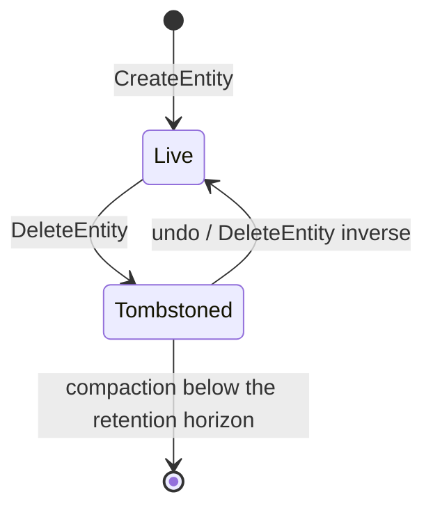
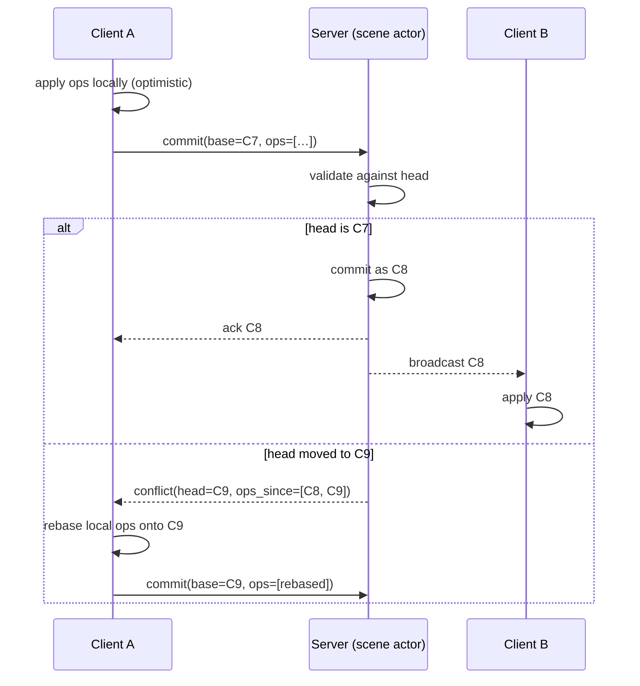
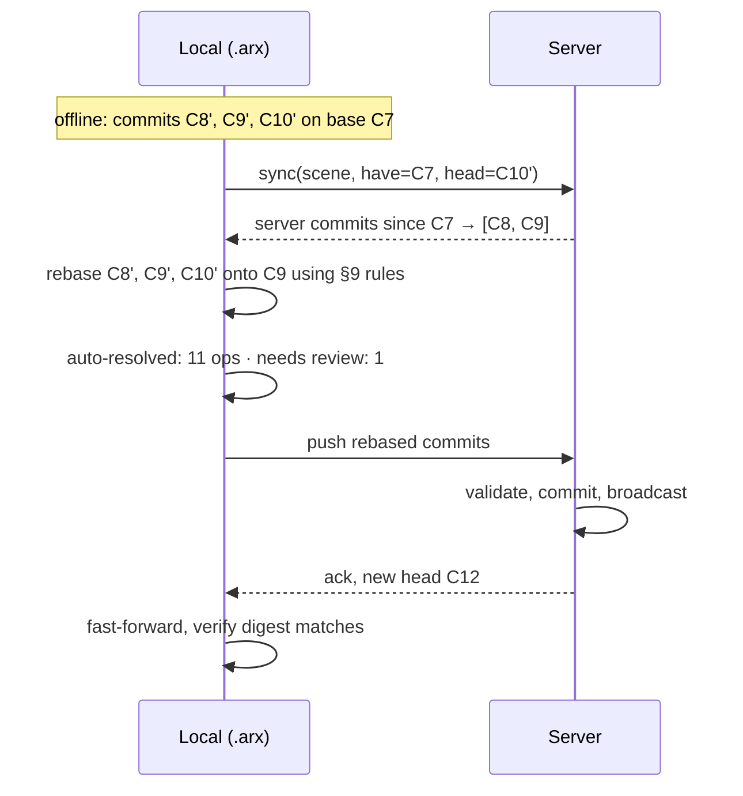

# ArchX3D — Scene Graph v2 specification

The normative definition of ArchX3D's central data structure: what a scene is,
how it is identified, stored, indexed, queried, changed, versioned, synchronised
and migrated.

```
Site ─► Building ─► Level ─► Space ─► Element
                      │        │        └─ components (transform, appearance, …)
                      │        └─ boundaries, openings, adjacency
                      └─ elevation, storey, plan-coordinate frame

    identity ─┬─ EntityId    (128-bit, time-ordered, globally unique)
              ├─ StableKey   (content-derived, survives re-import)
              └─ ExternalRef (IFC GlobalId, DXF handle, USD path)

    change ──► Operation ──► Transaction ──► Commit ──► Journal
                                                          └─► snapshots
```

**Status.** Normative for v2.0. Where this document and the code disagree, this
document is the specification and the code is a defect.

**Requirements this satisfies.** 1,000+ rooms · 100,000+ objects · multi-floor ·
IFC · BIM · incremental loading · streaming · transactions · undo · history ·
collaboration · plugins · versioning · distributed execution · offline editing ·
cloud synchronisation.

---

## Contents

1. [Why v1's graph cannot get there](#1-why-v1s-graph-cannot-get-there)
2. [The model: entities and components](#2-the-model-entities-and-components)
3. [Identity](#3-identity)
4. [The spatial hierarchy and the Level abstraction](#4-the-spatial-hierarchy-and-the-level-abstraction)
5. [Component catalogue](#5-component-catalogue)
6. [The operation algebra](#6-the-operation-algebra)
7. [Transactions, commits and the journal](#7-transactions-commits-and-the-journal)
8. [Snapshots, undo and history](#8-snapshots-undo-and-history)
9. [Collaboration and conflict resolution](#9-collaboration-and-conflict-resolution)
10. [Relationships](#10-relationships)
11. [Indexes](#11-indexes)
12. [Spatial indexing](#12-spatial-indexing)
13. [The query API](#13-the-query-api)
14. [Incremental loading and streaming](#14-incremental-loading-and-streaming)
15. [Storage layout](#15-storage-layout)
16. [Serialisation](#16-serialisation)
17. [IFC and BIM alignment](#17-ifc-and-bim-alignment)
18. [Plugin components](#18-plugin-components)
19. [Offline editing and cloud synchronisation](#19-offline-editing-and-cloud-synchronisation)
20. [Distributed execution](#20-distributed-execution)
21. [Versioning and migration](#21-versioning-and-migration)
22. [Invariants and validation](#22-invariants-and-validation)
23. [Performance budgets](#23-performance-budgets)
24. [Migrating from v1](#24-migrating-from-v1)

---

## 1. Why v1's graph cannot get there

v1's `SceneGraph` (`modules/vision/schema.py`) is a good design for what it was
built for: one room, forty objects, one JSON file, readable in a diff. Its
strengths — everything carries a confidence, metric units throughout, an explicit
coordinate frame, tolerant parsing of model output — are all preserved below.

Its structure is the problem.

### 1.1 Linear scans

```python
def object_by_id(self, obj_id):          # O(n)
    for obj in self.objects:
        if obj.id == obj_id: return obj
```

`object_by_id`, `wall_by_id`, `room_by_id`, `objects_in_room`, `viewpoints_for`
are all linear. They are called *inside loops over objects* by
`optimizer.mutations`, `vision.validate`, `vision.recheck` and
`review.apply_edits`, so the real complexity is O(n²). `validate_graph` is worse:

```python
if obj.support_id and obj.support_id not in seen_ids | {o.id for o in graph.objects}:
```

— a full set comprehension over every object, rebuilt on every iteration of a
loop over every object. At 100,000 objects that is 10¹⁰ operations.

### 1.2 Whole-document materialisation

`SceneGraph.load` parses the entire JSON; `to_dict` re-materialises it;
`save` rewrites all of it. `rollback.take` deep-copies `to_dict()` output **per
action**. At the target scale that is a ~400 MB document, several seconds per
snapshot, and gigabytes of churn per refinement run.

There is no way to ask for one storey, one room, or one camera frustum.

### 1.3 No Level

`rooms` is a flat list. Rooms carry `bounds_min`/`bounds_max` in plan metres and
a `ceiling_height`. Two floors of the same building would occupy identical plan
coordinates and be indistinguishable. Wall `start`/`end` are 2-D. Nothing in the
schema can express "storey 3, at +9.6 m".

### 1.4 A closed schema

Adding a field means editing `schema.py`, `to_dict`, `from_dict`, the review
payload builder, the TypeScript mirror, and every consumer. A plugin cannot add
data to an entity at all. `SceneObject` has 24 fields, several of which
(`distance_to_nearest_wall`, `distance_to_room_center`, `asset_score`) are
*derived* values persisted alongside authored ones with no way to tell them
apart.

### 1.5 No history

The graph on disk is a snapshot of now. There is no record of how it got there.
`flags` carries prose notes (`"optimiser moved by (+0.120, -0.048) m"`) —
history reduced to a changelog string, unqueryable and not invertible.

### 1.6 Three writers

Documented as defect D3 in [`ARCHITECTURE.md`](ARCHITECTURE.md#d3--three-mutation-paths).
`review.apply_edits`, `optimizer.mutations.apply` and `web/lib/editor.ts` each
mutate scenes with their own vocabulary, validation, undo model and audit format.

**Everything below follows from fixing these six things without losing what v1
got right.**

---

## 2. The model: entities and components

### 2.1 The decision

A scene is a **store of entities**. An entity is an identity and a kind. All data
lives in **components** attached to entities.

```
Entity      = (EntityId, EntityKind, level, parent, lifecycle)
Component   = (EntityId, ComponentType, data, provenance, updated_at)
Relationship= (subject, predicate, object, confidence, provenance)
```

There is no `SceneObject` class with 24 fields. There is an entity of kind
`furniture` carrying a `core:transform`, a `core:dimensions`, a
`core:appearance`, a `core:asset_binding`, a `core:detection` and a
`core:support` component.

### 2.2 Why entity–component and not a class hierarchy

| Requirement | Class hierarchy | Entity–component |
| --- | --- | --- |
| Plugin adds thermal data to a wall | edit core schema | attach `acme.thermal` component |
| Load only transforms for a frustum query | load whole objects | read one component table |
| A field applies to several kinds (openings, objects and lights all have transforms) | duplicate it, or invent a base class nobody wanted | one component, reused |
| Distinguish authored from derived | naming convention | separate components, separate provenance |
| Column-oriented storage for 100k rows | not possible | natural |
| Schema evolution | migrate every subclass | add a component type |

The decisive argument is the plugin one. `PLUGIN_SPEC.md` promises that a
third party can add data to a scene. Under a closed class hierarchy that promise
requires either a `metadata: dict` escape hatch — untyped, unindexed,
unvalidated, the place where all schemas go to die — or forking. Components make
it a first-class, typed, indexable, migratable operation.

The second argument is loading. The viewport needs `transform` and `bounds` for
40,000 entities and nothing else. Under a class hierarchy, that is 40,000 full
objects. Under components, it is one indexed read of one table.

### 2.3 What entity–component costs, and the mitigation

It is less immediate to read. `graph.objects[0].position.x` becomes
`scene.get(entity, Transform).position.x`. Two mitigations, both required:

**Typed views.** Ergonomic, read-only facades over the component store, generated
from the component definitions:

```python
sofa = scene.view(entity_id, as_=FurnitureView)
sofa.position          # Vec3   — from core:transform
sofa.dimensions        # Dims   — from core:dimensions
sofa.confidence        # float  — from core:detection
sofa.room              # RoomView | None
```

A view is a projection, not a copy: it holds the entity id and reads through.
Views are how 90% of domain code touches the scene, so the entity–component
machinery stays where it belongs — in the store.

**Bulk accessors.** For the code that actually needs the scale, columnar reads:

```python
for eid, x, y, z, yaw in scene.columns(Transform, level=level_id):
    ...                                        # no object allocation at all
```

### 2.4 Entity kinds

Closed vocabulary. Adding a kind is a schema-minor change.

| Kind | Meaning | Parent kind |
| --- | --- | --- |
| `site` | the whole project's coordinate root | — |
| `building` | one structure | `site` |
| `level` | a storey; defines a plan-coordinate frame at an elevation | `building` |
| `space` | an enclosed or semi-enclosed volume — the v1 `Room` | `level` |
| `zone` | a non-geometric grouping (fire zone, HVAC zone, phase) | `building` \| `level` |
| `wall` | a vertical boundary element | `level` |
| `slab` | floor or ceiling plate | `level` |
| `opening` | door, window, archway, niche — cut into a boundary | `wall` \| `slab` |
| `structure` | column, beam, stair, railing, partition | `level` |
| `furniture` | movable furniture | `space` |
| `fixture` | fixed equipment — sanitary, kitchen, built-in | `space` |
| `decor` | small decorative object | `space` \| `furniture` |
| `luminaire` | a light-emitting fixture | `space` \| `wall` \| `slab` |
| `viewpoint` | a stored camera | `space` \| `level` |
| `annotation` | a user note, dimension, markup | any |
| `asset_group` | an authored assembly treated as one thing | `space` |

`space` replaces `Room` because IFC calls it `IfcSpace`, because a corridor is
not a room, and because the concept covers unenclosed areas in open-plan
buildings. `Room` remains as an alias in the typed-view layer for readability.

### 2.5 Lifecycle

Entities are never physically deleted while history is retained.



A tombstone records the commit that removed it. Queries exclude tombstones by
default; history queries include them. Compaction physically removes entities
tombstoned before the retention horizon, and only then.

---

## 3. Identity

Three identifiers, for three different questions. Conflating them is the source
of most re-import and synchronisation bugs in tools of this kind.

### 3.1 `EntityId` — "is this the same object?"

A 128-bit **UUIDv7**: 48 bits of Unix milliseconds, 74 bits of randomness.

| Property | Consequence |
| --- | --- |
| Globally unique without coordination | offline clients mint ids that never collide with the server's |
| Time-ordered prefix | index locality; new entities cluster; B-tree splits stay at the right edge |
| 16 bytes fixed | compact keys, cheap comparison, no string interning |
| Opaque | no meaning to parse, so nothing depends on its structure |

Rendered as a 26-character Crockford base32 string in APIs and logs
(`01J8Z3K7QP4M2N9V6XW0RTB5FC`), never as a hyphenated UUID — shorter,
case-insensitive, no ambiguous characters.

v1's human-readable ids (`room_1`, `coffee_table_1`, `img_a1`) are **retained as
a display name**, in `core:label`, not as identity. They are ideal for a report
and unusable as identity: they collide across rooms, change when a category is
corrected, and cannot be minted offline.

### 3.2 `StableKey` — "is this the same object *as last time*?"

A content-derived digest used to reconcile a re-import or a re-analysis with an
existing scene.

```
StableKey = BLAKE3(source_kind ‖ source_ref ‖ discriminator)[:16]
```

| Source | `source_ref` | `discriminator` |
| --- | --- | --- |
| DXF | file digest | entity handle (`LINE#4A2F`) |
| IFC | file digest | `GlobalId` |
| Vision | image digest | fused observation cluster id |
| Procedural | generator id + version | deterministic index |

The problem it solves: a user uploads a corrected DXF. Without a stable key,
every wall is a new entity, every room re-segments, and every manual edit is
orphaned. With it, re-import matches on `StableKey`, and only genuinely new or
changed elements produce operations — so the user's edits survive and the diff
is legible.

`StableKey` is indexed, not unique: two entities may legitimately share one after
a split, and the reconciler resolves that explicitly.

### 3.3 `ExternalRef` — "what is this in the other system?"

An optional component recording the entity's identity in an external authority:

```json
{ "system": "ifc", "id": "3Bx7fZ$Kn0hxL2QqR9pTm4",
  "file": "blob:b3:1c9d…", "schema": "IFC4X3" }
```

Round-tripping requires it. An IFC file re-exported with regenerated `GlobalId`s
is, to any BIM tool, a completely different building.

### 3.4 References between entities

**Always by `EntityId`, never by object reference.** No Python object in the
scene holds a pointer to another. This is not style — it is what makes partial
loading possible (a reference to an unloaded entity is still valid), what keeps
serialisation acyclic, and what prevents the import cycles that a mutually
referencing type graph creates.

`TypedRef[Kind]` carries the expected kind so a mis-wired reference fails
validation rather than at render time.

---

## 4. The spatial hierarchy and the Level abstraction

### 4.1 The hierarchy

```
site (project origin, geo-reference, true north)
└── building
    ├── level  (elevation, storey number, height, plan frame)
    │   ├── space  (polygon, volume, adjacency)
    │   │   ├── furniture / fixture / decor / luminaire / viewpoint
    │   ├── wall / slab / structure
    │   │   └── opening
    └── zone  (non-geometric grouping, cross-cuts levels and spaces)
```

Two orthogonal hierarchies, deliberately:

- **Containment** (`parent_id`) — the spatial tree above. Every entity has
  exactly one parent. Deleting a parent cascades.
- **Grouping** (`zone` membership, via relationships) — many-to-many, cross-
  cutting, non-geometric. A fire compartment spans three levels; an HVAC zone
  covers half of one.

Forcing both into one tree is what makes BIM data models painful to query.

### 4.2 Level — the missing abstraction

```json
{
  "kind": "level",
  "components": {
    "core:level": {
      "storey": 3,
      "name": "Third Floor",
      "elevation_m": 9.60,
      "height_m": 3.20,
      "structural_thickness_m": 0.30,
      "plan_frame": { "origin": [0.0, 0.0], "rotation_deg": 0.0 },
      "is_ground": false,
      "is_roof": false
    }
  }
}
```

**A Level defines a 2-D plan-coordinate frame at a known elevation.** That single
sentence is the whole abstraction, and it resolves five things at once:

1. **Coordinates.** A wall's `start`/`end` stay 2-D — the form DXF produces, the
   form the plan editor manipulates, the form v1 already uses. World Z is
   `level.elevation_m + local_z`. No 2-D geometry has to become 3-D, and the
   existing extraction, segmentation and grounding code keeps working unchanged.
2. **Loading.** A level is the natural unit of partial load. "Open storey 3" is
   one indexed read.
3. **Alignment.** Levels can be individually rotated and offset —
   real buildings have plans drawn in different frames per floor, and
   `plan_frame` handles it without touching entity coordinates.
4. **Vertical circulation.** A stair or lift is a `structure` on one level with
   a `connects_level` relationship to another. Multi-floor navigation and
   evaluation become graph traversals rather than special cases.
5. **IFC.** Maps exactly onto `IfcBuildingStorey`, which is what BIM tools
   expect.

Rules:

- Every geometric entity belongs to exactly one level (`entities.level_id`).
- Level elevations within a building are unique and totally ordered by `storey`.
- A `space` may not span levels. A double-height volume is one space on its lower
  level with a `void_through` relationship to the level above — because that is
  how IFC models it and how quantity take-off expects to count it.
- A `site` may hold several buildings; each has its own level sequence.

### 4.3 Coordinate frames

| Frame | Units | Axes | Used by |
| --- | --- | --- | --- |
| Geographic | degrees + metres | WGS84 + local ENU | `site` geo-reference |
| Site | metres | X east, Y north, Z up | building placement |
| Building | metres | site frame + rotation to true north | level placement |
| **Level (plan)** | metres | X, Y in plan; Z from level elevation | **almost everything** |
| Entity (local) | metres | X right, Y forward, Z up | mesh and asset definitions |

**Metre-canonical, +Z up, right-handed, throughout.** Non-negotiable, and stated
in the BuildPlan header so no backend has to guess. v1 already establishes this
in `schema.py`'s coordinate-frame docstring; v2 keeps it verbatim, including the
convention that `rotation_z` is degrees counter-clockwise with 0 meaning the
object's front faces +Y, and that an object's `position` is the centre of its
footprint at its base height, not its volumetric centre.

Preserving that convention exactly matters: every existing asset, prompt,
placement heuristic and test encodes it.

---

## 5. Component catalogue

### 5.1 Rules

- Namespaced: `core:*` is reserved; plugins use `<vendor>.<name>`.
- A component is a **flat, JSON-representable record**. No nesting beyond one
  level, no references except `EntityId`.
- Every component instance carries `provenance` (§5.3).
- Components are **independently versioned** and independently migratable.
- **Derived components are marked `derived: true`** and may be recomputed at any
  time. They are never authoritative and never conflict during merge.

### 5.2 Core components

| Component | Attaches to | Fields | Notes |
| --- | --- | --- | --- |
| `core:label` | any | `name`, `display_id` | v1's readable ids live here |
| `core:transform` | geometric | `position: Vec3`, `rotation_z: deg`, `scale: Vec3` | level-local |
| `core:dimensions` | geometric | `width`, `depth`, `height` | object frame, metres |
| `core:bounds` | geometric | `min: Vec3`, `max: Vec3` | **derived**, level-local AABB; feeds the spatial index |
| `core:level` | `level` | see §4.2 | |
| `core:space` | `space` | `space_type`, `polygon`, `area_m2`, `volume_m3`, `ceiling_height` | v1's `Room` geometry |
| `core:style` | `space`, `building` | `style`, `confidence`, `source` | drives asset selection |
| `core:palette` | `space` | six named roles + `source`, `confidence` | v1's `ColourPalette` verbatim |
| `core:lighting_env` | `space` | ambient, daylight direction/elevation, window contribution, CCT, shadow softness, time of day | v1's `LightingEnvironment` verbatim |
| `core:finish` | `wall`, `slab`, `space` surfaces | `material`, `colour_hex`, `roughness`, `metallic`, `finish`, `description` | v1's `Finish` |
| `core:appearance` | `furniture`, `decor`, `fixture` | `colour_hex`, `material`, `material_overrides` | |
| `core:wall` | `wall` | `start`, `end`, `thickness`, `height`, `observed` | 2-D in level frame |
| `core:slab` | `slab` | `polygon`, `thickness`, `is_ceiling` | |
| `core:opening` | `opening` | `kind`, `width`, `height`, `sill_height`, `offset_along_host` | positioned along its host |
| `core:luminaire` | `luminaire` | `kind`, `mounting`, `power_w`, `temperature_k`, `size`, `length` | v1's `LightSource` |
| `core:asset_binding` | instanced | `asset_key`, `catalogue`, `score`, `variant` | |
| `core:support` | placed | `support: floor\|wall\|ceiling\|on_object`, `support_id`, `wall_id` | |
| `core:detection` | vision-derived | `confidence`, `uncertain`, `bbox_2d`, `source_images`, `observation_count`, `alternatives` | v1's detection fields |
| `core:viewpoint` | `viewpoint` | `position`, `yaw`, `pitch_deg`, `vfov_deg`, `aspect`, `source_image`, `confidence` | v1's `ViewPoint` verbatim |
| `core:lock` | any | `locked`, `locked_by`, `locked_at`, `scope` | principle 9 made structural |
| `core:external_ref` | any | `system`, `id`, `file`, `schema` | §3.3 |
| `core:stable_key` | any | `key`, `source_kind`, `source_ref` | §3.2 |
| `core:annotation` | `annotation` | `text`, `author`, `anchor`, `resolved` | |
| `core:quantities` | any | `area_m2`, `volume_m3`, `length_m`, `count` | **derived**, for BIM take-off |
| `core:spatial_stats` | `furniture`, `decor` | `distance_to_nearest_wall`, `distance_to_room_center` | **derived** — v1 stores these as authored fields on `SceneObject`; they are not |

### 5.3 Provenance

Every component instance carries this record. It is principle 4 made structural.

```json
{
  "source": "observed | inferred | prior | imported | user | optimiser | generated | derived",
  "confidence": 0.82,
  "agent": "gemini-2.5-pro@objects/4",
  "evidence": ["blob:b3:7f2a…", "obs_01J8Z…"],
  "commit": "01J8Z3K7QP4M2N9V6XW0RTB5FC",
  "at": "2026-07-29T09:14:22Z"
}
```

The `source` vocabulary is closed and load-bearing:

| `source` | Meaning | May an optimiser change it? | Weight in evaluation |
| --- | --- | --- | --- |
| `user` | a human stated it | **no** (principle 9) | ground truth |
| `observed` | measured from imagery | yes | evidence |
| `inferred` | derived from observations | yes | weak evidence |
| `prior` | a catalogue or style default | yes | not evidence |
| `imported` | from DXF/IFC | **no** (geometry is immutable to the optimiser) | authoritative geometry |
| `optimiser` | set by the refinement loop | yes | not evidence |
| `generated` | produced by a generative model | yes | never evidence, always labelled |
| `derived` | recomputable from other components | recomputed, never edited | n/a |

`optimizer.constraints`' immutable set (DXF geometry, walls, openings, locked
objects) is expressible as a predicate over this field rather than a hard-coded
list — which means a plugin's constraint rule can use it too.

---

## 6. The operation algebra

**The single most important section of this specification.** It is the fix for
defect D3 and the foundation of undo, history, collaboration, offline editing and
audit.

### 6.1 The contract

Every operation is:

| Property | Meaning |
| --- | --- |
| **Typed** | a closed vocabulary; `op_type` is a small integer, stable forever |
| **Serialisable** | round-trips through JSON and msgpack with no loss |
| **Validatable** | can be checked against a scene before it is applied |
| **Invertible** | has an exact inverse, computed at apply time against the state it saw |
| **Attributable** | carries agent, author and reason |
| **Deterministic** | applying the same op to the same state always gives the same result |

### 6.2 The vocabulary

Closed, exactly as `ActionType` is closed in v1 and for the same reason: an
operation exists only where there is an apply, an inverse, a validator and a
test.

**Structural**

| Op | Payload | Inverse |
| --- | --- | --- |
| `CreateEntity` | `entity_id`, `kind`, `parent`, `level`, initial components | `DeleteEntity` |
| `DeleteEntity` | `entity_id`, `cascade` | `CreateEntity` with the captured state |
| `Reparent` | `entity_id`, `new_parent`, `old_parent` | `Reparent` swapped |
| `SetLevel` | `entity_id`, `new_level`, `old_level` | `SetLevel` swapped |

**Components**

| Op | Payload | Inverse |
| --- | --- | --- |
| `SetComponent` | `entity_id`, `component`, `data`, `provenance` | `SetComponent` with prior data, or `RemoveComponent` |
| `PatchComponent` | `entity_id`, `component`, `changes: {field: value}` | `PatchComponent` with prior values |
| `RemoveComponent` | `entity_id`, `component` | `SetComponent` with captured data |

**Transforms** — deliberately separate from `PatchComponent`

| Op | Payload | Inverse |
| --- | --- | --- |
| `Translate` | `entity_id`, `delta: Vec3` | `Translate(-delta)` |
| `Rotate` | `entity_id`, `delta_deg` | `Rotate(-delta_deg)` |
| `Rescale` | `entity_id`, `factor: Vec3` | `Rescale(1/factor)` |
| `SetTransform` | `entity_id`, absolute transform | `SetTransform` with prior |

**Relationships**

| Op | Payload | Inverse |
| --- | --- | --- |
| `AddRelation` | `subject`, `predicate`, `object`, `confidence` | `RemoveRelation` |
| `RemoveRelation` | same | `AddRelation` with captured attributes |
| `SetRelationState` | `satisfied` | `SetRelationState` with prior |

**Bulk**

| Op | Payload | Inverse |
| --- | --- | --- |
| `ApplyBatch` | an ordered list of ops sharing one intent | the reversed list of inverses |

Twenty operations. That is the entire write surface of ArchX3D.

### 6.3 Why relative transform operations exist

`Translate(delta)` and `PatchComponent(transform, {position: p})` do the same
thing to a single-user scene. They behave completely differently under
concurrency:

```
Start:  sofa at x = 3.0

Absolute:   A: set x = 3.2      B: set x = 2.8
            → last writer wins. One user's edit vanishes silently.

Relative:   A: translate +0.2   B: translate −0.2
            → both apply, commute, result x = 3.0.
            Neither user's intent is discarded.
```

Relative operations **commute**, which means they merge without transformation.
That property is what makes multi-user editing, offline queues and the optimiser
running concurrently with a human all work with one mechanism.

Rule: **prefer relative where intent is relative.** A drag is relative. A typed
coordinate is absolute. The UI knows which, and emits accordingly.

### 6.4 Inverses are materialised, never recomputed

The inverse of an operation is computed **at apply time, against the state the
operation actually saw**, and stored beside it in the journal.

This is the v1 rollback docstring's argument, generalised. `optimizer.rollback`
chose whole-state snapshots because *"an inverse that drifts from its forward
operation is a bug that only shows up after a rejected action, which is exactly
when nobody is looking."* That reasoning is correct and the conclusion was right
for eleven hand-written inverse functions.

Materialisation gets the same safety with none of the cost:

- The inverse is not a *function of the op*; it is a *record of what changed*.
  There is nothing to drift.
- `DeleteEntity`'s inverse contains the deleted entity's full state, so undo is
  exact by construction.
- Undo of a 100k-entity scene is proportional to the ops undone, not to the
  scene. A deep-copy snapshot is proportional to the scene.

Snapshots remain, as periodic checkpoints (§8), which is what they are actually
good at.

### 6.5 Validation

Three stages, all of them before anything is written:

```
1. Schema      the payload matches the operation's schema; ids well-formed
2. Referential the entity exists, the parent exists, kinds are compatible
3. Semantic    constraint rules over (before, after) — the ConstraintRule port
```

Semantic rules ship as a core set and are extensible by plugins:

| Rule | Rejects |
| --- | --- |
| `LockedEntity` | any change to a component whose provenance is `user` on a locked entity |
| `ImmutableGeometry` | changes to `imported` walls, slabs and openings from a non-import agent |
| `DimensionBounds` | width/depth/height outside `[0.05, 20.0]` m |
| `WithinLevel` | an entity whose bounds fall outside its level's extent |
| `SupportResolves` | `support: on_object` with a missing or tombstoned `support_id` |
| `NoSupportCycle` | A rests on B rests on A |
| `OpeningFitsHost` | an opening wider than its wall, or extending past its ends |
| `SpacePolygonSimple` | a self-intersecting space boundary |
| `RelationEndpoints` | a relationship naming a non-existent entity |
| `SingleParent` | reparenting that would create a cycle in the containment tree |

The bounds constants (`MIN_DIMENSION = 0.05`, `MAX_DIMENSION = 20.0`,
`MIN/MAX_COLOR_TEMPERATURE_K`, `MAX_POWER_W`) move from
`vision/review.py` into the rule set, are exported to the generated TypeScript,
and exist exactly once.

**Validation failure rejects the whole transaction.** Nothing partial commits.

### 6.6 What this replaces

| v1 | v2 |
| --- | --- |
| `review.apply_edits(graph, edits)` | UI builds ops → `store.commit(tx)` |
| `optimizer.mutations.apply(action, graph)` | action compiles to ops → `store.commit(tx)` |
| `web/lib/editor.ts` `EditorDoc` | client ops queue, same types |
| `EditReport` / `MutationResult` | the commit's operation list with inverses |
| `rollback.take` / `restore` | `store.revert(commit)` |
| `MIN_DIMENSION` in Python **and** TypeScript | one `DimensionBounds` rule, generated |

`optimizer.mutations` does not disappear — it becomes a *compiler* from `Action`
to `[Operation]`, which is a much smaller and more testable thing:

```python
def compile(action: Action, scene: SceneView) -> list[Operation]:
    """Actions in, operations out. Applies nothing, validates nothing."""
```

Its existing per-handler discipline — mutate only what the action declared,
report field by field, never invent — is preserved exactly. Only now the report
*is* the journal, and rollback is the store's, so the same guarantees cover the
editor and every plugin as well.

---

## 7. Transactions, commits and the journal

### 7.1 Transaction

```python
with scene.transaction(agent="editor", author=principal, message="Move sofa") as tx:
    tx.translate(sofa, delta=(0.2, 0.0, 0.0))
    tx.patch(sofa, Appearance, colour_hex="#8B8B86")
    # exception here ⇒ nothing is applied
commit_id = tx.commit_id
```

ACID:

- **Atomic** — all operations or none.
- **Consistent** — all constraint rules pass, or nothing commits.
- **Isolated** — single-writer-per-scene; readers see the previous head until
  commit.
- **Durable** — the journal is written and fsynced (SQLite WAL / Postgres WAL)
  before the commit returns.

### 7.2 Commit

```json
{
  "commit_id": "01J8Z3K7QP4M2N9V6XW0RTB5FC",
  "parent": "01J8Z3K5RM8H1P4T2YV7QSA3ND",
  "scene": "01J8Z1A0…",
  "author": "usr_01J7…",
  "agent": "optimizer@2.0.0",
  "message": "lighting_adjustment: room_a ambient 0.45 → 0.62",
  "lamport": 4127,
  "wall_clock": "2026-07-29T09:14:22.481Z",
  "op_count": 3,
  "digest": "b3:2f8c…",
  "context": { "job": "job_01J8…", "action": "lighting_adjustment:room_a" }
}
```

`digest` is over the resulting entity/component state — a Merkle-style content
hash of the scene at that commit. It makes two things cheap: verifying that a
replayed journal produced the same state, and detecting divergence between a
client and the server in one comparison.

`agent` matters as much as `author`. "Who changed this?" has two answers — the
person, and the subsystem acting on their behalf — and reports need both.

### 7.3 The journal

Append-only, immutable, totally ordered per scene.

```
commit 4125 ─ op 0 CreateEntity  furniture 01J8… ─ inverse: DeleteEntity
             op 1 SetComponent   transform       ─ inverse: RemoveComponent
             op 2 SetComponent   dimensions      ─ inverse: RemoveComponent
commit 4126 ─ op 0 Translate     +0.2, 0, 0      ─ inverse: Translate −0.2, 0, 0
commit 4127 ─ op 0 PatchComponent lighting_env   ─ inverse: PatchComponent {prior}
```

Guarantees:

- **Immutable.** Operations are never edited or deleted above the retention
  horizon. Below it, compaction removes whole commits, never rewrites them.
- **Complete.** Replaying the journal from empty reproduces the exact head state.
  Verified by a contract test on every repository implementation.
- **Attributed.** Every change traces to an agent, an author and a reason.
- **The audit log.** There is no second audit mechanism, because a second one
  would be the one that drifts.

### 7.4 Compaction

Journals grow. Retention policy, configurable, defaulting to:

| Age | Retained |
| --- | --- |
| < 30 days | every commit, every operation |
| 30–365 days | commits kept; operations compacted to per-commit state deltas |
| > 365 days | snapshot at the horizon; commits below it merged into it |

Compaction is a background job. It never runs on a scene with unsynchronised
clients below the horizon — the journal is the sync mechanism, so compacting
below a client's last-known commit would strand it and force a full re-fetch.

---

## 8. Snapshots, undo and history

### 8.1 Snapshots

A snapshot is the full materialised state at a commit, stored as a blob.

| Trigger | Threshold |
| --- | --- |
| operation count | every 1,000 ops |
| journal size | every 5 MB of operations |
| explicit | named versions the user created |
| pre-migration | always, before a schema migration |
| pre-destructive | before a bulk delete or re-import |

Loading state at commit *C*: find the nearest snapshot at or before *C*, apply
the journal forward. With the thresholds above, that is at most 1,000
operations — bounded work regardless of scene age.

### 8.2 Undo and redo

```
undo:  take the last commit by this author on this scene,
       apply its operations' materialised inverses,
       as a new commit with agent="undo", referencing the undone commit.
redo:  apply the inverse of the undo commit.
```

**Undo creates history; it does not erase it.** This is not a stylistic choice:
in a collaborative or offline setting, erasing a commit would invalidate every
client that has already replicated it. Recording the undo as a forward commit
keeps the journal append-only, which is what makes replication correct.

**Undo is per-author by default.** In a shared scene, undoing another user's
change without knowing it is the classic collaborative-editing failure.
`undo(scope="mine" | "selection" | "all")` makes it explicit; `mine` is the
default.

**Coalescing.** Continuous gestures (a drag, a slider) emit many operations. The
client coalesces them into one commit on gesture end, so undo steps match user
intent rather than frame rate. Coalescing happens at commit construction, never
retroactively in the journal.

### 8.3 History as a product feature

The journal is not only infrastructure. It surfaces as:

- **Timeline** — every commit with author, agent and message.
- **Blame** — for any component, the commit that last set it and why.
- **Diff** — between any two commits, expressed as entities added, removed and
  changed.
- **Named versions** — a user-labelled commit ("client presentation, March").
- **Branches** — a commit can be checked out into a new scene; the branch shares
  history below the fork point. Used for "try a different style" without
  destroying the current state.
- **Restore** — check out an old commit as the new head, recorded as a forward
  commit authored by the restorer.

**The refinement loop gets this for free.** `output/refinement/optimization_history.json`
— which records every attempt including rejected ones — becomes a *query over
the journal* filtered by `agent = "optimizer"`, rather than a separate file
format. Rejected actions appear as a commit followed immediately by its revert,
which is exactly what happened, and is now inspectable in the same UI as
everything else.

---

## 9. Collaboration and conflict resolution

### 9.1 Model

Server-authoritative, with optimistic local application.



### 9.2 Resolution rules

Per-operation, deterministic, applied in the order below.

| Situation | Rule | Why |
| --- | --- | --- |
| Two relative transforms on one entity | **both apply** (they commute) | neither intent is lost |
| Two absolute sets of the same field | **HLC last-writer-wins**, loser recorded | a total order exists; the loss is visible |
| Set vs. delete | **delete wins**, set recorded as orphaned | resurrecting a deleted entity by a stale edit is worse |
| Two creates with the same `StableKey` | **merge into one entity**, union the components | the re-import case; this is the point of `StableKey` |
| Concurrent reparent to different parents | **HLC wins**; cycle check re-runs | tree integrity is non-negotiable |
| Change vs. `user` provenance | **`user` wins** | principle 9 |
| Change to a `locked` entity | **rejected**, reported to the author | principle 9 |
| Two edits to different components of one entity | **both apply** | components are independent by design |

The last row is why component granularity matters: two users changing a sofa's
position and its colour do not conflict at all, because those are separate rows.
Under v1's single `SceneObject`, they would.

### 9.3 Hybrid logical clocks

```
HLC = (wall_clock_ms, logical_counter, node_id)
```

Wall clock alone is unusable — clients have skewed clocks and an offline client
may be hours behind. Lamport counters alone lose all relation to real time,
making history unreadable. HLC gives a total order that is causally correct *and*
approximately chronological, which is what both the merge algorithm and the
timeline UI need.

### 9.4 Presence

Cursors, selections, viewport frusta and "user X is editing Y" are broadcast over
a separate ephemeral channel (Redis pub/sub), never journalled. Presence is not
history, and putting it in the journal would swamp it.

Soft locks are advisory presence with a timeout, and are deliberately distinct
from the semantic `core:lock` component, which means "this placement is ground
truth" and outlives any session.

---

## 10. Relationships

### 10.1 Model

```
(subject: EntityId, predicate: Predicate, object: EntityId,
 confidence: float, satisfied: bool, provenance: Provenance)
```

Relationships are **first-class and load-bearing**, not annotation. v1
established this — the placement solver reads them, so "sofa faces tv_unit"
actually rotates the sofa — and v2 keeps the property while making the store
indexed in both directions.

### 10.2 Predicate vocabulary

Closed. Each has an arity, a symmetry, and a consumer.

| Predicate | Symmetry | Consumed by |
| --- | --- | --- |
| `faces` | directed | placement solver, rotation actions |
| `adjacent_to` | symmetric | space adjacency, circulation |
| `rests_on` | directed | support cascade, deletion cascade, gravity validation |
| `mounted_on` | directed | wall/ceiling placement |
| `aligned_with` | symmetric | layout tidying |
| `part_of` | directed | assembly grouping |
| `connects` | symmetric | doors joining spaces; the room graph |
| `connects_level` | directed | stairs, lifts — multi-floor traversal |
| `serves` | directed | luminaire → space, fixture → space |
| `void_through` | directed | double-height volumes |
| `in_zone` | directed | non-geometric grouping |
| `derived_from` | directed | provenance: this entity came from that observation |
| `replaces` | directed | re-import reconciliation history |

### 10.3 Indexing and integrity

Indexed on `(subject, predicate)` and `(object, predicate)`. Reverse traversal —
"what rests on this table?" — is an index lookup, not a scan. v1 performs that
scan on every delete (`_cascade_supports`).

Integrity:
- Both endpoints must exist and be live. Enforced by `RelationEndpoints`.
- Deleting an entity tombstones its relationships (and can be undone with it).
- `rests_on` and `part_of` must be acyclic.
- `satisfied` is set by the subsystem that enforced the constraint — preserving
  v1's behaviour where the optimiser marks a relationship satisfied so a later
  plan does not propose the same rotation again.

---

## 11. Indexes

Six indexes, maintained inside the commit transaction. Rebuildable from the
entity and component tables — an index is never a source of truth.

| Index | Structure | Answers | Cost |
| --- | --- | --- | --- |
| **Identity** | hash `EntityId → row` | "get this entity" | O(1) |
| **StableKey** | hash `StableKey → [EntityId]` | "did we import this before?" | O(1) |
| **Containment** | B-tree `(parent, kind)` | "children of", "objects in space" | O(log n + k) |
| **Kind/component** | B-tree `(kind)`, `(component)` | "every luminaire", "every entity with a palette" | O(log n + k) |
| **Spatial** | grid + BVH per level (§12) | "what is in this box/frustum/radius" | O(log n + k) |
| **Relationship** | B-tree both directions | "faces what", "what rests on this" | O(log n + k) |

The identity index alone converts the O(n²) patterns of §1.1 into O(n).

---

## 12. Spatial indexing

### 12.1 Two levels, on purpose

```
Level 0 — uniform grid, per Level entity
          cell size = max(2 m, 4 × median object footprint)
          rebuilt incrementally; a moved entity touches at most 2 cells
          answers: broad-phase, collision candidates, "what is near here"

Level 1 — BVH over static geometry, per Level entity
          built once per commit that changes structure
          answers: ray picking, frustum culling, occlusion
```

**Why both.** A grid is O(1) to update and ideal for the constantly-moving
furniture the editor manipulates; rebuilding a BVH per drag frame is not viable.
A BVH is far better for rays and frusta over static walls and slabs, which change
rarely. Splitting by mutation rate rather than by geometry type is what makes
both cheap.

**Why per-level.** A building's spatial index partitions perfectly by storey:
queries are almost always within one level, indexes stay small enough to be
memory-resident, and a level can be loaded and unloaded with its index.

### 12.2 Persisted spatial index

In Postgres, a GiST index over 2-D bounding boxes on the `transforms` table
serves the same queries at the database level, so a spatial query does not
require loading the scene. Both exist because they serve different callers: the
in-memory index serves the interactive editor, the database index serves the API
and the workers.

### 12.3 Hilbert ordering for streaming

Every entity stores a Hilbert curve index over its level-local position:

```
hilbert = hilbert_d2xy(order=16, x_quantised, y_quantised)
```

A space-filling curve maps 2-D locality to 1-D locality: entities near each other
in the plan are near each other in the index. Consequences:

- **Streaming reads in visual order** — a viewport loads a contiguous range.
- **Sequential I/O** instead of random, both from disk and over the network.
- **Progressive detail** — read the range coarsely first, refine.

This is one integer per entity and it is what makes "load what I can see" a range
scan rather than a spatial query per frame.

### 12.4 Queries served

| Query | Structure | Target |
| --- | --- | --- |
| point containment ("which space is this?") | grid + polygon test | < 0.1 ms |
| box / radius | grid | < 1 ms over 100k |
| frustum cull | BVH | < 2 ms over 100k |
| ray pick | BVH | < 0.5 ms |
| k-nearest | grid, expanding rings | < 1 ms |
| collision candidates | grid | < 1 ms per entity |
| streaming range | Hilbert | sequential |

---

## 13. The query API

### 13.1 A typed AST, not a string language

```python
from archx3d.scene.query import Q, Transform, Detection, Appearance

results = scene.query(
    Q.entities()
     .of_kind("furniture", "decor")
     .on_level(level_3)
     .in_space(kitchen)
     .with_component(Detection)
     .where(Detection.confidence >= 0.65)
     .where(Detection.uncertain == False)
     .where(Appearance.material.in_("wood_light", "wood_dark"))
     .within_box(min=(0, 0), max=(6, 4))
     .order_by(Transform.position.x)
     .select(Transform, Appearance)
     .limit(500)
)
```

**Why not SQL, and why not a DSL string.**

SQL exposed to callers would freeze the physical schema — the entity/component
split, the promoted `transforms` table, the interning of kinds — as a public
contract, making every storage optimisation a breaking change. It also cannot be
implemented over the in-memory store the editor uses.

A string DSL would need a parser, would fail at runtime instead of at type-check
time, and would be invisible to refactoring tools.

The typed AST is checked by the type checker, refactorable, and compiles to three
backends: SQL for Postgres, SQL for SQLite, and index traversal for the
in-memory store. The same query object runs in all three, and the contract test
suite asserts they agree.

### 13.2 Result modes

| Mode | Returns | Use |
| --- | --- | --- |
| `.select(*components)` | typed rows | most reads |
| `.ids()` | `EntityId` only | when the caller will fetch selectively |
| `.count()` | integer | statistics without materialisation |
| `.columns(Component)` | column arrays | bulk numeric work; no per-entity allocation |
| `.stream(batch=1000)` | iterator of batches | 100k-entity traversals in bounded memory |
| `.exists()` | bool | short-circuits |

### 13.3 Query planning and cost

Queries are planned: the most selective predicate first, using index statistics.
`in_space` (containment index, ~50 rows) is applied before
`Detection.confidence >= 0.65` (~90% selective).

Every query records `archx3d_query_seconds` with its plan. A query that falls
back to a full scan emits a `query.scan` event naming the missing index. That
event is what turns a performance problem into a work item rather than a mystery.

### 13.4 Read consistency

A `SceneView` is a **snapshot at a commit**. It does not change under the reader,
however long the read takes and whatever the writer is doing. Long-running
analysis (evaluation, export, a research sweep) therefore sees a consistent
scene, and readers never block writers.

`evaluate` receives a `SceneView` and has no method by which to write — which is
the structural enforcement of the rule that the evaluation engine never modifies
the scene graph.

---

## 14. Incremental loading and streaming

### 14.1 Loading strategies

```python
scene = repo.open(scene_id, load=Load.LAZY)          # metadata + levels only
scene = repo.open(scene_id, load=Load.LEVEL(l3))     # one storey
scene = repo.open(scene_id, load=Load.SPACES([a, b]))# named spaces + hosts
scene = repo.open(scene_id, load=Load.FRUSTUM(cam))  # what a camera sees
scene = repo.open(scene_id, load=Load.EAGER)         # everything (small scenes, batch jobs)
```

Lazy is the default for interactive clients. Eager remains available and is right
for a worker that will touch everything anyway — being able to say so avoids
thousands of small reads.

### 14.2 The resident set

An entity is resident when its identity row is loaded. Components load on demand
per component type, so the viewport's working set is `transform` + `bounds` +
`asset_binding` and nothing else — roughly 80 bytes per entity, so 100,000
entities cost ~8 MB rather than the ~400 MB a full load would.

Eviction is LRU with pinning: pinned (selected, edited, or in the current
frustum) entities are never evicted; dirty entities are never evicted before
commit.

### 14.3 Streaming protocol

```
client                                       server
  │  open(scene, level=3, frustum=F)            │
  │ ──────────────────────────────────────────► │
  │  ◄── manifest {levels, spaces, counts, head}│   ~2 KB
  │  ◄── entity batch, Hilbert order, coarse    │   ~50 KB
  │  ◄── transforms for visible entities        │
  │  ◄── appearance for visible entities        │
  │  ◄── geometry blob refs (fetched from CDN)  │
  │  ◄── commit stream (live updates)           │
```

Ordered so the user sees something useful as early as possible: counts, then
placement, then appearance, then geometry. First meaningful paint does not wait
for the last mesh.

Priority follows the viewport. Camera movement re-prioritises the queue rather
than queuing more — a user who turns around should not wait for the geometry
behind them.

---

## 15. Storage layout

### 15.1 The `.arx` file

A SQLite database. Documented, openable by any SQLite binding, single file.

```
archx3d_meta        schema_version, scene_id, created_at, generator
entities            entity_id, kind, level_id, parent_id, created_at, deleted_at
components          entity_id, component, data (msgpack), provenance, updated_at
transforms          promoted numeric columns + hilbert  (derived index)
relationships       subject, predicate, object, confidence, satisfied, provenance
commits             commit_id, parent, author, agent, message, lamport, digest
operations          commit_id, seq, op_type, target, payload, inverse
snapshots           commit_id, blob_id, entity_count
blobs               blob_id, digest, media_type, bytes, data | external_url
assets_used         asset_key, catalogue, version           (portability manifest)
```

Design notes:

- **Blobs may be internal or external.** A self-contained `.arx` you can email
  embeds them; a working document references the shared blob store. One flag,
  one packing operation.
- **`assets_used` is what makes a file portable.** Opening a scene whose assets
  are missing tells you exactly which catalogue and version to fetch, instead of
  rendering grey boxes.
- **WAL mode** so the journal is durable without an fsync per operation.
- **The full journal is in the file**, so history, undo and offline sync work with
  no server.

### 15.2 Server layout

Identical logical schema in Postgres, with `scene_id` on every table and
row-level security by tenant. See [`ARCHITECTURE.md` §14](ARCHITECTURE.md#14-storage-architecture)
for the DDL.

The symmetry is the point: one `SceneRepository` contract suite, one migration
chain, one sync algorithm.

### 15.3 Size budget

For the `tower` fixture — 1,200 spaces, 12 levels, 110,000 entities:

| Table | Rows | Bytes/row | Total |
| --- | --- | --- | --- |
| `entities` | 110,000 | 64 | 7 MB |
| `components` | ~450,000 | ~180 | 81 MB |
| `transforms` | 110,000 | 96 | 11 MB |
| `relationships` | ~180,000 | 72 | 13 MB |
| `operations` (1 year) | ~2,000,000 | ~160 | 320 MB |
| indexes | — | — | ~60 MB |
| **total, journal included** | | | **~490 MB** |
| **head state only** (post-compaction) | | | **~170 MB** |

The equivalent v1 JSON document is roughly 400 MB **for the head state alone**,
with no history, no indexes and no partial read.

---

## 16. Serialisation

Four representations, one model.

| Form | Encoding | Use | Lossless |
| --- | --- | --- | --- |
| `.arx` | SQLite | canonical document | yes |
| Wire | msgpack | API, sync, worker payloads | yes |
| Debug | JSON | inspection, diffs, fixtures, tests | yes |
| Export | glTF / USD / IFC | interchange | **no** — documented boundary |

### 16.1 Canonical form

Every representation shares one canonical form, and it is what digests are taken
over:

1. Keys sorted lexicographically.
2. Floats rounded to 6 decimal places, `-0.0` normalised to `0.0`, non-finite
   values rejected at write.
3. Arrays in defined order — entities by `EntityId`, components by type,
   relationships by `(subject, predicate, object)`.
4. Optional fields with default values omitted.
5. UTF-8, NFC-normalised strings.

Rule 2 is inherited directly from v1's `render.cache._normalise`, which rounds to
six decimals because *"positions are metres and rotations degrees; six decimals is
far below any difference a 640×360 preview could show, and rounding keeps float
noise in the graph's JSON round-trip from producing spurious cache misses."*
That reasoning is exactly right and now applies to every digest in the system.

### 16.2 The JSON debug form

Human-readable, diffable, and the format fixtures are stored in — because a test
corpus you cannot read in a code review is a test corpus nobody reviews.

```json
{
  "archx3d": "2.0",
  "scene": "01J8Z1A0…",
  "head": "01J8Z3K7…",
  "levels": [ { "id": "01J8Z1A1…", "storey": 0, "elevation_m": 0.0 } ],
  "entities": [
    { "id": "01J8Z1B4…", "kind": "furniture", "level": "01J8Z1A1…",
      "parent": "01J8Z1A9…",
      "components": {
        "core:label":      { "name": "sofa_1" },
        "core:transform":  { "position": {"x": 3.1, "y": 1.8, "z": 0.0}, "rotation_z": 90.0 },
        "core:dimensions": { "width": 2.4, "depth": 1.6, "height": 0.8 },
        "core:appearance": { "colour_hex": "#8B8B86", "material": "fabric" },
        "core:detection":  { "confidence": 0.82, "uncertain": false,
                             "source_images": ["img_a1"], "observation_count": 2 }
      },
      "provenance": {
        "core:transform":  { "source": "observed", "confidence": 0.79,
                             "agent": "gemini-2.5-pro@objects/4" },
        "core:dimensions": { "source": "prior", "confidence": 0.40,
                             "agent": "catalog@2.0.0" }
      }
    }
  ],
  "relationships": [
    { "subject": "01J8Z1B4…", "predicate": "faces", "object": "01J8Z1C2…",
      "confidence": 0.71, "satisfied": true }
  ]
}
```

The per-component provenance block is the visible payoff of the design: the
transform was observed with reasonable confidence, the dimensions came from a
catalogue prior. In v1 both are fields on `SceneObject` and indistinguishable.

---

## 17. IFC and BIM alignment

### 17.1 Mapping

| ArchX3D | IFC 4.3 | Notes |
| --- | --- | --- |
| `site` | `IfcSite` | geo-reference, true north |
| `building` | `IfcBuilding` | |
| `level` | `IfcBuildingStorey` | elevation, name |
| `space` | `IfcSpace` | `space_type` → `PredefinedType` + `LongName` |
| `zone` | `IfcZone` | non-geometric grouping |
| `wall` | `IfcWallStandardCase` | axis + thickness maps directly |
| `slab` | `IfcSlab` | `FLOOR` / `ROOF` |
| `opening` (door) | `IfcDoor` + `IfcOpeningElement` | IFC separates the void from the door |
| `opening` (window) | `IfcWindow` + `IfcOpeningElement` | |
| `structure` (column) | `IfcColumn` | |
| `structure` (stair) | `IfcStair` | + `connects_level` |
| `furniture` | `IfcFurnishingElement` | |
| `fixture` | `IfcFlowTerminal` / `IfcSanitaryTerminal` | by category |
| `luminaire` | `IfcLightFixture` | photometrics where known |
| `core:finish` | `IfcMaterial` + `IfcMaterialLayerSet` | |
| `core:external_ref` | `GlobalId` | required for round-trip |
| `core:quantities` | `IfcElementQuantity` | area, volume, length |
| `relationships.connects` | `IfcRelSpaceBoundary` | |
| `relationships.in_zone` | `IfcRelAssignsToGroup` | |

`space` and `level` being first-class rather than derived is what makes this
mapping direct instead of a reconstruction. It is a substantial part of why the
Level abstraction is required.

### 17.2 What does not map, and how it survives

IFC has no vocabulary for observation confidence, evidence images, observation
counts, human locks, palettes, lighting environments, viewpoints, or edit
history. These are ArchX3D's distinctive data and its reason to exist.

Policy:

- **Export** writes them as `IfcPropertySet` entries under `ArchX3D_Provenance`,
  so BIM tools ignore them harmlessly and ArchX3D can read them back.
- **The `.arx` file remains canonical.** IFC export is explicitly lossy and the
  export report names exactly what was dropped. A user who exports to IFC and
  re-imports must be told what they lost, not discover it later.
- **Import** creates entities with `source: "imported"` provenance and
  `confidence: 1.0` for geometry — an IFC model is an assertion by an author, not
  an observation, and the optimiser must treat it as immutable exactly as it
  treats DXF geometry.

### 17.3 Import scale

IFC models of real buildings run to gigabytes and millions of elements. Import
is therefore a **streaming, chunked job**: parse incrementally, emit operations
in batches of 1,000, commit per batch, report progress. The scene is queryable
while the import proceeds — a direct benefit of incremental loading.

Filtering at import (by storey, by discipline, by element type) is a first-class
option, because most reconstruction work needs the architectural model and not
the structural, mechanical and electrical ones.

---

## 18. Plugin components

### 18.1 Registration

```python
@component("acme.thermal", version=1)
@dataclass(frozen=True)
class ThermalProperties:
    u_value: float                      # W/m²K
    thermal_mass: float                 # kJ/m²K
    surface_emissivity: float = 0.9

    class Meta:
        attaches_to = {"wall", "slab", "opening"}
        indexed_fields = ("u_value",)
        derived = False
```

The host validates: namespace ownership, no collision with `core:`, a valid
migration path from any previously registered version.

### 18.2 Rules

1. **Namespaced.** `core:` is reserved. A plugin owns `<vendor>.*` and nothing
   else.
2. **No modification of `core:` components' meaning.** A plugin may write to a
   core component through operations, subject to the same validation as anyone
   else. It may not redefine one.
3. **Unknown components are preserved, never dropped.** A scene containing
   `acme.thermal` opened without the plugin round-trips it untouched, and the
   client records that it did so. This is the "preserve unknown" rule from
   `ARCHITECTURE.md` §21 and it is what makes a mixed-plugin fleet survivable.
4. **Plugin components carry their own migrations**, run when the plugin loads
   and finds an older version in the document.
5. **Plugin components may be indexed**, declared in `Meta.indexed_fields`. The
   host creates the index; the plugin never touches storage.
6. **Uninstalling a plugin does not delete its data.** Components persist,
   flagged as belonging to an absent plugin, and are shown as such. Deletion is
   an explicit user action.

---

## 19. Offline editing and cloud synchronisation

### 19.1 Why this works at all

Because the `.arx` file and the server hold the *same* structures — the same
entities, the same components, the same journal — synchronisation is journal
reconciliation. There is no import, no export, no conversion, and no second merge
algorithm. It is the same algorithm §9 uses for live collaboration, run less
often over more operations.

### 19.2 Protocol



### 19.3 Rules

- **Nothing auto-resolves silently in a way a user would not expect.** Commuting
  operations merge with no notification. A genuine conflict — two absolute sets,
  or an edit to something deleted — surfaces a review UI showing both, with
  authors and timestamps, defaulting to the rule in §9.2 but never applying it
  without the user seeing it.
- **The digest check is mandatory.** After sync, local and server state digests
  must match. A mismatch is a bug, not a warning: sync stops, the local state is
  preserved, and a diagnostic bundle is produced.
- **Blobs sync separately and lazily.** Operations are small and sync first;
  meshes and images follow by content digest, resumable, deduplicated.
- **Conflicts never lose data.** The losing operation stays in the journal,
  marked superseded. It can be inspected and re-applied.

### 19.4 Partial offline

A user may take one level offline. The lease records which subtree is checked
out; the server marks it and warns other users that concurrent edits there will
need reconciliation. This is soft, not a hard lock — hard locks in collaborative
tools are reliably worked around by users, and then relied upon by code.

---

## 20. Distributed execution

The scene graph's role in a distributed system.

### 20.1 Workers do not share a scene

A worker receives an **immutable `SceneView` at a specific commit**, addressed by
`(scene_id, commit_id)`. It computes, and returns **operations** or an artefact
reference. It never holds a writable handle.

This has three consequences that make distribution nearly free:

- Workers need no locking, no coordination and no consistency protocol.
- A worker's result is a pure function of `(scene_id, commit_id, task_inputs)`,
  so it is cacheable and its task key is well-defined.
- A worker crash loses nothing, because it had no authority to change anything.

### 20.2 Materialising a view remotely

```
1. worker requests view(scene, commit, load=…)
2. server serves nearest snapshot blob + journal delta   [CDN-cacheable]
3. worker materialises locally, verifies digest
4. worker computes
5. worker returns [Operation] or BlobRef
6. scene actor validates and commits, attributed to the worker's job
```

Step 2 is why snapshots are stored as blobs: it is a content-addressed fetch, so
a hundred render workers on the same commit hit a CDN rather than the database.

### 20.3 Sharding

Scenes shard by `scene_id`. Because there is one writer per scene, there is no
cross-shard transaction and no distributed consensus anywhere in the design.
Write throughput scales linearly with shard count.

Cross-scene operations (copying a room between projects) are modelled as an
export followed by an import — two single-scene transactions with a
`derived_from` relationship recording the provenance — rather than as a
distributed transaction.

---

## 21. Versioning and migration

### 21.1 Version numbers

| Version | Scope | Breaking means |
| --- | --- | --- |
| `SCHEMA_VERSION` | the document | an older reader cannot load it |
| component `version` | one component type | that component's shape changed |
| `OPS_VERSION` | the operation vocabulary | **never breaks** |

Per-component versioning is what keeps most changes small: adding a field to
`core:lighting_env` is that component's migration and touches nothing else.

### 21.2 Compatibility

- **Backward: unlimited.** Every released version is readable, forever, via the
  migration chain. Fixture documents from every version live in the repository
  and are tested on every build.
- **Forward: one minor, with preservation.** A 2.1 reader opening a 2.2 document
  preserves unknown components and unknown fields, records that it did, and
  refuses to write in a way that would drop them.
- **Major: refused, with an actionable error** naming the version needed and the
  upgrade path.

### 21.3 Document migration

```python
@migration(component="core:lighting_env", from_version=1, to_version=2)
def add_shadow_softness(data: dict) -> dict:
    """v1 had no shadow_softness. Derive it from time_of_day rather than
    defaulting, because a hard default would assert a lighting condition the
    document never claimed."""
    softness = {"overcast": 0.9, "day": 0.5, "evening": 0.4, "night": 0.3}
    return {**data, "shadow_softness": softness.get(data.get("time_of_day"), 0.5),
            "_migrated_fields": ["shadow_softness"]}
```

Rules:

1. **Chained.** 1→2→3→4 runs in order. No version-pair-specific migrations.
2. **Pure.** A dict in, a dict out. No I/O, no clock, no network. Testable in
   microseconds against fixtures.
3. **Recorded as a commit.** The migrated document gets a commit authored by
   `migration:2.4`. It appears in history and can be reverted like anything else
   — a property no file-format migration normally has.
4. **A snapshot is taken first**, always.
5. **Derived values are recomputed, not migrated.** `core:bounds`,
   `core:quantities` and `core:spatial_stats` are regenerated after migration
   because migrating a derived value can only be wrong.
6. **Never invent evidence.** A migration that must fill a new field either
   derives it from existing data, or writes it with `source: "derived"` and low
   confidence, or leaves it absent. It never writes a plausible value as though
   it were observed — that is principle 2 applied to migrations, and it is the
   easiest place in the system to violate it accidentally.

### 21.4 Journal migration

Operations are **never** migrated: reinterpreting a five-year-old operation
rewrites history. Old operation types remain executable at replay forever.

Evolution is by supersession: `Translate` is deprecated for emission,
`TranslateV2` is added, and every reader keeps understanding both. The cost is a
growing replay surface; the benefit is that history stays true, which is not
negotiable.

---

## 22. Invariants and validation

### 22.1 Invariants — never false in a committed scene

| # | Invariant |
| --- | --- |
| I1 | Every `EntityId` is unique within a scene |
| I2 | Every entity has exactly one parent, except `site` |
| I3 | The containment graph is acyclic |
| I4 | Every geometric entity belongs to exactly one live level |
| I5 | Every reference resolves to a live entity, or is explicitly nullable |
| I6 | `rests_on` and `part_of` are acyclic |
| I7 | Every component's data validates against its registered schema |
| I8 | Every component instance has a provenance record |
| I9 | Dimensions are finite and within `[0.05, 20.0]` m |
| I10 | Confidences are in `[0, 1]` |
| I11 | Space polygons are simple and closed |
| I12 | Openings fit within their host |
| I13 | Level elevations within a building are unique and ordered by storey |
| I14 | The journal replays from empty to exactly the head state |
| I15 | Derived components are consistent with their sources, or marked stale |

I14 is the deep one: it is checked by a contract test on every repository
implementation, and it is what makes every other guarantee in this document —
undo, history, sync, distributed views — true rather than intended.

### 22.2 Three tiers of checking

| Tier | When | Cost | Blocks a commit |
| --- | --- | --- | --- |
| **Structural** | every operation | µs | yes |
| **Semantic** | every transaction | ms | yes |
| **Physical** | on demand, and pre-build | 100 ms–s | **no** |

Physical plausibility — objects intersecting, furniture floating, a sofa
occupying 80% of a room, a light inside a wall — is **reported, never enforced**.
This preserves v1's design exactly: `vision.validate` handles physical
plausibility separately from `schema.validate_graph`'s structural checks, and the
pre-build check in `project_api` "reports and does not correct: reaching this
point means the user looked at the scene and chose it".

The reasoning is principle 9. A user may deliberately place something a heuristic
dislikes. The system's job is to tell them, not to overrule them.

---

## 23. Performance budgets

Measured on the `tower` fixture (1,200 spaces, 12 levels, 110,000 entities) on a
2023-class laptop. These are CI-enforced regression thresholds, not aspirations.

| Operation | Budget | v1 equivalent |
| --- | --- | --- |
| Open scene (lazy) | < 50 ms | ~45 s (full JSON parse) |
| Open one level | < 200 ms | not possible |
| `get(entity)` | < 10 µs | ~5 ms (linear scan) |
| Query: objects in a space | < 1 ms | ~50 ms |
| Query: frustum, 100k entities | < 5 ms | not possible |
| Commit: 1 operation | < 1 ms | ~2 s (full document rewrite) |
| Commit: 1,000 operations | < 50 ms | ~2 s |
| Undo: 1 commit | < 5 ms | ~1.5 s (deep-copy restore) |
| Snapshot | < 500 ms | ~1.5 s per action |
| Full validation | < 2 s | ~40 min (O(n²)) |
| Journal replay, 100k ops | < 10 s | n/a |
| Memory, lazy | < 50 MB | ~1.6 GB |
| Memory, full | < 400 MB | ~1.6 GB |

The validation row is the one that most clearly shows why the change is
necessary: `validate_graph`'s set comprehension inside a loop over objects is
O(n²), which at 110,000 entities is not slow but effectively non-terminating.

---

## 24. Migrating from v1

### 24.1 Compatibility

v1's `data/scene_graph.json` (`SCHEMA_VERSION = "2.0"`, confusingly — it becomes
document schema `1.0` under the v2 numbering) is read by a dedicated importer,
not by the migration chain, because it is a different model rather than an
earlier version of this one.

```
scene_graph.json ──► v1 reader ──► [Operation] ──► new scene at commit 1
```

The whole document becomes one commit authored by `import:legacy@2.0.0`. Nothing
is lost, and the import is inspectable and revertible like any other change.

### 24.2 Mapping

| v1 | v2 |
| --- | --- |
| `SceneGraph` | scene document |
| `rooms[]` | `space` entities under a synthesised `level` at elevation 0 |
| `room` (mirrored primary) | dropped; `SceneGraph.room` was a single-room compatibility shim |
| `walls[]` | `wall` entities, `core:wall` |
| `floor` / `ceiling` (graph-level `Finish`) | `slab` entities per space, `core:finish` |
| `openings[]` | `opening` entities parented to their wall |
| `architecture[]` | `structure` entities |
| `lights[]` | `luminaire` entities, `core:luminaire` |
| `objects[]` | `furniture` / `decor` / `fixture` by `group`, split into components |
| `SceneObject.locked` | `core:lock` |
| `SceneObject.flags` | parsed where it encodes a known event, else `core:annotation` |
| `SceneObject.distance_to_*` | `core:spatial_stats`, marked derived, recomputed |
| `relationships[]` | relationship rows |
| `viewpoints[]` | `viewpoint` entities |
| `provenance` / `diagnostics` | commit metadata + per-component provenance |
| `Room.palette` / `.lighting` | `core:palette` / `core:lighting_env` |
| `uncertain` | `core:detection.uncertain` — the `ConfidencePolicy` bands are unchanged |

### 24.3 What is deliberately preserved

Not merely tolerated — kept because it is right:

- The **coordinate frame** and every convention around it: metres, +Z up,
  `rotation_z` degrees CCW with 0 facing +Y, position as footprint centre at base
  height.
- The **`ConfidencePolicy` bands** — `ACCEPT = 0.65`, `REVIEW = 0.40`, and the
  default that the uncertain band keeps the record without building it.
- **Tolerant numeric parsing** (`_f`) and **colour normalisation**
  (`normalise_hex`), because VLM output genuinely contains `null`, `"1.2m"` and
  `#abc`, and a bad number should degrade to a default rather than kill a run.
  What changes: the coercion is recorded on the component's provenance.
- The **six-role palette** and the reasoning behind it — roles rather than a flat
  histogram, because an accent used sparingly on decor would be wrong as a wall.
- The **`LightingEnvironment` distinction** between room-scale conditions and
  individual luminaires.
- **`ViewPoint` persistence**, and the reason: rendering the reconstruction from
  the same vantage as the photograph is what makes objective comparison possible.
- Every **field-level docstring** explaining a convention. They are ported into
  the component definitions verbatim.

### 24.4 Sequence

| Step | Ships in | Notes |
| --- | --- | --- |
| v2 store behind `SceneRepository`, v1 as the only implementation | 2.0-alpha | no behaviour change |
| Operation algebra; `review.apply_edits` and `optimizer.mutations` recompiled onto it | 2.0-beta | D3 closed; three writers become one |
| Entity–component store; typed views keep call sites readable | 2.0-rc | D1 closed |
| Level abstraction; single-level scenes get a synthesised level | 2.0 | multi-floor unlocked |
| Journal, snapshots, undo | 2.0 | replaces `rollback` |
| Postgres backend, same contract suite | 2.1 | cloud |
| Collaboration, offline sync | 2.2 | |
| IFC import/export | 2.3 | |

Every step keeps the test suite green. There is no flag day, and at no point is
the v1 pipeline unable to produce a model.

---

## Related

- [`ARCHITECTURE.md`](ARCHITECTURE.md) — where this sits in the system; storage DDL; distributed execution.
- [`ENGINEERING_PRINCIPLES.md`](ENGINEERING_PRINCIPLES.md) — principles 2, 4, 6 and 9, which this specification implements.
- [`PLUGIN_SPEC.md`](PLUGIN_SPEC.md) — plugin components and the constraint-rule port.
- [`API_SPEC.md`](API_SPEC.md) — how operations, commits and queries are exposed over the wire.
- [`PERFORMANCE_GUIDE.md`](PERFORMANCE_GUIDE.md) — the measurements behind §23.
