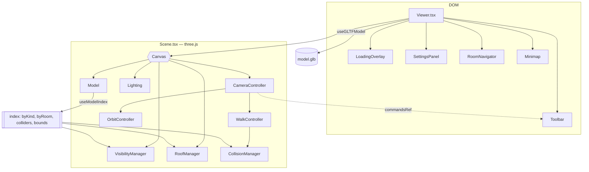

# ArchX3D — Interactive architectural viewer (v1.0)

Explores a generated building in the browser: orbit it, walk through it, take
the roof off, isolate the structure, and fly to a room — without downloading
the GLB.

```
   GLB ──► classify every mesh ──► index by kind, room, collider
                                        │
        ┌───────────────────────────────┼───────────────────────────────┐
        ▼                               ▼                               ▼
   roof toggle                    view modes                     walk collision
   (fade in/out)              (visibility only)                (capsule vs BVH)
```

**Not a glTF viewer.** A generic viewer shows you a mesh. This one knows which
mesh is the roof, which room a sofa is in, and what the camera may walk through
— because the generator writes that down, and because it infers it when an
older model does not.

**Nothing in the reconstruction pipeline changed.** The DXF parser, vision
pipeline, scene graph, optimiser and Blender geometry are untouched. The one
addition on the Python side is [§7](#7-metadata-in-the-glb): a tagging pass that
labels objects before export and creates no geometry.

---

## Contents

1. [Where it lives](#1-where-it-lives)
2. [Architecture](#2-architecture)
3. [Controls](#3-controls)
4. [The camera system](#4-the-camera-system)
5. [Roof detection](#5-roof-detection)
6. [Collision](#6-collision)
7. [Metadata in the GLB](#7-metadata-in-the-glb)
8. [View modes](#8-view-modes)
9. [Rooms and the minimap](#9-rooms-and-the-minimap)
10. [Performance](#10-performance)
11. [Testing](#11-testing)
12. [Configuration and deployment](#12-configuration-and-deployment)
13. [Future extensions](#13-future-extensions)

---

## 1. Where it lives

```
web/
├── app/viewer/page.tsx              /viewer route — resolves the model URL
├── types/viewer.ts                  the shared vocabulary
├── lib/viewer/                      pure logic — no three.js, unit-tested
│   ├── classify.ts                  what is this mesh?
│   ├── bounds.ts                    framing, spawn points, plan ↔ viewer
│   ├── movement.ts                  walk feel: acceleration, gravity, stepping
│   ├── manifest.ts                  the room block from the GLB
│   └── settings.ts                  defaults, validation, persistence, store
├── hooks/
│   ├── useGLTFModel.ts              load with progress, errors and disposal
│   ├── useRoofDetection.ts          index the model; roof detection
│   └── useViewerSettings.ts         React's view of the settings store
└── components/viewer/
    ├── ViewerClient.tsx             lazy, client-only entry point
    ├── Viewer.tsx                   DOM: overlays, shortcuts, fullscreen
    ├── Scene.tsx                    everything inside <Canvas>
    ├── Model.tsx                    the GLB in the scene
    ├── Lighting.tsx                 HDRI, tone mapping, shadows
    ├── CameraController.tsx         modes, framing, fly-to, persistence
    ├── OrbitController.tsx          orbit / pan / zoom
    ├── WalkController.tsx           WASD, pointer lock, gravity
    ├── CollisionManager.tsx         merged BVH, capsule solver
    ├── RoofManager.tsx              roof fade
    ├── VisibilityManager.tsx        view modes, wireframe, room highlight
    ├── Toolbar.tsx  SettingsPanel.tsx  RoomNavigator.tsx
    └── Minimap.tsx  LoadingOverlay.tsx  icons.tsx
```

> **A note on the path.** The brief specified `frontend/src/components/viewer/`.
> This repository's frontend is `web/`, with no `src/`, and the instruction to
> integrate rather than replace the existing frontend architecture takes
> precedence over the literal path. Everything else — file names, structure,
> responsibilities — follows the brief exactly.

### The pure / impure split

`lib/viewer/*` imports no `three`. It takes plain numbers and records, and
returns plain numbers and records. This is the same split the Python side
already uses, where `blender/colour.py` decides and `blender/materials.py`
builds — and it is why 117 tests run in 176 ms with no GPU, no canvas and no
model.

The rule: **if it is a judgement, it goes in `lib/`. If it needs a renderer, it
contains no judgements.**

---

## 2. Architecture



### The two boundaries that matter

**DOM / scene.** Everything in `Viewer.tsx` is HTML; everything in `Scene.tsx`
is three.js. They communicate downward through plain-data props and upward
through `commandsRef` — an imperative handle populated inside the canvas by
`CameraController` and called by the toolbar. Writing a `<div>` inside a
`<Canvas>` produces a blank screen with no error, so the boundary is a file
boundary to make it visible.

**Index once, look up many.** `useModelIndex` walks the model once at load and
produces `byKind`, `byRoom`, `colliders`, `bounds` and statistics. Hiding the
roof, switching view modes, flying to a room and building the collider are then
array lookups rather than four more traversals of a 100,000-object scene.

### Re-render discipline

Walking around a building costs **zero React renders**. The frame loop reads
settings through `getSettings()` — a module-level store, not a hook — so
dragging the speed slider while walking changes your speed without re-rendering
the canvas tree. The only things that render during interaction are throttled
deliberately: FPS at 2 Hz, minimap pose at 15 Hz and only when the camera has
actually moved.

---

## 3. Controls

### Orbit mode

| Input | Action |
| --- | --- |
| Left drag | Rotate |
| Right drag / two-finger drag | Pan |
| Scroll / pinch | Zoom |
| Click a room in the list or minimap | Fly to it |

### Walk mode

| Input | Action |
| --- | --- |
| Click the canvas | Capture the pointer |
| `W` `A` `S` `D` / arrows | Move |
| Mouse | Look |
| `Shift` | Run |
| `Q` / `E` | Down / up — free flight only, when collision is off |
| `Space` | Jump — disabled by default, see [§6](#6-collision) |
| `Esc` | Release the pointer |

Keys are matched on `KeyboardEvent.code`, so `KeyW` is the same physical key on
AZERTY — where `event.key` would report `"z"`.

### Shortcuts

| Key | Action |
| --- | --- |
| `O` | Orbit mode |
| `W` | Walk mode |
| `R` | Toggle roof |
| `V` | Cycle view mode |
| `F` | Toggle wireframe |
| `H` | Reset camera |
| `P` | Screenshot |
| `M` | Room list |
| `S` | Settings |
| `Enter` | Fullscreen |

**While the pointer is locked, `W` and `S` move rather than switching mode.**
They are movement keys first; a viewer where walking backwards opens a settings
panel is not usable. Every other shortcut works in both modes.

---

## 4. The camera system

Two modes, one orchestrator. `CameraController` owns *where the camera is*;
neither controller knows the other exists.

### Mode transitions

Switching is not just swapping controllers. Orbit needs a position and a target;
walk needs a position, a yaw, a pitch, an eye height and a floor to stand on.
Each transition saves the pose it is leaving and restores — or derives — the one
it is entering, so orbit → walk → orbit returns you to where you were.

### Entering walk mode

1. Use the saved walk pose for this model, if there is one.
2. Otherwise spawn at the centre of the **largest room** — better than the plan
   centroid, which in an L-shaped building lands in the notch, outside the walls.
3. Raycast down through the collider and stand on whatever is below, so a saved
   eye height from a different model cannot leave you inside a slab.
4. Face the middle of the building, so the first thing you see is the interior
   rather than the wall you happen to be against.

### Framing

`fitCameraToBox` fits on **both** axes and takes the larger distance. Fitting on
height alone crops a wide building at the sides — the common case, since
buildings are much wider than they are tall. The default direction is a raised
three-quarter view, which is how architectural drawings are conventionally
presented because it reads plan and elevation at once.

### Persistence

Camera poses are stored in `localStorage`, **keyed on the model URL**:

```
archx3d.viewer.camera.v1:http://localhost:8000/api/projects/abc/model.glb
```

Per model, not globally — resuming a position from a different building drops
you inside a wall or a hundred metres above a bungalow. Settings are separate
and global (`archx3d.viewer.settings.v1`), because a walking speed is a
preference and a camera position is not.

Everything read back is validated and clamped. `localStorage` is user-writable
and survives across versions; a `walkSpeed` of `null` from an older build must
not put the camera in orbit around Jupiter.

---

## 5. Roof detection

The single most-used control, and the reason it is a first-class feature.

Every generated building has a ceiling — a room without one renders with light
pouring in and looks nothing like its reference photograph. That same ceiling
makes the interior invisible from outside, so the default view of a finished
model is a box.

### Three sources, in order of trust

| Rung | Source | Reliability |
| --- | --- | --- |
| 1 | `extras.archx3d_kind === "roof"` | Exact. Any current build. |
| 2 | Mesh named `Ceiling` or `Roof` | Reliable for older builds. |
| 3 | A thin plate, high up, spanning the plan | Inference. |

Rungs 4 and 5 in `classify.ts` — ancestor inheritance and the geometric test —
round out the ladder for models from other tools.

### Whole-name matching

`ceiling_fan_fan_1` starts with "ceiling". A substring test would hide the fan
with the roof, and the user would be left wondering where it went. Shell names
are matched on the **whole** name, after stripping Blender's `.001`
de-duplication suffix. Both the Python and TypeScript sides have an explicit
test for this case.

### The geometric test, and why it is reluctant

```
thickness / building height  ≤ 0.12    a plate, not a wall
(base − floor) / height      ≥ 0.75    in the top quarter
footprint / plan footprint   ≥ 0.30    spans the building, unlike a shelf
```

Deliberately strict. It would rather miss a roof than hide a mezzanine floor: a
missed roof is visible and the user can switch to Interior view, while a wrongly
hidden floor is a piece of the building that has silently vanished. The
mezzanine case has its own test.

### Fade, not blink

The roof fades over 180 ms. A hard cut through a large surface reads as a glitch
— the eye cannot tell whether geometry was removed or the camera moved — while a
short fade reads unmistakably as *that thing was taken away*. Once fully
transparent the mesh is hidden outright, because a transparent surface is still
rasterised and a ceiling covers the whole viewport.

`RoofManager` is the **sole owner** of roof visibility. `VisibilityManager`
skips the roof entirely: two effects writing `visible` on the same objects race
on cleanup order, which shows up as a roof reappearing when an unrelated setting
changes.

---

## 6. Collision

### Why not raycasts

Casting a few rays and stopping on a hit fails three ways in a real building:
rays miss thin geometry at glancing angles, so you slip through a wall you
approached diagonally; a handful of rays cannot describe a body, so you clip
corners; and per-triangle testing against 400,000 triangles is O(n) per frame.

### What it does instead

```
collidable meshes ──► StaticGeometryGenerator (merge, positions only)
                  ──► MeshBVH
                          │
   camera capsule ────────┴──► shapecast ──► push out ──► slide
```

**One merged BVH.** Built once per model by `StaticGeometryGenerator`, which
bakes world transforms so the result needs no matrix at test time. Positions
only — normals and UVs are several times the data and collision never reads
them.

**A capsule, not a box.** A vertical segment with a radius:

```
 eye ──────●  ┐   segment.start = eye − radius
           │  │
           │  ├── eye height (1.65 m default)
           │  │
 feet ─────●  ┘   segment.end   = eye − height + radius
```

A capsule cannot catch on a corner — there is no edge to snag — so walking along
a wall slides instead of stuttering. Radius is 0.28 m: narrow enough to fit
through a 0.8 m doorway without brushing both jambs, wide enough that no
realistic wall can be crossed in one sub-step.

**Sliding.** After resolution, only the velocity component heading *into* the
surface is cancelled. Keeping the tangential part is what makes walking into a
wall at an angle slide along it rather than stop dead.

**Sub-stepping.** A capsule moved further than its own radius in one step can
pass clean through a wall. `subStepCount` splits any frame whose motion exceeds
0.2 m, capped at six steps. This matters after a stall — a tab switch can
produce a `dt` of half a second, and `clampDelta` caps that at 0.1 s so a stall
costs a moment of movement rather than your position.

### What collides

| Collides | Does not |
| --- | --- |
| walls, floors, slabs | furniture |
| roof, ceilings | decor |
| columns, beams, stairs | appliances |
| door and window cuts | |
| unclassified meshes | |

Furniture is excluded on purpose: a walkthrough that snags on a rug or cannot
round a coffee table feels broken, and users consistently expect to walk
*through* the contents of a room and *around* its structure. Unclassified meshes
are included — an unknown mesh in a building is far more likely to be part of it
than not, and a false collider is a smaller failure than falling out of the
world.

**Collision is keyed on the model, not the view mode.** Hiding the roof must not
let you walk out through the ceiling, and a user in Furniture view still expects
walls to be solid.

### Gravity and jumping

Gravity is 9.81 m/s² with a terminal velocity, so a fall through a gap cannot
outrun the solver. Jumping is **off by default** — an architectural walkthrough
is not a platformer — and can be enabled in settings. Holding the key mid-air
does nothing.

Turning collision off enables free flight, with `Q`/`E` for vertical movement.

---

## 7. Metadata in the GLB

The one change to the Python side, and the reason the viewer can be exact rather
than clever.

### What was added

| File | Change |
| --- | --- |
| `modules/blender/metadata.py` | **new** — classification and the scene manifest |
| `modules/blender_generator.py` | import, one `tag_scene()` call, `export_extras=True` |
| `modules/blender_furniture.py` | two lines: `archx3d_group`, `archx3d_room` |

It creates no geometry, changes no material, moves nothing and alters no
lighting. **A build with it and a build without it render identically.** The
tagging call is wrapped so a failure prints a warning and the export proceeds.

### Per-object properties

```python
obj["archx3d_kind"]       # roof | wall | floor | opening | structure |
                          # furniture | decor | appliance | light | unknown
obj["archx3d_room"]       # scene-graph room id
obj["archx3d_id"]         # scene-graph object id
obj["archx3d_category"]   # catalogue category, e.g. "sofa"
obj["archx3d_group"]      # furniture | decor | appliance
obj["archx3d_confidence"] # detection confidence
```

`export_extras=True` carries these into glTF node `extras`, which `GLTFLoader`
puts on `object.userData`. Without that flag the properties were written and
silently dropped — they already existed in the `.blend` for debugging.

### The scene manifest

```json
{
  "version": "1.0",
  "generator": "archx3d",
  "up_axis": "Y",
  "units": "metre",
  "rooms": [
    {
      "id": "room_a",
      "name": "Living Room",
      "room_type": "living_room",
      "style": "modern",
      "area_m2": 24.0,
      "ceiling_height": 2.7,
      "bounds_min": [0.0, 0.0],
      "bounds_max": [6.0, 4.0],
      "polygon": [[0,0], [6,0], [6,4], [0,4]],
      "connected_to": ["room_b"],
      "object_count": 9
    }
  ]
}
```

Stored as a JSON string on `bpy.context.scene["archx3d"]`, because Blender
custom properties hold scalars and strings rather than nested structures. It
arrives on `gltf.scene.userData.archx3d`.

### Coordinates

Room coordinates are **Blender plan metres**, +Z up — the frame the scene graph
and `geometry.json` use. The GLB itself is **Y-up**, because the exporter
converts. One function bridges them, and it exists in exactly one place:

```ts
// lib/viewer/bounds.ts
planToViewer(x, y, height) => [x, height, -y]
```

Getting this backwards mirrors the building, which is subtle enough to survive a
casual look. `up_axis` in the manifest records what the *file* ended up as, so
the viewer never has to assume.

### Graceful absence

Every consumer degrades:

| Missing | Consequence |
| --- | --- |
| `archx3d_kind` | Classification falls to name, hierarchy, then geometry |
| `archx3d_room` | Room highlight does nothing; navigation still flies |
| The whole manifest | Room list and minimap disappear; toolbar buttons disable with a tooltip saying why |
| All metadata | Full viewer, roof detected geometrically |

An older GLB opens and works. The settings panel reports what fraction of meshes
were classified from metadata versus inferred, and warns below 50% — because
that changes what the user should expect from the roof toggle.

---

## 8. View modes

Visibility only. Nothing is refetched, re-parsed, rebuilt or re-uploaded to the
GPU, so switching costs one traversal of a pre-built index — well under a
millisecond on a large model.

| Mode | Shows | Roof |
| --- | --- | --- |
| **Full building** | everything | user's choice |
| **Interior** | everything | forced off |
| **Structure** | walls, slabs, roof, columns, openings | user's choice |
| **Furniture** | furniture, decor, appliances, **and the floor** | off |
| **Lighting** | luminaires **and the floor** | off |
| **Wireframe** | everything, as edges | user's choice |

Furniture and Lighting keep the floor deliberately: furniture floating in a void
is disorienting and tells you nothing about where it sits, and a light with no
surface to fall on reads as a bug.

Luminaire *fixtures* appear in Lighting mode as well as the punctual lights,
because a category like `pendant_light` is grouped as decor by the catalogue but
is a light to anyone looking at it.

### Wireframe and shared materials

The generator shares one material across every wall and every object of a given
species, so a per-mesh wireframe flag would toggle far more than the mesh it was
set on. Wireframe is applied per **material**, over a de-duplicated set, with
every original value recorded so exiting restores exactly what was there.

Every visibility effect restores what it changed on cleanup, so a fast sequence
of mode changes can never strand a mesh hidden.

---

## 9. Rooms and the minimap

Both are driven by the scene manifest, and both disappear entirely without it —
not an empty list or a "no rooms found" message. An empty panel invites the user
to work out what they did wrong; an absent one simply is not part of the
interface for that model.

### Navigation

Clicking a room flies the camera over ~1.15 s with an ease-in-out curve.
Where it flies to depends on the mode:

- **Walk** — stand at the room's short end looking down it, dropped onto the
  floor.
- **Orbit** — look at the room from above and outside. Standing *in* it would
  bury the camera in the worktop and the user would have to zoom out to work out
  what happened.

Selecting a room dims everything outside it to 12% opacity, with `depthWrite`
off so dimmed geometry does not occlude what is behind it. Walls and floors keep
their opacity — dimming the enclosure of the room you are looking into removes
the very thing that makes it a room.

### Minimap

An SVG plan, not a second WebGL view. A second camera would mean a full render
pass over the scene every frame for a 160-pixel widget; the manifest already
carries polygons and bounds in metres, so the map is drawn from data.

The marker is a dot **and a view cone**. The cone matters more: position alone
leaves the user working out which way they are facing from the 3D view, which is
exactly the question a minimap exists to answer.

Rooms are clickable. The room you are standing in is highlighted green and
labelled "here" in the list.

---

## 10. Performance

### Measured

| Route | Size | First load JS |
| --- | --- | --- |
| `/viewer` | 2.85 kB | **109 kB** |
| `/new`, `/generate/[job_id]`, `/` | unchanged | unchanged |

The 3D stack is behind `next/dynamic` with `ssr: false`, so it does not enter
the route's initial bundle. Imported statically it made `/viewer` 355 kB and
461 kB first-load; deferred, the shell paints from 109 kB, a skeleton explains
the wait, and the ~350 kB of three.js, drei and the BVH streams in behind it.

On a cold cache that is the difference between a blank page for a second and a
page that responds at once — and it matters most precisely when it is slowest,
because the model download that follows is the part the user actually has to
wait for.

No other route gained a byte.

### Techniques in use

| Technique | Effect |
| --- | --- |
| Route-level code splitting | Other pages carry none of this |
| Lazy, client-only viewer | Instant first paint; no wasted SSR of a canvas |
| Index once at load | Mode switches are lookups, not traversals |
| `frameloop="demand"` in orbit | A model being *looked at* renders once, not 60×/s |
| Frustum culling | On for every mesh |
| Precomputed bounding volumes | No first-frame hitch deriving them lazily |
| Merged collision geometry | One BVH, positions only |
| Scratch objects in frame loops | No per-frame allocation, so no GC stutter |
| External settings store | Frame code never triggers a render |
| Throttled probes | FPS 2 Hz, pose 15 Hz and only on movement |
| Explicit disposal | Geometries, materials and textures freed on model change |
| `dpr={[1, 2]}` | Caps device pixel ratio on 3× phones |
| `powerPreference: "high-performance"` | Asks a dual-GPU laptop for the discrete chip |

### Disposal

Three.js does not garbage-collect GPU resources. Dropping a reference to a
`Scene` leaves its geometries, materials and textures resident until the context
is lost. `disposeScene` walks the model and disposes every one, on model change
and on unmount; skipping it leaks tens of megabytes per model viewed.

### Compression support

Draco, Meshopt and KTX2 are all wired into the loader even though the current
Blender export uses none of them. They cost nothing when absent — a decoder is
only fetched if the file references the extension — and mean a future exporter
change needs no viewer change.

Decoders come from a CDN, pinned to the `three` version we build against. To
self-host, copy `node_modules/three/examples/jsm/libs/draco/` and `.../basis/`
into `public/` and change `DRACO_PATH` and `KTX2_PATH` in `useGLTFModel.ts`.

### Shadows

One shadow-casting directional light, not several. Shadow maps are the single
most expensive thing a WebGL scene can do, and a building has large flat
surfaces where a second map buys almost nothing. The shadow camera's frustum and
bias are derived from the model's radius, so texel density stays roughly
constant whether it is a 6 m flat or a 60 m office.

Shadows are the first thing to turn off if the frame rate drops; the settings
panel says so.

---

## 11. Testing

```bash
cd web && npm test          # 117 tests, ~180 ms
cd web && npm run typecheck
cd web && npm run build
python -m pytest tests/test_blender_metadata.py -q   # 26 tests
```

### What is covered

| Area | Examples |
| --- | --- |
| Classification | metadata beats name; `ceiling_fan` is not the ceiling; `.001` suffixes; unknown kinds fall through |
| Roof inference | accepts a ceiling; rejects floors, walls, shelves, **and mezzanines** |
| View modes | roof composition with the toggle; furniture keeps the floor |
| Framing | targets the centre; clears the building; pulls back on portrait; survives a degenerate box |
| Movement | diagonals normalised; run multiplier; **frame-rate independence**; fall speed capped; jump ignored when disabled |
| Sub-stepping | one step at walking pace; more after a stall; capped |
| Manifest | JSON string and object forms; corrupt input; rooms with no polygon; sorting |
| Settings | clamping; one bad field does not lose the rest; malformed saved cameras rejected |
| Python | every classification path; manifest shape; JSON-serialisability |

Two tests are worth pointing at specifically:

**Frame-rate independence.** One 1/30 s damping step must land in exactly the
same place as two 1/60 s steps. Without it the camera accelerates faster on a
144 Hz display, which is the most common cause of movement that "feels different
on my machine".

**The mezzanine.** A flat, broad plate at mid height must *not* be classified as
a roof. It is the false positive that would matter most — hiding a floor the
user is standing on.

### What is not unit-tested, and why

The BVH solver, pointer lock, WebGL rendering and the loader all need a browser.
Mocking them would test the mock. They are covered by the manual checklist
below, and the *decisions* they depend on — capsule dimensions, sub-step counts,
velocity integration — are pure and are tested.

### Manual checklist

- [ ] Model loads; progress bar advances; byte counts are right
- [ ] Backend stopped → error names the unreachable origin, Retry works
- [ ] Wrong URL → error says the model may not have been generated
- [ ] Building is framed on load, whatever its size
- [ ] Orbit: rotate, pan, zoom; cannot roll under the floor
- [ ] Roof toggle fades; interior visible; ceiling fan still present
- [ ] All six view modes; wireframe restores materials on exit
- [ ] Walk: click locks, WASD moves, Shift runs, Esc releases
- [ ] Cannot walk through walls, doors, columns or the roof
- [ ] Walking into a wall at an angle slides
- [ ] Alt-tab while holding W → camera stops
- [ ] Room list flies and highlights; minimap cone points the right way
- [ ] Reset camera returns to the fitted view
- [ ] Screenshot downloads a correct PNG
- [ ] Fullscreen keeps the overlays
- [ ] Reload resumes the last camera position
- [ ] A GLB with no metadata still opens; room controls disable with a tooltip

---

## 12. Configuration and deployment

### Model URLs

| Route | Source | Model |
| --- | --- | --- |
| `/viewer?project_id=…` | wizard | `/api/projects/{id}/model.glb` |
| `/viewer?job_id=…` | one-shot `/api/generate` | `/output/model.glb?job={id}` |

The one-shot pipeline writes to the shared `output/` directory, so two runs
produce the same URL. The job id is appended as a cache buster — without it a
user's second model is served from the first one's cache.

Opening `/viewer` with neither parameter shows a page explaining what is missing
and offering both ways to get a model, rather than 404-ing on a route that
legitimately exists.

### CORS

`server.py` already allows `localhost:3000` and `127.0.0.1:3000`. A deployment
on another origin must add it to the CORS list, or the model fetch fails with a
network error — which `describeLoadError` reports as an unreachable origin.

### Environment

`NEXT_PUBLIC_API_BASE_URL` (default `http://localhost:8000`) is the only
variable, and is shared with the rest of the app.

### Browser support

WebGL 2, `PointerLockControls` and the Fullscreen API — Chrome, Edge, Firefox
and Safari 15+. Pointer lock on iOS Safari is unavailable, so walk mode is
effectively desktop-only there; orbit mode works everywhere and is the default.

---

## 13. Future extensions

Ordered by value against effort. Each names the seam that already exists for it.

| Extension | Where it plugs in |
| --- | --- |
| **Measurement tool** | A raycast against the existing BVH; two clicks and a label |
| **Section planes** | `THREE.Plane` clipping in `Lighting`/renderer settings; the classification index already knows what to cut |
| **Object inspection** | `byKind`/`byRoom` already carry `archx3d_id`; a click-to-select panel could show confidence and provenance from the review payload |
| **Saved viewpoints** | The `ViewPoint` records in the scene graph are already exported; add them to the manifest and list them beside rooms |
| **Reference comparison** | Fly to a stored `ViewPoint` and blend the reference photograph over the render — the evaluation engine already pairs them |
| **Multi-floor** | `RoomInfo` gains a `level`; the room list groups by storey and the minimap switches |
| **Annotations** | Persist to the project, render as sprites |
| **Daylight study** | The manifest could carry `daylight_direction` from `LightingEnvironment`; drive the sun from a time slider |
| **VR** | `@react-three/xr` over the same scene; walk mode's capsule already models a body |
| **Progressive loading** | Split the GLB per level or per room; the index is already built incrementally |

### Deliberately not planned

| Not doing | Why |
| --- | --- |
| Editing geometry in the viewer | The scene graph is the source of truth and the wizard is where it is edited. A second editor is a second vocabulary. |
| A second renderer backend | One WebGL viewer is enough until there is a second real need. |
| Server-side rendering of the canvas | No WebGL, no `localStorage`, no pointer lock — the markup is thrown away on hydration. |

---

## Related

- [`APPEARANCE.md`](APPEARANCE.md) — how Blender builds the materials and lighting the viewer displays.
- [`EDITOR.md`](EDITOR.md) — the review step, where the scene graph is edited before it is built.
- [`RENDER_PIPELINE.md`](RENDER_PIPELINE.md) — the deterministic preview renders the evaluation engine scores.
- [`ARCHITECTURE.md`](ARCHITECTURE.md) §19 — where a browser viewer sits in the v2 architecture.
